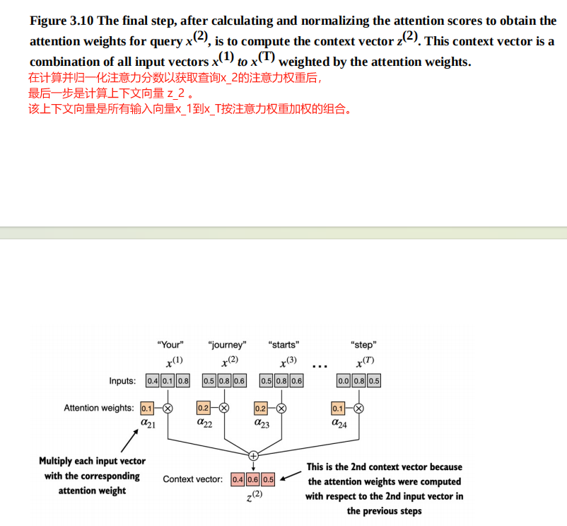
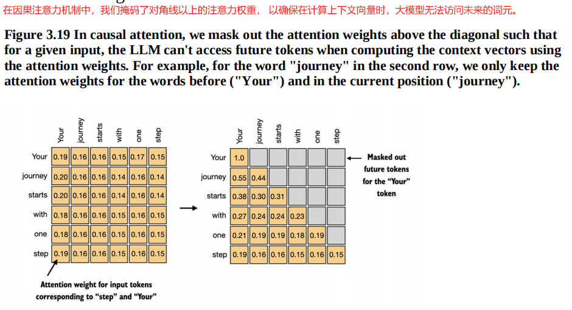
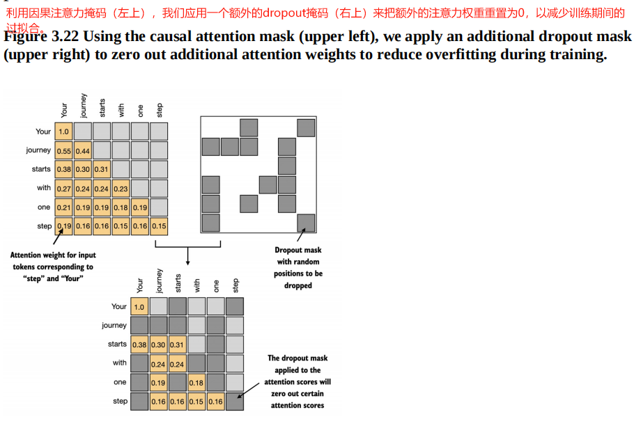
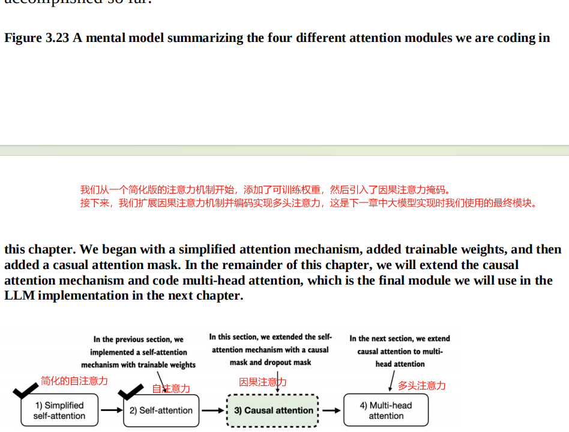

# 【README】

本文总结自<font color="#ff0000">《从零构建大模型》</font>，非常棒的一本书，墙裂推荐； 

本文代码参见： [https://github.com/TomJourney/build_a_llm_from_scratch](https://github.com/TomJourney/build_a_llm_from_scratch)

---

# 【1】通过自注意力机制关注输入的不同部分

自注意力机制是所有基于Transformer架构的大模型的基石；

在自注意力机制中，自指的是该机制通过关联单个输入序列中的不同位置来计算注意力权重的能力；它可以评估并学习输入本身各个部分之间的关系与依赖；比如句子中的单词或图像中的像素；（而传统注意力关注的是两个不同序列元素之间的关系）

---

## 【1.1】无可训练权重的简单自注意力机制

1）实现一个不包含任何可训练权重的简化的自注意力机制变体；步骤如下：

- 第1步：根据词元id的的嵌入向量计算注意力分数；
- 第2步：对注意力分数做归一化；（归一化的目的是获得总和为1的注意力权重。这种归一化是要给惯例，有助于解释结果，并能维持大模型的训练稳定性）
  -  归一化使用softmax函数；

【test0301_p51_attention_score.py】 

```python
import torch
from src.utils import MathUtis

inputs = torch.tensor(
    [
        [0.43, 0.15, 0.89], # x_1
        [0.55, 0.87, 0.66],
        [0.57, 0.85, 0.64],
        [0.22, 0.58, 0.33],
        [0.77, 0.25, 0.10],
        [0.05, 0.80, 0.55] # x_6
    ]
)

print("\n\n=== 计算注意力分数")
# 把第2个元素作为查询词元
query = inputs[1]
print("inputs.shape = ", inputs.shape)
# inputs.shape =  torch.Size([6, 3])

print("inputs.shape[0] = ", inputs.shape[0])
# inputs.shape[0] =  6

attention_score_2 = torch.empty(inputs.shape[0])
print("attention_score_2 = ", attention_score_2)
# attention_score_2 =  tensor([-8.3727e+34,  7.5530e-43,  0.0000e+00,  0.0000e+00,  0.0000e+00, 0.0000e+00])

for i, x_i in enumerate(inputs):
    attention_score_2[i] = torch.dot(x_i, query)
print("after torch.dot(), x2的注意力分数=attention_score_2 = ", attention_score_2)
# after torch.dot(), attention_score_2 =  tensor([0.9544, 1.4950, 1.4754, 0.8434, 0.7070, 1.0865])

# 对注意力分数归一化得到注意力权重
print("\n\n===对注意力分数归一化得到注意力权重")
attention_weight_2_temp = attention_score_2 / attention_score_2.sum()
print("attention_weight_2_temp = ", attention_weight_2_temp)
print("attention_weight_2_temp.sum() = ", attention_weight_2_temp.sum())
# attention_weight_2_temp =  tensor([0.1455, 0.2278, 0.2249, 0.1285, 0.1077, 0.1656])
# attention_weight_2_temp.sum() =  tensor(1.0000)

# 使用自定义softmax函数进行朴素归一化
print("\n\n===使用自定义softmax函数进行朴素归一化")
attention_weight_2_naive = MathUtis.diy_softmax_naive(attention_score_2)
print("attention_weight_2_naive = ", attention_weight_2_naive)
print("attention_weight_2_naive.sum() = ", attention_weight_2_naive.sum())
# attention_weight_2_naive =  tensor([0.1385, 0.2379, 0.2333, 0.1240, 0.1082, 0.1581])
# attention_weight_2_naive.sum() =  tensor(1.)

# 使用pytorch.softmax函数进行朴素归一化
print("\n===使用pytorch.softmax函数进行朴素归一化")
attention_weight_2_torch = torch.softmax(attention_score_2, dim=0)
print("attention_weight_2_torch = ", attention_weight_2_torch)
print("attention_weight_2_torch.sum() = ", attention_weight_2_torch.sum())
# attention_weight_2_torch =  tensor([0.1385, 0.2379, 0.2333, 0.1240, 0.1082, 0.1581])
# attention_weight_2_torch.sum() =  tensor(1.)
```

---

### 【1.1.1】理解点积

<font color="#ff0000">点积是向量相似度的一种度量指标，可以量化两个向量之间的对齐程度：点积越大，向量之间的对齐程序或相似度就越高</font>；

在自注意力机制中，点积决定了序列中每个元素对其他元素的关注程度：点积越大，两个元素之间的相似度和注意力分数就越高；

---

### 【1.1.2】计算某个词元的上下文向量

上下文向量计算方法：x_i对x_2的权值（注意力权重） 乘上 x_i的嵌入向量，并累加后得到对应x_2的上下文向量 context_vector_2；

【test0301_p53_compute_context_vector.py】

```python
import torch
from src.utils import MathUtis

inputs = torch.tensor(
    [
        [0.43, 0.15, 0.89], # x_1
        [0.55, 0.87, 0.66],
        [0.57, 0.85, 0.64],
        [0.22, 0.58, 0.33],
        [0.77, 0.25, 0.10],
        [0.05, 0.80, 0.55] # x_6
    ]
)


print("\n\n=== 计算注意力分数")
# 把第2个元素作为查询词元
query = inputs[1]
print("inputs.shape = ", inputs.shape)
# inputs.shape =  torch.Size([6, 3])

print("inputs.shape[0] = ", inputs.shape[0])
# inputs.shape[0] =  6

attention_score_2 = torch.empty(inputs.shape[0])
print("attention_score_2 = ", attention_score_2)
# attention_score_2 =  tensor([-8.3727e+34,  7.5530e-43,  0.0000e+00,  0.0000e+00,  0.0000e+00, 0.0000e+00])

for i, x_i in enumerate(inputs):
    attention_score_2[i] = torch.dot(x_i, query)
print("after torch.dot(), x2的注意力分数=attention_score_2 = ", attention_score_2)
# after torch.dot(), attention_score_2 =  tensor([0.9544, 1.4950, 1.4754, 0.8434, 0.7070, 1.0865])


# 使用pytorch.softmax函数进行朴素归一化
print("\n=====================使用pytorch.softmax函数对x2的注意力分数进行朴素归一化， 得到x2的注意力权重")
attention_weight_2_normalization_torch = torch.softmax(attention_score_2, dim=0)
print("attention_weight_2_normalization_torch = ", attention_weight_2_normalization_torch)
print("attention_weight_2_normalization_torch.sum() = ", attention_weight_2_normalization_torch.sum())
# attention_weight_2_normalization_torch =  tensor([0.1385, 0.2379, 0.2333, 0.1240, 0.1082, 0.1581])
# attention_weight_2_normalization_torch.sum() =  tensor(1.)

print("\n\n==================== 计算x2的上下文向量z2")
# 把第2个元素作为查询词元
query = inputs[1]
context_vector_2 = torch.zeros(query.shape)
print("context_vector_2 = ", context_vector_2)
# context_vector_2 =  tensor([0., 0., 0.])

for i, x_i in enumerate(inputs):
    print("\n====================  我是行分隔符 ====================")
    # x_i对x2的权值（注意力权重） 乘上 x_i的嵌入向量，并累加后得到对应x2的上下文向量 context_vector_2
    context_vector_2 += attention_weight_2_normalization_torch[i] * x_i
print("context_vector_2 = ", context_vector_2)
# context_vector_2 =  tensor([0.4419, 0.6515, 0.5683])
```

---

【补充1】其他词元x_i对词元x_2的注意力分数：等于x_i点乘x_2；

```python
for i, x_i in enumerate(inputs):
    attention_score_2[i] = torch.dot(x_i, query)
```

所以上述代码计算的是x_1~x6对次元x_2的注意力分数；计算结果如下：

```python
# after torch.dot(), attention_score_2 =  tensor([0.9544, 1.4950, 1.4754, 0.8434, 0.7070, 1.0865])
```

【补充2】x_2的上下文向量：所有输入向量的加权总和，即x_i对x_2的权值（注意力权重） 乘上 x_i的嵌入向量，并累加；

【计算词元的上下文向量流程图】



<br>

---

### 【1.1.3】计算所有词元的上下文向量

1）计算所有词元的上下文向量，步骤如下：

- 第1步：计算所有输入词元的注意力分数；
- 第2步：注意力分数归一化，得到所有词元的注意力权重；
- 第3步：使用注意力权重通过矩阵乘法计算所有词元的上下文向量；

【test0303_p55_compute_all_token_context_vector.py】

```python
import torch
from src.utils import MathUtis

# 标题： 计算所有输入词元的注意力权重
# 6个词元的嵌入向量表示
inputs = torch.tensor(
    [
        [0.43, 0.15, 0.89], # x_1
        [0.55, 0.87, 0.66],
        [0.57, 0.85, 0.64],
        [0.22, 0.58, 0.33],
        [0.77, 0.25, 0.10],
        [0.05, 0.80, 0.55] # x_6
    ]
)

# 计算所有输入词元的注意力分数
print("\n\n=== 第1步：计算所有输入词元的注意力分数： 方法1-使用for循环")
all_attention_scores_1 = torch.empty(6, 6)
for i, x_i in enumerate(inputs):
    for j, x_j in enumerate(inputs):
        # 计算xi对xj的注意力分数（即xi对xj的相似度）
        all_attention_scores_1[i, j] = torch.dot(x_i, x_j)
print("all_attention_scores = ", all_attention_scores_1)

print("\n\n=== 第1步：计算所有输入词元的注意力分数： 方法2-使用矩阵乘法")
all_attention_scores_2 = inputs @ inputs.T
print("使用矩阵乘法计算词元间的注意力分数， all_attention_scores_2 = ", all_attention_scores_2)
# all_attention_scores_2 =  tensor([[0.9995, 0.9544, 0.9422, 0.4753, 0.4576, 0.6310],
#         [0.9544, 1.4950, 1.4754, 0.8434, 0.7070, 1.0865],
#         [0.9422, 1.4754, 1.4570, 0.8296, 0.7154, 1.0605],
#         [0.4753, 0.8434, 0.8296, 0.4937, 0.3474, 0.6565],
#         [0.4576, 0.7070, 0.7154, 0.3474, 0.6654, 0.2935],
#         [0.6310, 1.0865, 1.0605, 0.6565, 0.2935, 0.9450]])

print("\n\n 第2步：注意力分数归一化，得到所有词元的注意力权重")
all_attention_weights = torch.softmax(all_attention_scores_2, dim=-1)
print("all_attention_weights = ", all_attention_weights)
# all_attention_weights =  tensor([[0.2098, 0.2006, 0.1981, 0.1242, 0.1220, 0.1452],
#         [0.1385, 0.2379, 0.2333, 0.1240, 0.1082, 0.1581],
#         [0.1390, 0.2369, 0.2326, 0.1242, 0.1108, 0.1565],
#         [0.1435, 0.2074, 0.2046, 0.1462, 0.1263, 0.1720],
#         [0.1526, 0.1958, 0.1975, 0.1367, 0.1879, 0.1295],
#         [0.1385, 0.2184, 0.2128, 0.1420, 0.0988, 0.1896]])

# all_attention_weights[1][2] 表示词元1与词元2间的相似性度量， all_attention_weights[3][2]表示词元3与词元2的相似性度量

print("\n\n 第3步：使用注意力权重通过矩阵乘法计算所有词元的上下文向量")
all_token_context_vectors = all_attention_weights @ inputs
print("all_token_context_vectors = ", all_token_context_vectors)

```

---

<br>

# 【2】实现带可训练权重的自注意力机制

第1章本文实现了一个简化的注意力机制，以理解注意力背后的原理。现在本文为注意力添加可训练的权重。

第1章中的某词元x_2的上下文向量计算方法为：嵌入向量x_i与对应注意力权重(x_i与x_2的相似性度量，即两者向量点积)相乘，再把乘积累加（如x_1~x_6）就得到上下文向量在该维度上的值；

如嵌入向量x_i有3个维度，6个嵌入向量(x_i,i=1~6)在3个维度上的值与对应权重（x_i与x_2的点积）相乘，并再各自维度上累加就得到3维度上的x_2的上下文向量；

而本章中的词元x_2的上下文向量计算方法为：某个输入元素对于序列中所有输入向量的加权和。

---

## 【2.1】基于注意力权重计算词元x_2的上下文向量

1）引入3个可训练的权重矩阵实现自注意力机制， 包括查询向量Wq, 键向量Wk, 值向量Wv；

【test0304_p58_trainable_weight_self_attention.py】

```python
import torch

# 标题： 计算所有输入词元的注意力权重
# 6个词元的嵌入向量表示
inputs = torch.tensor(
    [
        [0.43, 0.15, 0.89],  # x_1
        [0.55, 0.87, 0.66],
        [0.57, 0.85, 0.64],
        [0.22, 0.58, 0.33],
        [0.77, 0.25, 0.10],
        [0.05, 0.80, 0.55]  # x_6
    ]
)

# 3.4.1 逐步计算注意力权重
x_2 = inputs[1]
# 输入d_in的嵌入维度等于3， 输出d_out的嵌入维度等于2
d_in = inputs.shape[1]
d_out = 2

# 初始化3个权重矩阵，包括查询向量 W_query， 键向量 W_key，值向量 W_value
print("\n\n===初始化3个权重矩阵，包括查询向量W_query， 键向量W_key，值向量W_value")
torch.manual_seed(123)
W_query = torch.nn.Parameter(torch.rand(d_in, d_out), requires_grad=False)
W_key = torch.nn.Parameter(torch.rand(d_in, d_out), requires_grad=False)
W_value = torch.nn.Parameter(torch.rand(d_in, d_out), requires_grad=False)
print("W_query = ", W_query)
print("W_key = ", W_key)
print("W_value = ", W_value)

# W_query =  Parameter containing:
# tensor([[0.2961, 0.5166],
#         [0.2517, 0.6886],
#         [0.0740, 0.8665]])
# W_key =  Parameter containing:
# tensor([[0.1366, 0.1025],
#         [0.1841, 0.7264],
#         [0.3153, 0.6871]])
# W_value =  Parameter containing:
# tensor([[0.0756, 0.1966],
#         [0.3164, 0.4017],
#         [0.1186, 0.8274]])

# 计算查询向量， 键向量，值向量
print("\n\n===计算x_2的查询向量， 键向量，值向量")
query_2 = x_2 @ W_query
key_2 = x_2 @ W_key
value_2 = x_2 @ W_value
print("query_2 = ", query_2)
print("key_2 = ", key_2)
print("value_2 = ", value_2)
# query_2 =  tensor([0.4306, 1.4551])
# key_2 =  tensor([0.4433, 1.1419])
# value_2 =  tensor([0.3951, 1.0037])

# 通过矩阵乘法计算所有的键向量和值向量
print("\n\n===通过矩阵乘法计算所有输入向量的键向量和值向量")
keys = inputs @ W_key
values = inputs @ W_value
print("keys = ", keys)
print("values = ", values)
# 从输出可以看出，可以把三维度词元降低到二维
# keys =  tensor([[0.3669, 0.7646],
#         [0.4433, 1.1419],
#         [0.4361, 1.1156],
#         [0.2408, 0.6706],
#         [0.1827, 0.3292],
#         [0.3275, 0.9642]])
# values =  tensor([[0.1855, 0.8812],
#         [0.3951, 1.0037],
#         [0.3879, 0.9831],
#         [0.2393, 0.5493],
#         [0.1492, 0.3346],
#         [0.3221, 0.7863]])

# 计算注意力分数
print("\n\n===计算x_2的注意力分数")
keys_2 = keys[1]
attention_score_22 = query_2.dot(keys_2)
print("attention_score_22 = ", attention_score_22)
# attention_score_22 =  tensor(1.8524)

# 通过矩阵乘法计算所有的注意力分数(向量相似性， x_2点积x_i, i~6)
attention_score_2 = query_2 @ keys.T
print("attention_score_2 = ", attention_score_2)
# attention_score_2 =  tensor([1.2705, 1.8524, 1.8111, 1.0795, 0.5577, 1.5440])

# 把注意力分数转换为注意力权重并归一化
print("\n===把注意力分数转换为注意力权重并归一化")
d_k = keys.shape[-1]
print("d_k = ", d_k)
# d_k =  2
attention_score_weights_2 = torch.softmax(attention_score_2 / d_k ** 0.5, dim=-1)
print("attention_score_weights_2 = ", attention_score_weights_2)
# attention_score_weights_2 =  tensor([0.1500, 0.2264, 0.2199, 0.1311, 0.0906, 0.1820])

# 通过对值向量进行加权求和来计算上下文向量
# 其中， 注意力权重作为加权因子， 用于权衡每个值向量的重要性。
print("\n===通过对值向量进行加权求和来计算上下文向量")
context_vector_2 = attention_score_weights_2 @ values
print("context_vector_2 = ", context_vector_2)
# context_vector_2 =  tensor([0.3061, 0.8210])

```

---

## 【2.2】实现基于注意力权重的自注意力python类并计算所有词元的上下文向量

【test0304_p63_simplified_self_attention_v1.py】

```python
import torch
import torch.nn as nn
# 标题： 实现一个简化的自注意力python类

class SelfAttention_v1(nn.Module):
    def __init__(self, d_in, d_out):
        super().__init__()
        self.W_query = nn.Parameter(torch.rand(d_in, d_out))
        self.W_key = nn.Parameter(torch.rand(d_in, d_out))
        self.W_value = nn.Parameter(torch.rand(d_in, d_out))

    # 前向传播
    def forward(self, x):
        keys = x @ self.W_key
        queries = x @ self.W_query
        values = x @ self.W_value
        attention_scores = queries @ keys.T # omega
        attention_scores_weights = torch.softmax(attention_scores/keys.shape[-1] ** 0.5, dim=-1) # 归一化
        context_vector = attention_scores_weights @ values  # 创建上下文向量
        return context_vector

```

---

【test0304_p63_simplified_self_attention_v1_main.py】 简化的自注意力python类测试案例

```python
import torch
from src.chapter03.test0304_p63_simplified_self_attention_v1 import SelfAttention_v1

## 标题： 实现一个简化的自注意力python类
# 6个词元的嵌入向量表示
inputs = torch.tensor(
    [
        [0.43, 0.15, 0.89], # x_1
        [0.55, 0.87, 0.66],
        [0.57, 0.85, 0.64],
        [0.22, 0.58, 0.33],
        [0.77, 0.25, 0.10],
        [0.05, 0.80, 0.55] # x_6
    ]
)

x_2 = inputs[1]
# 输入d_in的嵌入维度等于3， 输出d_out的嵌入维度等于2
d_in = inputs.shape[1]
d_out = 2

# 使用自注意力python类生成6个上下文向量
print("\n===使用自注意力python类(SelfAttention_v1)生成6个上下文向量")
torch.manual_seed(123)
self_attention_v1 = SelfAttention_v1(d_in, d_out)
print(self_attention_v1(inputs))

# tensor([[0.2996, 0.8053],
#         [0.3061, 0.8210],
#         [0.3058, 0.8203],
#         [0.2948, 0.7939],
#         [0.2927, 0.7891],
#         [0.2990, 0.8040]], grad_fn=<MmBackward0>)
#
```

---

## 【2.3】使用Pytorch线性层实现基于注意力权重的自注意力类并计算所有词元的上下文向量

【test0304_p65_linear_self_attention_v2.py】

```python
import torch
import torch.nn as nn
# 标题： 使用Pytorch线性层的自注意力类

class SelfAttention_v2(nn.Module):
    def __init__(self, d_in, d_out, qkv_bias=False):
        super().__init__()
        self.W_query = nn.Linear(d_in, d_out, bias=qkv_bias)
        self.W_key = nn.Linear(d_in, d_out, bias=qkv_bias)
        self.W_value = nn.Linear(d_in, d_out, bias=qkv_bias)

    # 前向传播
    def forward(self, x):
        keys = self.W_key(x)
        queries = self.W_query(x)
        values = self.W_value(x)
        attention_scores = queries @ keys.T # omega
        attention_scores_weights = torch.softmax(attention_scores / keys.shape[-1] ** 0.5, dim=-1)  # 归一化
        context_vector = attention_scores_weights @ values  # 创建上下文向量
        return context_vector

```

---

【test0304_p65_linear_self_attention_v2_main.py】使用Pytorch线性层的自注意力类-测试案例

```python
import torch
from src.chapter03.test0304_p65_linear_self_attention_v2 import SelfAttention_v2

## 标题： 实现一个简化的自注意力python类
# 6个词元的嵌入向量表示
inputs = torch.tensor(
    [
        [0.43, 0.15, 0.89], # x_1
        [0.55, 0.87, 0.66],
        [0.57, 0.85, 0.64],
        [0.22, 0.58, 0.33],
        [0.77, 0.25, 0.10],
        [0.05, 0.80, 0.55] # x_6
    ]
)

x_2 = inputs[1]
# 输入d_in的嵌入维度等于3， 输出d_out的嵌入维度等于2
d_in = inputs.shape[1]
d_out = 2

# 使用自注意力python类生成6个上下文向量
print("\n===使用Pytorch线性层的自注意力python类(SelfAttention_v2)生成6个上下文向量")
torch.manual_seed(789)
self_attention_v2 = SelfAttention_v2(d_in, d_out)
print("self_attention_v2(inputs) = ", self_attention_v2(inputs))
# self_attention_v2(inputs) =  tensor([[-0.0739,  0.0713],
#         [-0.0748,  0.0703],
#         [-0.0749,  0.0702],
#         [-0.0760,  0.0685],
#         [-0.0763,  0.0679],
#         [-0.0754,  0.0693]], grad_fn=<MmBackward0>)
```

---

<br>

# 【3】利用因果注意力隐藏未来词汇

1. 因果注意力定义：它是一种特殊的自注意力形式；<font color="#ff0000">因果注意力限制模型在处理任何给定词元时，只能基于序列中的先前和当前输入来计算注意力分数，而标准的自注意力机制可以一次性访问整个输入序列</font>；
2. 下面通过修改标准自注意力机制来<font color="#ff0000">创建因果注意力机制，这是后面开发大语言模型的关键步骤</font>；
3. 要在类GPT模型中实现这一点， 对于每个处理的词元， 需要掩码当前词元之后的后续词元；
1. 如掩码对角线以上的注意力权重， 并归一化未掩码的注意力权重，使得每一行的权重之和为1；



---

## 【3.1】因果注意力（CausalAttention）的掩码实现

【test0305_p67_causal_attention.py】

```python
import torch

from src.chapter03.test0304_p65_linear_self_attention_v2 import SelfAttention_v2

## 标题： 因果注意力的掩码实现
# 6个词元的嵌入向量表示
inputs = torch.tensor(
    [
        [0.43, 0.15, 0.89],  # x_1
        [0.55, 0.87, 0.66],
        [0.57, 0.85, 0.64],
        [0.22, 0.58, 0.33],
        [0.77, 0.25, 0.10],
        [0.05, 0.80, 0.55]  # x_6
    ]
)

x_2 = inputs[1]
# 输入d_in的嵌入维度等于3， 输出d_out的嵌入维度等于2
d_in = inputs.shape[1]
d_out = 2

# 使用自注意力python类生成6个上下文向量
print("\n===使用Pytorch线性层的自注意力python类(SelfAttention_v2)")
torch.manual_seed(789)
self_attention_v2 = SelfAttention_v2(d_in, d_out)

# 因果注意力的掩码实现
print("\n\n========== 因果注意力的掩码实现")

# 步骤1：生成注意力权重
print("\n===步骤1：生成注意力权重")
queries = self_attention_v2.W_query(inputs)
keys = self_attention_v2.W_key(inputs)
attention_scores = queries @ keys.T
attention_scores_weights = torch.softmax(attention_scores / keys.shape[-1] * 0.5, dim=-1)
print("attention_scores_weights = ", attention_scores_weights)
# attention_scores_weights =  tensor([[0.1754, 0.1661, 0.1663, 0.1626, 0.1687, 0.1610],
#         [0.1793, 0.1666, 0.1667, 0.1606, 0.1668, 0.1599],
#         [0.1791, 0.1666, 0.1667, 0.1607, 0.1668, 0.1600],
#         [0.1736, 0.1667, 0.1668, 0.1633, 0.1665, 0.1630],
#         [0.1723, 0.1668, 0.1668, 0.1639, 0.1664, 0.1638],
#         [0.1758, 0.1667, 0.1667, 0.1623, 0.1667, 0.1618]],
#        grad_fn=<SoftmaxBackward0>)

# 步骤2： 创建掩码矩阵
print("\n===步骤2： 创建掩码矩阵（对角线以上为0的掩码）")
context_length = attention_scores.shape[0]
mask_simple = torch.tril(torch.ones(context_length, context_length))
print("\n===掩码矩阵：mask_simple = ", mask_simple)
# 掩码矩阵：mask_simple =  tensor([[1., 0., 0., 0., 0., 0.],
#         [1., 1., 0., 0., 0., 0.],
#         [1., 1., 1., 0., 0., 0.],
#         [1., 1., 1., 1., 0., 0.],
#         [1., 1., 1., 1., 1., 0.],
#         [1., 1., 1., 1., 1., 1.]])

# 步骤3：使用掩码矩阵与注意力权重矩阵相乘，使对角线上方的值变为0
print("\n\n===步骤3：使用掩码矩阵与注意力权重矩阵相乘，使对角线上方的值变为0")
mask_simple = attention_scores_weights * mask_simple
print("\n===mask_simple = ", mask_simple)
# ===mask_simple =  tensor([[0.1754, 0.0000, 0.0000, 0.0000, 0.0000, 0.0000],
#         [0.1793, 0.1666, 0.0000, 0.0000, 0.0000, 0.0000],
#         [0.1791, 0.1666, 0.1667, 0.0000, 0.0000, 0.0000],
#         [0.1736, 0.1667, 0.1668, 0.1633, 0.0000, 0.0000],
#         [0.1723, 0.1668, 0.1668, 0.1639, 0.1664, 0.0000],
#         [0.1758, 0.1667, 0.1667, 0.1623, 0.1667, 0.1618]],
#        grad_fn=<MulBackward0>)


# 步骤4： 重新归一化注意力权重， 使每一行的总和再次为1.
print("\n\n===步骤4： 重新归一化注意力权重， 使每一行的总和再次为1.")
row_nums = mask_simple.sum(dim=-1, keepdim=True)
mask_simple_norm = mask_simple / row_nums
print("\n=== 掩码后的归一化注意力权重矩阵 mask_simple_norm = ", mask_simple_norm)
# 归一化后的注意力权重矩阵 mask_simple_norm =  tensor([[1.0000, 0.0000, 0.0000, 0.0000, 0.0000, 0.0000],
#         [0.5183, 0.4817, 0.0000, 0.0000, 0.0000, 0.0000],
#         [0.3495, 0.3251, 0.3254, 0.0000, 0.0000, 0.0000],
#         [0.2590, 0.2487, 0.2488, 0.2435, 0.0000, 0.0000],
#         [0.2061, 0.1994, 0.1995, 0.1960, 0.1990, 0.0000],
#         [0.1758, 0.1667, 0.1667, 0.1623, 0.1667, 0.1618]],
#        grad_fn=<DivBackward0>)

## 步骤5： 对注意力权重矩阵掩码进行优化：
## 通过创建一个对角线以上是1的掩码，并将这些1替换为负无穷大（-inf），来实现更高效的掩码方法
print("\n\n=== 步骤5： 通过创建一个对角线以上是1的掩码，并将这些1替换为负无穷大（-inf），来实现更高效的掩码方法")
mask = torch.triu(torch.ones(context_length, context_length), diagonal=1)
masked = attention_scores.masked_fill(mask.bool(), -torch.inf)
print("\nmasked = ", masked)
# masked =  tensor([[0.2899,   -inf,   -inf,   -inf,   -inf,   -inf],
#         [0.4656, 0.1723,   -inf,   -inf,   -inf,   -inf],
#         [0.4594, 0.1703, 0.1731,   -inf,   -inf,   -inf],
#         [0.2642, 0.1024, 0.1036, 0.0186,   -inf,   -inf],
#         [0.2183, 0.0874, 0.0882, 0.0177, 0.0786,   -inf],
#         [0.3408, 0.1270, 0.1290, 0.0198, 0.1290, 0.0078]],
#        grad_fn=<MaskedFillBackward0>)

## 步骤6： 对上述掩码矩阵应用softmax函数归一化即可
print("\n\n=== 步骤6： 对上述掩码矩阵应用softmax函数归一化即可")
attention_scores_weights = torch.softmax(masked / keys.shape[-1] ** 0.5, dim=-1)
print("=== attention_scores_weights = ", attention_scores_weights)
# === attention_scores_weights =  tensor([[1.0000, 0.0000, 0.0000, 0.0000, 0.0000, 0.0000],
#         [0.5517, 0.4483, 0.0000, 0.0000, 0.0000, 0.0000],
#         [0.3800, 0.3097, 0.3103, 0.0000, 0.0000, 0.0000],
#         [0.2758, 0.2460, 0.2462, 0.2319, 0.0000, 0.0000],
#         [0.2175, 0.1983, 0.1984, 0.1888, 0.1971, 0.0000],
#         [0.1935, 0.1663, 0.1666, 0.1542, 0.1666, 0.1529]],
#        grad_fn=<SoftmaxBackward0>)


# 步骤7： 基于pytorch的dropout实现应用于一个由1组成的6*6张量
print("\n\n=== 步骤7： 基于pytorch的dropout实现应用于一个由1组成的6*6张量")
torch.manual_seed(123)
# 选择使用50%的dropout率
dropout = torch.nn.Dropout(0.5)
# 创建一个全1的矩阵
example = torch.ones(6, 6)
print("\n dropout(example) = ", dropout(example))
# dropout(example) =  tensor([[2., 2., 0., 2., 2., 0.],
#         [0., 0., 0., 2., 0., 2.],
#         [2., 2., 2., 2., 0., 2.],
#         [0., 2., 2., 0., 0., 2.],
#         [0., 2., 0., 2., 0., 2.],
#         [0., 2., 2., 2., 2., 0.]])

# 步骤8： 对注意力权重矩阵进行dropout操作
print("\n\n=== 步骤8： 对注意力权重矩阵进行dropout操作")
attention_scores_weights = torch.softmax(masked / keys.shape[-1] ** 0.5, dim=-1)
torch.manual_seed(123)
print("\ndropout(attention_scores_weights) = ", dropout(attention_scores_weights))
# dropout(attention_scores_weights) =  tensor([[2.0000, 0.0000, 0.0000, 0.0000, 0.0000, 0.0000],
#         [0.0000, 0.0000, 0.0000, 0.0000, 0.0000, 0.0000],
#         [0.7599, 0.6194, 0.6206, 0.0000, 0.0000, 0.0000],
#         [0.0000, 0.4921, 0.4925, 0.0000, 0.0000, 0.0000],
#         [0.0000, 0.3966, 0.0000, 0.3775, 0.0000, 0.0000],
#         [0.0000, 0.3327, 0.3331, 0.3084, 0.3331, 0.0000]],
#        grad_fn=<MulBackward0>)
```

---

## 【3.2】利用dropout（丢弃）掩码额外的注意力权重

1. dropout定义：是一种深度学习技术，通过在训练过程中随机忽略一些隐藏层单元来有效丢弃它们。
1. 这种方法有助于减少模型对特定隐藏层单元的依赖， 从而避免过拟合。需要强调的是，dropout仅在训练期间使用，训练完成后就取消（删除）。
2. 在Transformer架构中，<font color="#ff0000"> 一些包括GPT在内的模型通常会在两个特定时间点使用注意力机制中的dropout：一是计算注意力权重之后； 二是将这些权重应用于值向量之后</font>；




---

### 【3.2.1】对注意力权重矩阵进行dropout操作

以因果注意力权重代码为基础，新增dropout掩码操作，如图3.22。

test0305_p67_causal_attention.py中的步骤7、步骤8.

```python
# 步骤7： 基于pytorch的dropout实现应用于一个由1组成的6*6张量
print("\n\n=== 步骤7： 基于pytorch的dropout实现应用于一个由1组成的6*6张量")
torch.manual_seed(123)
# 选择使用50%的dropout率
dropout = torch.nn.Dropout(0.5)
# 创建一个全1的矩阵
example = torch.ones(6, 6)
print("\n dropout(example) = ", dropout(example))
# dropout(example) =  tensor([[2., 2., 0., 2., 2., 0.],
#         [0., 0., 0., 2., 0., 2.],
#         [2., 2., 2., 2., 0., 2.],
#         [0., 2., 2., 0., 0., 2.],
#         [0., 2., 0., 2., 0., 2.],
#         [0., 2., 2., 2., 2., 0.]])

# 步骤8： 对注意力权重矩阵进行dropout操作
print("\n\n=== 步骤8： 对注意力权重矩阵进行dropout操作")
attention_scores_weights = torch.softmax(masked / keys.shape[-1] ** 0.5, dim=-1)
torch.manual_seed(123)
print("\ndropout(attention_scores_weights) = ", dropout(attention_scores_weights))
# dropout(attention_scores_weights) =  tensor([[2.0000, 0.0000, 0.0000, 0.0000, 0.0000, 0.0000],
#         [0.0000, 0.0000, 0.0000, 0.0000, 0.0000, 0.0000],
#         [0.7599, 0.6194, 0.6206, 0.0000, 0.0000, 0.0000],
#         [0.0000, 0.4921, 0.4925, 0.0000, 0.0000, 0.0000],
#         [0.0000, 0.3966, 0.0000, 0.3775, 0.0000, 0.0000],
#         [0.0000, 0.3327, 0.3331, 0.3084, 0.3331, 0.0000]],
#        grad_fn=<MulBackward0>)
```

---

## 【3.3】实现一个简化版的因果注意力类(CausalAttention)

使用因果注意力与dropout修改自注意力类SelfAttention，<font color="#ff0000">修改后的类将成为开发多头注意力的基础，而多头注意力是我们最终实现的注意力类</font>。 

补充：自注意力类SelfAttention参见 test0304_p63_simplified_self_attention_v1.py、test0304_p65_linear_self_attention_v2.py

【test0305_p72_simple_causal_attention_module.py】简化版因果注意力类

```python
import torch
import torch.nn as nn

## 标题： 实现一个简化的因果注意力类 (Causal Attention)
# 使用因果注意力与dropout修改自注意力类，修改后的类将成为开发多头注意力的基础
# 而多头注意力是我们最终实现的注意力类

class CausalAttention(torch.nn.Module):
    def __init__(self, d_in, d_out, context_length, dropout, qkv_bias=False):
        super().__init__()
        self.W_query = nn.Linear(d_in, d_out, bias=qkv_bias)
        self.W_key = nn.Linear(d_in, d_out, bias=qkv_bias)
        self.W_value = nn.Linear(d_in, d_out, bias=qkv_bias)
        # 与之前的注意力类相比，多了一个dropout层
        self.dropout = nn.Dropout(dropout)
        self.register_buffer(
            'mask',
            torch.triu(torch.ones(context_length, context_length),
            diagonal=1)
        )
    # 前向传播
    def forward(self, x):
        b, num_tokens, d_in = x.shape
        keys = self.W_key(x)
        queries = self.W_query(x)
        values = self.W_value(x)

        # 将维度1与维度2转置， 将批维度保持在第一个位置（0）
        attention_scores = queries @ keys.transpose(1, 2)

        # 在pytorch中， 所有以下划线结尾的操作都会直接作用于原数据， 从而减少不必要的内存复制
        attention_scores.masked_fill(
            self.mask.bool()[:num_tokens, :num_tokens], -torch.inf
        )
        attention_scores_weights = torch.softmax(
            attention_scores / keys.shape[-1] ** 0.5, dim=-1
        )

        attention_scores_weights = self.dropout(attention_scores_weights)
        context_vector = attention_scores_weights @ values
        return context_vector
```

---

【test0305_p72_simple_causal_attention_module_main.py】简化版因果注意力类测试案例

```python
import torch
from src.chapter03.test0305_p72_simple_causal_attention_module import CausalAttention


## 标题： 实现一个简化的自注意力python类
# 6个词元的嵌入向量表示
inputs = torch.tensor(
    [
        [0.43, 0.15, 0.89], # x_1
        [0.55, 0.87, 0.66],
        [0.57, 0.85, 0.64],
        [0.22, 0.58, 0.33],
        [0.77, 0.25, 0.10],
        [0.05, 0.80, 0.55] # x_6
    ]
)

x_2 = inputs[1]
# 输入d_in的嵌入维度等于3， 输出d_out的嵌入维度等于2
d_in = inputs.shape[1]
d_out = 2

# 步骤1：模拟批量输入
print("\n\n=== 步骤1：模拟批量输入")
batch_inputs = torch.stack((inputs, inputs), dim=0)
print("\nbatch.shape = ", batch_inputs.shape)
print("batch = ", batch_inputs)
# batch.shape =  torch.Size([2, 6, 3])
# batch =  tensor([[[0.4300, 0.1500, 0.8900],
#          [0.5500, 0.8700, 0.6600],
#          [0.5700, 0.8500, 0.6400],
#          [0.2200, 0.5800, 0.3300],
#          [0.7700, 0.2500, 0.1000],
#          [0.0500, 0.8000, 0.5500]],
#
#         [[0.4300, 0.1500, 0.8900],
#          [0.5500, 0.8700, 0.6600],
#          [0.5700, 0.8500, 0.6400],
#          [0.2200, 0.5800, 0.3300],
#          [0.7700, 0.2500, 0.1000],
#          [0.0500, 0.8000, 0.5500]]])

# 第2步：使用因果注意力类CausalAttention生成6个上下文向量
print("\n===第2步：使用因果注意力类CausalAttention生成6个上下文向量")
torch.manual_seed(123)
context_length = batch_inputs.shape[1]
print("context_length = ", context_length)
# context_length =  6
causal_attention = CausalAttention(d_in, d_out, context_length, 0.0)
context_vectors = causal_attention(batch_inputs)
print("\n===context_vectors = ", context_vectors)
# ===context_vectors =  tensor([[[-0.5337, -0.1051],
#          [-0.5323, -0.1080],
#          [-0.5323, -0.1079],
#          [-0.5297, -0.1076],
#          [-0.5311, -0.1066],
#          [-0.5299, -0.1081]],
#
#         [[-0.5337, -0.1051],
#          [-0.5323, -0.1080],
#          [-0.5323, -0.1079],
#          [-0.5297, -0.1076],
#          [-0.5311, -0.1066],
#          [-0.5299, -0.1081]]], grad_fn=<UnsafeViewBackward0>)
```

---

### 【3.3.1】因果注意力小结

图3.23所示，总结了目前本文所取得的进展。本文集中讨论了神经网络中因果注意力的概念和实现。下面，在第4章，本文将<font color="#ff0000">开发一个并行实现多个因果注意力机制的多头注意力模块</font>。



---

<br>

# 【4】将单头注意力扩展到多头注意力

1. <font color="#ff0000">多头注意力定义：指将注意力机制分成多个头，每个头独立工作</font>。在这种情况下，单个因果注意力模块可以被看做单头注意力，因为它只有一组注意力权重按顺序处理输入；

---

## 【4.1】叠加多个单头注意力层

1. 在实际操作中，实现多头注意力需要构建多个自注意力机制的实例，每个实例都有其独立的权重，然后将这些输出进行合成； 
   1. 这种计算方法对诸如基于Transformer的大模型之类的模型的复杂模式识别非常重要；
   2. 图3-24展示了多头注意力模块的结构；


<font color=red>【多头注意力的主要思想】</font>

把输入数据（如注意力机制中的查询向量，键向量，值向量）乘以权重矩阵得到的。

下文实现的多头注意力包装器类MultiHeadAttentionWrapper类就是堆叠了多个CausalAttention因果注意力模块实例。

<br>

【test0306_p75_multi_head_attention_wrapper_module.py】MultiHeadAttentionWrapper-多头注意力包装器类

```python
import torch
import torch.nn as nn
from src.chapter03.test0305_p72_simple_causal_attention_module import CausalAttention

class MultiHeadAttentionWrapper(nn.Module):
    def __init__(self, d_in, d_out, context_length, dropout, num_heads, qkv_bias=False):
        super().__init__()
        self.heads = nn.ModuleList([
            CausalAttention(d_in, d_out, context_length, dropout, qkv_bias)
            for _ in range(num_heads)
        ])

    def forward(self, x):
        return torch.cat([head(x) for head in self.heads], dim=-1)

```

若MultiHeadAttentionWrapper采用具有两个注意力头（num_heads=2）以及CausalAttention输出维度为d_out=2，则最后会得到一个四维的上下文向量（d_out * num_heads = 4）， 如图3.25所示。


---

【test0306_p75_multi_head_attention_wrapper_module_main.py】多头注意力包装器类-测试案例

```python
import torch

from src.chapter03.test0306_p75_multi_head_attention_wrapper_module import MultiHeadAttentionWrapper

## 标题： 实现一个简化的自注意力python类
# 6个词元的嵌入向量表示
inputs = torch.tensor(
    [
        [0.43, 0.15, 0.89],  # x_1
        [0.55, 0.87, 0.66],
        [0.57, 0.85, 0.64],
        [0.22, 0.58, 0.33],
        [0.77, 0.25, 0.10],
        [0.05, 0.80, 0.55]  # x_6
    ]
)

# 步骤1：模拟批量输入
print("\n\n=== 步骤1：模拟批量输入")
batch_inputs = torch.stack((inputs, inputs), dim=0)
print("\nbatch.shape = ", batch_inputs.shape)
print("batch = ", batch_inputs)
# batch.shape =  torch.Size([2, 6, 3])
# batch =  tensor([[[0.4300, 0.1500, 0.8900],
#          [0.5500, 0.8700, 0.6600],
#          [0.5700, 0.8500, 0.6400],
#          [0.2200, 0.5800, 0.3300],
#          [0.7700, 0.2500, 0.1000],
#          [0.0500, 0.8000, 0.5500]],
#
#         [[0.4300, 0.1500, 0.8900],
#          [0.5500, 0.8700, 0.6600],
#          [0.5700, 0.8500, 0.6400],
#          [0.2200, 0.5800, 0.3300],
#          [0.7700, 0.2500, 0.1000],
#          [0.0500, 0.8000, 0.5500]]])

# 步骤2： 使用多头注意力包装类创建上下文向量
print("\n\n=== 步骤2： 使用多头注意力包装类创建上下文向量")
torch.manual_seed(123)
context_length = batch_inputs.shape[1]  # 词元数量
d_in, d_out = 3, 2
# 实例化多头注意力对象
multi_head_attention = MultiHeadAttentionWrapper(d_in, d_out, context_length, 0.0, num_heads=2)
# 使用多头注意力对象创建上下文向量
context_vectors = multi_head_attention(batch_inputs)
print("\n===context_vectors.shape = ", context_vectors.shape)
# context_vectors.shape =  torch.Size([2, 6, 4])

print("\n===context_vectors = ", context_vectors)
# ===context_vectors =  tensor([[[-0.5337, -0.1051,  0.5085,  0.3508],
#          [-0.5323, -0.1080,  0.5084,  0.3508],
#          [-0.5323, -0.1079,  0.5084,  0.3506],
#          [-0.5297, -0.1076,  0.5074,  0.3471],
#          [-0.5311, -0.1066,  0.5076,  0.3446],
#          [-0.5299, -0.1081,  0.5077,  0.3493]],
#
#         [[-0.5337, -0.1051,  0.5085,  0.3508],
#          [-0.5323, -0.1080,  0.5084,  0.3508],
#          [-0.5323, -0.1079,  0.5084,  0.3506],
#          [-0.5297, -0.1076,  0.5074,  0.3471],
#          [-0.5311, -0.1066,  0.5076,  0.3446],
#          [-0.5299, -0.1081,  0.5077,  0.3493]]], grad_fn=<CatBackward0>)
```

---

【代码解析】

结果中的context_vectors张量的第一维是2，因为我们有2个输入文本； 第2维表示每个输入中的6个词元；第3维表示每个词元的4维嵌入；

---

<br>

## 【4.2】通过权重划分实现多头注意力

MultiHeadAttentionWrapper引入了CausalAttention，有两个类；下面把这两个概念（多头注意力，因果注意力）合并为一个类MultiHeadAttention。

MultiHeadAttention会把多头功能整合到一个类中， 通过重新调整投影后的查询张量，键张量，值张量的形状，把输入分为多个头，然后在计算注意力后合并这些头的结果。

<br>

【test0306_p78_multi_head_attention_module.py】MultiHeadAttention-高效的多头注意力类

```python
import torch
import torch.nn as nn

# 高效的多头注意力类
class MultiHeadAttention(nn.Module):
    def __init__(self, d_in, d_out, context_length, dropout, num_heads, qkv_bias=False):
        super().__init__()
        assert ((d_out % num_heads == 0), "d_out must be divisible by num_heads")

        self.d_out = d_out
        self.num_heads = num_heads
        # 减少投影维度以匹配所需的输出维度
        self.head_dim = d_out // num_heads
        self.W_query = nn.Linear(d_in, d_out, bias=qkv_bias)
        self.W_key = nn.Linear(d_in, d_out, bias=qkv_bias)
        self.W_value = nn.Linear(d_in, d_out, bias=qkv_bias)
        self.out_proj = nn.Linear(d_out, d_out)
        self.dropout = nn.Dropout(dropout)
        self.register_buffer("mask",
                             torch.triu(torch.ones(context_length, context_length), diagonal=1)
                             )

    def forward(self, x):
        # 张量形状： (b, num_tokens, d_out)
        b, num_tokens, d_in = x.shape
        keys = self.W_key(x)
        queries = self.W_query(x)
        values = self.W_value(x)

        # 通过添加一个 num_heads 维度来隐式分割矩阵
        # 然后展开最后一个维度： (b, num_tokens, d_out) -> (b, num_tokens, num_heads, head_dim)
        keys = keys.view(b, num_tokens, self.num_heads, self.head_dim)
        values = values.view(b, num_tokens, self.num_heads, self.head_dim)
        queries = queries.view(b, num_tokens, self.num_heads, self.head_dim)

        # 从形状 (b, num_tokens, num_heads, head_dim) -> (b, num_heads, num_tokens, head_dim)
        keys = keys.transpose(1, 2)
        queries = queries.transpose(1, 2)
        values = values.transpose(1, 2)

        ## 计算每个头的点积
        attention_score = queries @ keys.transpose(2, 3)
        # 被截断为词元数量的掩码
        mask_bool = self.mask.bool()[:num_tokens, :num_tokens]
        # 使用掩码来填充注意力分数
        attention_score.masked_fill_(mask_bool, -torch.inf)
        # 对注意力分数做归一化并做丢失dropout处理
        attention_score_weights = torch.softmax(attention_score / keys.shape[-1] ** 0.5, dim=-1)
        attention_score_weights = self.dropout(attention_score_weights)

        # 张量形状: (b, num_tokens, n_heads, head_dim)
        context_vector = (attention_score_weights @ values).transpose(1, 2)

        # 组合头： 其中 self.d_out = self.num_heads * self.head_dim
        context_vector = context_vector.contiguous().view(b, num_tokens, self.d_out)
        # 添加一个可选的线性投影
        context_vector = self.out_proj(context_vector)
        return context_vector

```


