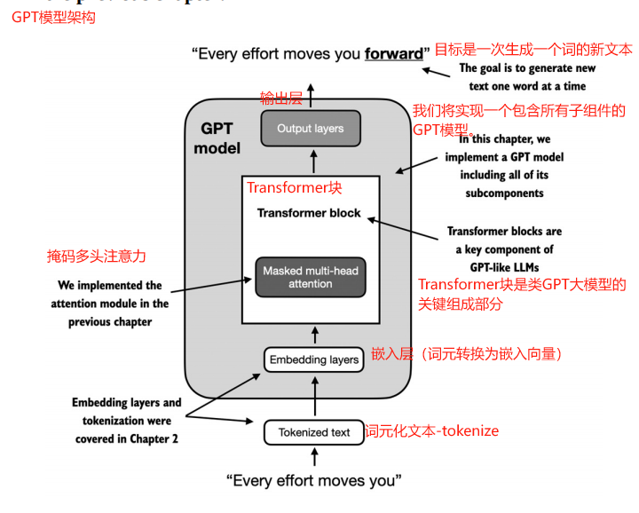
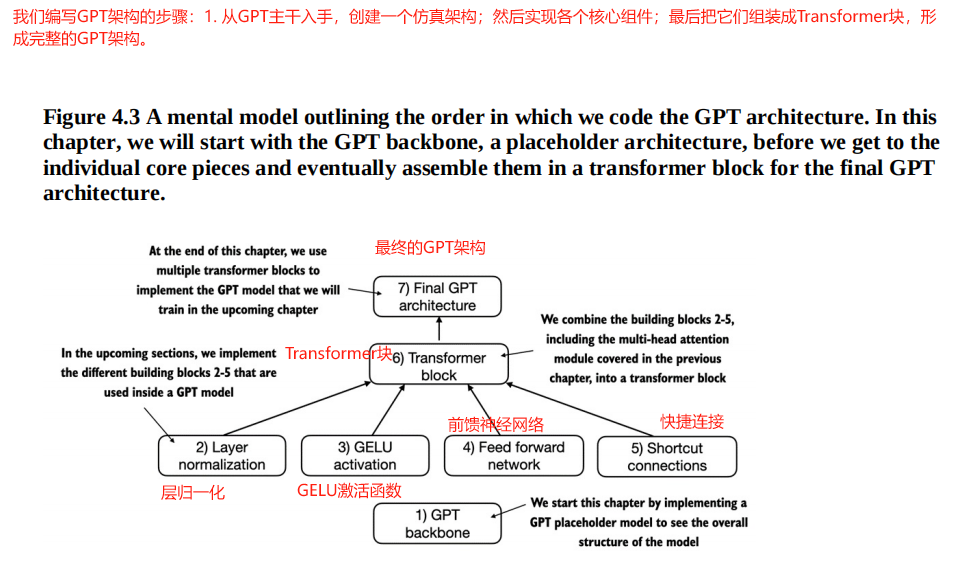
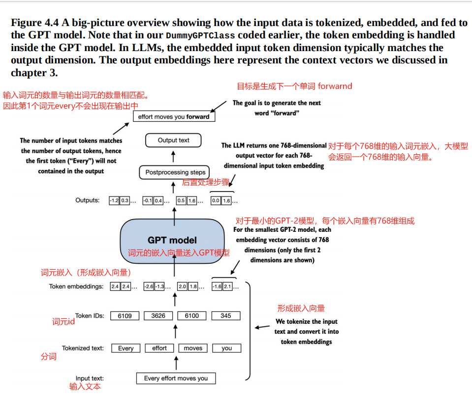
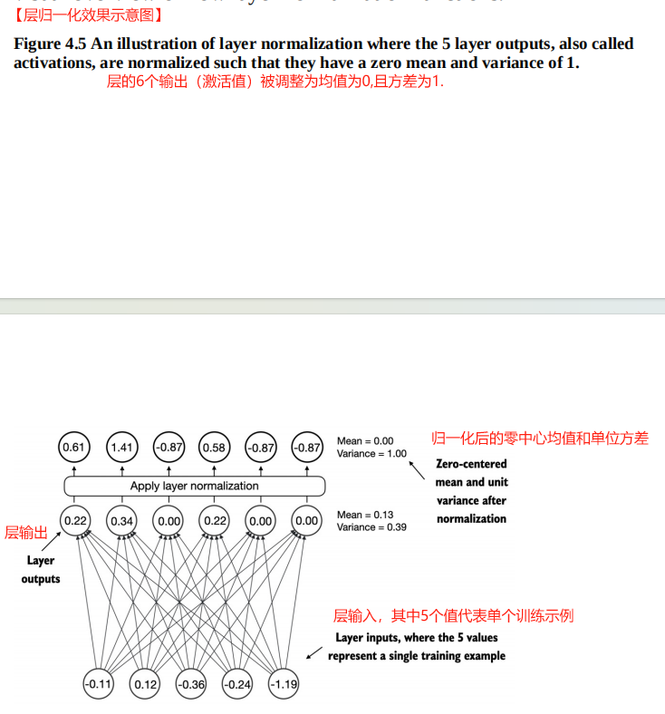

[TOC]

# 【README】

本文总结自<font color="#ff0000">《从零构建大模型》</font>，非常棒的一本书，墙裂推荐； 

- [ ] 本章中，我们将实现一个包含所有子组件的GPT模型；

- [ ] Transformer是类GPT大语言模型的关键组成部分；

- [ ] <font color=red>图4-3展示了编写GPT架构的顺序及GPT核心组件</font>，如下：

  1. GPT主干；
  2. 层归一化；
  3. GELU激活函数；
  4. 前馈神经网络；
  5. 快捷连接；

  上述核心组件组装成Transformer块，最终形成完整的GPT架构。

本文代码参见： [https://github.com/TomJourney/build_a_llm_from_scratch](https://github.com/TomJourney/build_a_llm_from_scratch)

---

# 【1】构建一个大语言模型架构

1. 大语言模型，比如GPT（生成式预训练Transformer），指一次生成一个词（或词元）的大型深度神经网络架构，如图4-2所示。




---

1. 可以通过以下python字典指定小型GPT-2模型的配置。

```python
print("\n\n===使用python字典指定小型GPT-2模型的配置")
GPT_CONFIG_124M = {
    "vocab_size": 50257,
    "context_length": 1024,
    "emb_dim": 768,
    "n_heads": 12,
    "n_layers": 12,
    "drop_rate": 0.1,
    "qkv_bias": False
}
```

【代码解说】

- vocab_size：词汇表大小（由50257个单词组成的词汇表）；
- context_length：模型通过位置嵌入能够处理的最大输入词元数量； 
- emb_dim：嵌入维度大小，可以将每个词元转换为768维的向量；
- n_heads：表示多头注意力机制中头的数量；
- n_layers：Transformer块的数量；
- drop_rate：dropout机制的强度（0.1表示有10%的隐藏单元被丢弃），防止过拟合； 
- qkv_bias：是否在多头注意力机制的线性层中添加一个偏置向量，用于查询，键和值的计算；

2. 通过该配置，我们将实现一个GPT仿真架构-DummyGPTModel，如图4-3所示。




【图解】

<font color=red>图4-3展示了编写GPT架构的顺序及GPT核心组件</font>，如下：

1. GPT主干；
2. 层归一化；
3. GELU激活函数；
4. 前馈神经网络；
5. 快捷连接；

上述核心组件组装成Transformer块，最终形成完整的GPT架构。

---

## 【1.1】GPT主干

【test0401_p86_gpt_model.py】GPT模型架构类模拟实现 

```python
import torch
import torch.nn as nn

# 模拟GPT模型
class DummyGPTModel(nn.Module):
    def __init__(self, cfg):
        super().__init__()
        self.tok_emb = nn.Embedding(cfg["vocab_size"], cfg["emb_dim"])
        self.pos_emb = nn.Embedding(cfg["context_length"], cfg["emb_dim"])
        self.drop_emb = nn.Dropout(cfg["drop_rate"])
        self.trf_blocks = nn.Sequential(
            *[DummyTransformerBlock(cfg)
              for _ in range(cfg["n_layers"])
              ]
        )
        self.final_norm = DummyLayerNorm(cfg["emb_dim"])
        self.out_head = nn.Linear(
            cfg["emb_dim"], cfg["vocab_size"], bias=False
        )

    def forward(self, in_idx):
        batch_size, seq_len = in_idx.shape
        tok_embeds = self.tok_emb(in_idx)
        pos_embeds = self.pos_emb(
            torch.arange(seq_len, device=in_idx.device)
        )
        x = tok_embeds + pos_embeds
        x = self.drop_emb(x)
        x = self.trf_blocks(x)
        x = self.final_norm(x)
        logits = self.out_head(x)
        return logits

# 模拟Transformer块
class DummyTransformerBlock(nn.Module):
    def __init__(self, cfg):
        super().__init__()

    def forward(self, x):
        return x

# 模拟层归一化
class DummyLayerNorm(nn.Module):
    def __init__(self, normalized_shape, eps=1e-5):
        super().__init__()

    def forward(self, x):
        return x

```

---

### 【1.1.1】GPT模型中输入数据的处理流程

GPT模型中，输入数据的处理流程包括分词，嵌入，并上送到GPT模型中，如图4-4所示。



下面使用第2章(chapter2)介绍的tiktoken分词器对包含两个文本的批次进行分词处理，并上送给模拟GPT模型处理。

【test0401_p86_gpt_model_main.py】模拟GPT主干-测试用例

```python
import tiktoken
import torch

from src.chapter04.test0401_p86_gpt_model import DummyGPTModel

print("\n\n===使用python字典指定小型GPT-2模型的配置")
GPT_CONFIG_124M = {
    "vocab_size": 50257,
    "context_length": 1024,
    "emb_dim": 768,
    "n_heads": 12,
    "n_layers": 12,
    "drop_rate": 0.1,
    "qkv_bias": False
}

print("\n=== 使用第2章介绍的tiktoken分词器对包含两个文本输入的批次进行分词处理， 以供GPT模型使用")
tokenizer = tiktoken.get_encoding("gpt2")
input_batch = []
txt1 = "Every effort moves you"
txt2 = "Every day holds a"

print("\n=== tiktoken分词器分词结果")
print("tokenizer.encode(txt1) = ", tokenizer.encode(txt1))
print("tokenizer.encode(txt2) = ", tokenizer.encode(txt2))
# tokenizer.encode(txt1) =  [6109, 3626, 6100, 345]
# tokenizer.encode(txt2) =  [6109, 1110, 6622, 257]

input_batch.append(torch.tensor(tokenizer.encode(txt1)))
input_batch.append(torch.tensor(tokenizer.encode(txt2)))
input_batch = torch.stack(input_batch, dim=0)
print("\ninput_batch = ", input_batch)
# input_batch =  tensor([[6109, 3626, 6100,  345],
#         [6109, 1110, 6622,  257]])

# 接下来， 初始化一个参数为1.24亿的 DummyGPTModel 实例，并将分词后的批次数据传递给DummyGPTModel得到logits
# (logits：模型输出的原始预测值，尚未经过softmax等归一化处理)
print("\n\n=== 初始化一个参数为1.24亿的 DummyGPTModel 实例，并将分词后的批次数据传递给DummyGPTModel 得到logits")
torch.manual_seed(123)
dummy_gpt_model = DummyGPTModel(GPT_CONFIG_124M)
logits = dummy_gpt_model(input_batch)
print("\n=== logits.shape = ", logits.shape)
print("\n=== logits = ", logits)
# === logits.shape =  torch.Size([2, 4, 50257])
# === logits =  tensor([[[-1.2034,  0.3201, -0.7130,  ..., -1.5548, -0.2390, -0.4667],
#          [-0.1192,  0.4539, -0.4432,  ...,  0.2392,  1.3469,  1.2430],
#          [ 0.5307,  1.6720, -0.4695,  ...,  1.1966,  0.0111,  0.5835],
#          [ 0.0139,  1.6754, -0.3388,  ...,  1.1586, -0.0435, -1.0400]],
#
#         [[-1.0908,  0.1798, -0.9484,  ..., -1.6047,  0.2439, -0.4530],
#          [-0.7860,  0.5581, -0.0610,  ...,  0.4835, -0.0077,  1.6621],
#          [ 0.3567,  1.2698, -0.6398,  ..., -0.0162, -0.1296,  0.3717],
#          [-0.2407, -0.7349, -0.5102,  ...,  2.0057, -0.3694,  0.1814]]],
#        grad_fn=<UnsafeViewBackward0>)

```

---

# 【2】使用层归一化进行归一化激活 

## 【2.1】层归一化主要思想 

背景：由于梯度消失或梯度爆炸等问题，使得神经网络训练过程中难以找到一组最小化损失函数的参数（权重）；即神经网络难以学习数据中的潜在模式，从而无法进行准确预测或决策；

- 解决方法是使用层归一化；

层归一化主要思想： 调整神经网络层的激活（输出），使其均值为0且方差为1。这种调整有助于加速权重的有效收敛，并确保训练过程的一致性和可靠性；

层归一化效果图，如图4-5所示。



<br>

---

## 【2.2】层归一化代码实现

层归一化代码实现，包括3个步骤：

1. 步骤1： 创建2个训练样本，每个样本包含5个维度或特征
2. 步骤2： 上述编写的神经网络层包括一个线性层和一个非线性激活函数ReLU（修正线性单元）， ReLU是神经网络中的一种标准激活函数
3. 步骤3：层归一化操作：具体方法是减少均值，并将结果除以方差的平方根（即标准差）

为提高可读性， 通过将sci_mode设置为False来关闭科学计数法，从而在打印张量值时避免使用科学计数法；

【test0402_p90_layer_norm.py】层归一化代码实现 

```python
import torch
import torch.nn as nn

print("\n\n=== 层归一化")
torch.manual_seed(123)
# 步骤1： 创建2个训练样本，每个样本包含5个维度或特征
batch_example = torch.randn(2, 5)
layer = nn.Sequential(nn.Linear(5, 6), nn.ReLU())
layer_out = layer(batch_example)
print("层处理（输出）结果-layer_out = ", layer_out)

# 步骤2： 上述编写的神经网络层包括一个线性层和一个非线性激活函数ReLU（修正线性单元）， ReLU是神经网络中的一种标准激活函数
print("\n=== 层归一化前，检查层处理结果的均值与方差")
layer_out_mean = layer_out.layer_norm_result_mean(dim=-1, keepdim=True)
layer_out_variance = layer_out.var(dim=-1, keepdim=True)
print("均值mean = ", layer_out_mean, "\n方差variance = ", layer_out_variance)

# 步骤3：层归一化操作：具体方法是减少均值，并将结果除以方差的平方根（即标准差）
print("\n===步骤3：层归一化操作：具体方法是减少均值，并将结果除以方差的平方根（即标准差）")
layer_out_norm = (layer_out - layer_out_mean) / torch.sqrt(layer_out_variance)
layer_out_norm_mean = layer_out_norm.layer_norm_result_mean(dim=-1, keepdim=True)
layer_out_norm_variance = layer_out_norm.var(dim=-1, keepdim=True)
print("层归一化结果 layer_out_norm = ", layer_out_norm)
print("层归一化结果均值 layer_out_norm_mean = ", layer_out_norm_mean)
print("层归一化结果方差 layer_out_norm_variance = ", layer_out_norm_variance)

# 为提高可读性， 通过将sci_mode设置为False来关闭科学计数法，从而在打印张量值时避免使用科学计数法
print("\n\n=== 通过将sci_mode设置为False来关闭科学计数法")
torch.set_printoptions(sci_mode=False)
print("层归一化结果均值 layer_out_norm_mean = ", layer_out_norm_mean)
print("层归一化结果方差 layer_out_norm_variance = ", layer_out_norm_variance) 
```

---

### 【2.2.1】层归一化步骤封装成Pytorch模块

【test0402_p90_layer_norm_module.py】层归一化Pytorch模块 

```python
import torch
import torch.nn as nn

# 层归一化类
class LayerNorm(nn.Module):
    def __init__(self, emb_dim):
        super().__init__()
        self.eps = 1e-5
        self.scale = nn.Parameter(torch.ones(emb_dim))
        self.shift = nn.Parameter(torch.zeros(emb_dim))

    def forward(self, x):
        mean = x.mean(dim=-1, keepdim=True)
        variance = x.var(dim=-1, keepdim=True, unbiased=False)
        norm_x = (x - mean) / torch.sqrt(variance + self.eps)
        return self.scale * norm_x + self.shift

```

---

【test0402_p90_layer_norm_module_main.py】层归一化pytorch模块测试案例

```python
import torch

from src.chapter04.test0402_p90_layer_norm_module import LayerNorm

print("\n\n=== 层归一化")
torch.manual_seed(123)
# 步骤1： 创建2个训练样本，每个样本包含5个维度或特征
batch_example = torch.randn(2, 5)

layer_norm = LayerNorm(emb_dim=5)
layer_norm_result = layer_norm(batch_example)

layer_norm_result_mean = layer_norm_result.mean(dim=-1, keepdim=True)
layer_norm_result_variance = layer_norm_result.var(dim=-1, keepdim=True, unbiased=False)
# 关闭科学计数法
torch.set_printoptions(sci_mode=False)
print("层归一化结果均值mean = ", layer_norm_result_mean)
print("层归一化结果方差variance = ", layer_norm_result_variance)
# 层归一化结果均值mean =  tensor([[    -0.0000],
#         [     0.0000]], grad_fn=<MeanBackward1>)
# 层归一化结果方差variance =  tensor([[1.0000],
#         [1.0000]], grad_fn=<VarBackward0>)
```

<br>

---

# 【3】实现具有GELU激活函数的前馈神经网络