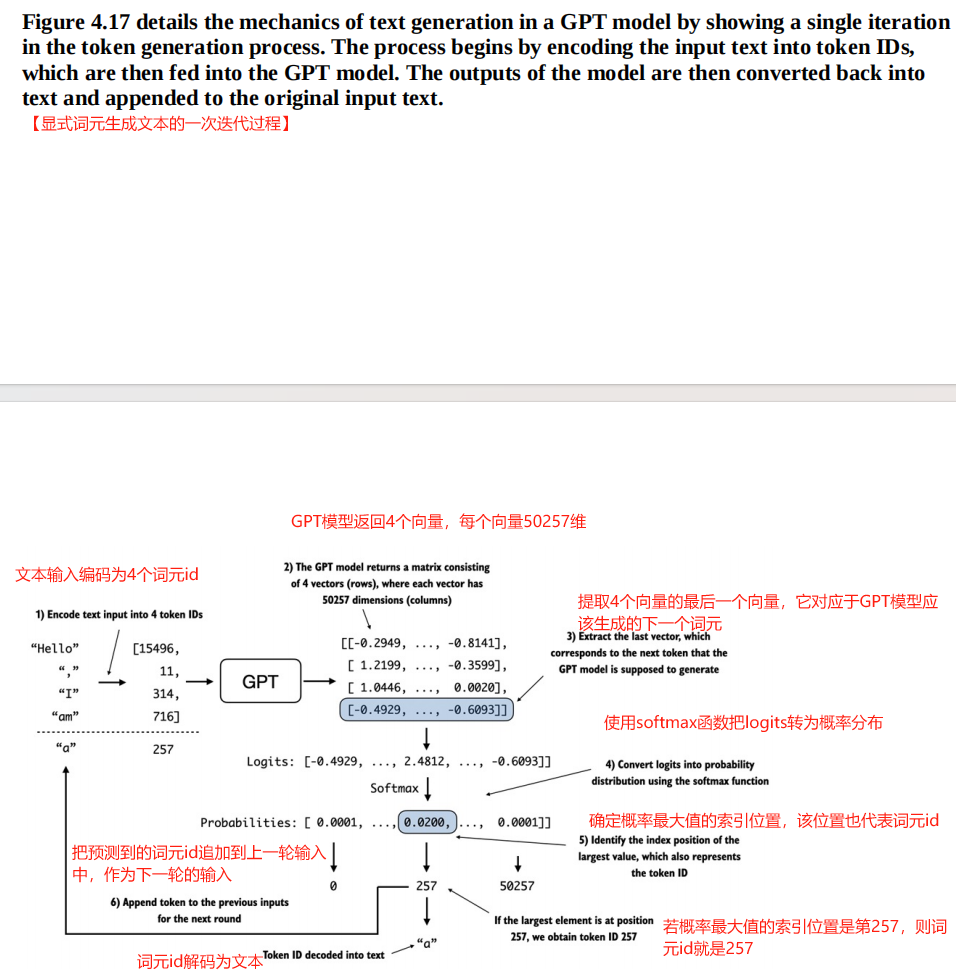

[TOC]

# 【README】

本文总结自<font color="#ff0000">《从零构建大模型》</font>，非常棒的一本书，墙裂推荐； 

- [ ] 本章中，我们将实现一个包含所有子组件的GPT模型；

- [ ] Transformer是类GPT大语言模型的关键组成部分；

- [ ] <font color=red>图4-3展示了编写GPT架构的顺序及GPT核心组件</font>，如下：

  1. GPT主干；
  2. 层归一化；
  3. GELU激活函数；
  4. 前馈神经网络；
  5. 快捷连接；

  上述核心组件组装成Transformer块，最终形成完整的GPT架构。

- [ ] <font color=red>GPT模型的数据流</font>：
  1. 词元化文本（分词）；
  2. 词元嵌入层（词元id嵌入，形成嵌入向量）；
  3. 使用位置嵌入进行增强；
  4. dropout处理；
  5. 上送给Transformer块（层归一化+掩码多头注意力+GELU激活函数+前馈神经网络+快捷连接），重复使用多次（如参数量为124亿的GPT-2模型，重复使用12次Transformer块）；
  6. Transformer块的输出会经过最后一层的层归一化处理；
  7. 线性输出层把层归一化后的Transformer块的结果映射到一个高维空间，以预测序列中的下一个词元；

- [ ] <font color=red>GPT模型根据输入文本生成文本（下一词元）步骤</font>： 
  1. 文本输入编码为词元id（分词与词元化）
  2. 词元id上送给GPT模型，GPT返回4个向量，每个向量50257个维度；
  3. 提取4个向量中的最后一个，对应GPT模型应该生成的下一个词元
  4. 使用softmax函数把logits转为概率分布；
  5. 选择概率值最大的索引位置，该位置代表词元id；
  6. 把词元id解码为文本；
  7. 把词元id追加到上一轮输入中，以便进行下一轮输入；

本文代码参见： [https://github.com/TomJourney/build_a_llm_from_scratch](https://github.com/TomJourney/build_a_llm_from_scratch)

---

# 【1】构建一个大语言模型架构

1. 大语言模型，比如GPT（生成式预训练Transformer），指一次生成一个词（或词元）的大型深度神经网络架构，如图4-2所示。


---

1. 可以通过以下python字典指定小型GPT-2模型的配置。

```python
print("\n\n===使用python字典指定小型GPT-2模型的配置")
GPT_CONFIG_124M = {
    "vocab_size": 50257,
    "context_length": 1024,
    "emb_dim": 768,
    "n_heads": 12,
    "n_layers": 12,
    "drop_rate": 0.1,
    "qkv_bias": False
}
```

【代码解说】

- vocab_size：词汇表大小（由50257个单词组成的词汇表）；
- context_length：模型通过位置嵌入能够处理的最大输入词元数量； 
- emb_dim：嵌入维度大小，可以将每个词元转换为768维的向量；
- n_heads：表示多头注意力机制中头的数量；
- n_layers：Transformer块的数量；
- drop_rate：dropout机制的强度（0.1表示有10%的隐藏单元被丢弃），防止过拟合； 
- qkv_bias：是否在多头注意力机制的线性层中添加一个偏置向量，用于查询，键和值的计算；

2. 通过该配置，我们将实现一个GPT仿真架构-DummyGPTModel，如图4-3所示。


【图解】

<font color=red>图4-3展示了编写GPT架构的顺序及GPT核心组件</font>，如下：

1. GPT主干；
2. 层归一化；
3. GELU激活函数；
4. 前馈神经网络；
5. 快捷连接；

上述核心组件组装成Transformer块，最终形成完整的GPT架构。

---

## 【1.1】GPT主干

【test0401_p86_gpt_model.py】GPT模型架构类模拟实现 

```python
import torch
import torch.nn as nn

# 模拟GPT模型
class DummyGPTModel(nn.Module):
    def __init__(self, cfg):
        super().__init__()
        self.tok_emb = nn.Embedding(cfg["vocab_size"], cfg["emb_dim"])
        self.pos_emb = nn.Embedding(cfg["context_length"], cfg["emb_dim"])
        self.drop_emb = nn.Dropout(cfg["drop_rate"])
        self.trf_blocks = nn.Sequential(
            *[DummyTransformerBlock(cfg)
              for _ in range(cfg["n_layers"])
              ]
        )
        self.final_norm = DummyLayerNorm(cfg["emb_dim"])
        self.out_head = nn.Linear(
            cfg["emb_dim"], cfg["vocab_size"], bias=False
        )

    def forward(self, in_idx):
        batch_size, seq_len = in_idx.shape
        tok_embeds = self.tok_emb(in_idx)
        pos_embeds = self.pos_emb(
            torch.arange(seq_len, device=in_idx.device)
        )
        x = tok_embeds + pos_embeds
        x = self.drop_emb(x)
        x = self.trf_blocks(x)
        x = self.final_norm(x)
        logits = self.out_head(x)
        return logits

# 模拟Transformer块
class DummyTransformerBlock(nn.Module):
    def __init__(self, cfg):
        super().__init__()

    def forward(self, x):
        return x

# 模拟层归一化
class DummyLayerNorm(nn.Module):
    def __init__(self, normalized_shape, eps=1e-5):
        super().__init__()

    def forward(self, x):
        return x

```

---

### 【1.1.1】GPT模型中输入数据的处理流程

GPT模型中，输入数据的处理流程包括分词，嵌入，并上送到GPT模型中，如图4-4所示。


下面使用第2章(chapter2)介绍的tiktoken分词器对包含两个文本的批次进行分词处理，并上送给模拟GPT模型处理。

【test0401_p86_gpt_model_main.py】模拟GPT主干-测试用例

```python
import tiktoken
import torch

from src.chapter04.test0401_p86_gpt_model import DummyGPTModel

print("\n\n===使用python字典指定小型GPT-2模型的配置")
GPT_CONFIG_124M = {
    "vocab_size": 50257,
    "context_length": 1024,
    "emb_dim": 768,
    "n_heads": 12,
    "n_layers": 12,
    "drop_rate": 0.1,
    "qkv_bias": False
}

print("\n=== 使用第2章介绍的tiktoken分词器对包含两个文本输入的批次进行分词处理， 以供GPT模型使用")
tokenizer = tiktoken.get_encoding("gpt2")
input_batch = []
txt1 = "Every effort moves you"
txt2 = "Every day holds a"

print("\n=== tiktoken分词器分词结果")
print("tokenizer.encode(txt1) = ", tokenizer.encode(txt1))
print("tokenizer.encode(txt2) = ", tokenizer.encode(txt2))
# tokenizer.encode(txt1) =  [6109, 3626, 6100, 345]
# tokenizer.encode(txt2) =  [6109, 1110, 6622, 257]

input_batch.append(torch.tensor(tokenizer.encode(txt1)))
input_batch.append(torch.tensor(tokenizer.encode(txt2)))
input_batch = torch.stack(input_batch, dim=0)
print("\ninput_batch = ", input_batch)
# input_batch =  tensor([[6109, 3626, 6100,  345],
#         [6109, 1110, 6622,  257]])

# 接下来， 初始化一个参数为1.24亿的 DummyGPTModel 实例，并将分词后的批次数据传递给DummyGPTModel得到logits
# (logits：模型输出的原始预测值，尚未经过softmax等归一化处理)
print("\n\n=== 初始化一个参数为1.24亿的 DummyGPTModel 实例，并将分词后的批次数据传递给DummyGPTModel 得到logits")
torch.manual_seed(123)
dummy_gpt_model = DummyGPTModel(GPT_CONFIG_124M)
logits = dummy_gpt_model(input_batch)
print("\n=== logits.shape = ", logits.shape)
print("\n=== logits = ", logits)
# === logits.shape =  torch.Size([2, 4, 50257])
# === logits =  tensor([[[-1.2034,  0.3201, -0.7130,  ..., -1.5548, -0.2390, -0.4667],
#          [-0.1192,  0.4539, -0.4432,  ...,  0.2392,  1.3469,  1.2430],
#          [ 0.5307,  1.6720, -0.4695,  ...,  1.1966,  0.0111,  0.5835],
#          [ 0.0139,  1.6754, -0.3388,  ...,  1.1586, -0.0435, -1.0400]],
#
#         [[-1.0908,  0.1798, -0.9484,  ..., -1.6047,  0.2439, -0.4530],
#          [-0.7860,  0.5581, -0.0610,  ...,  0.4835, -0.0077,  1.6621],
#          [ 0.3567,  1.2698, -0.6398,  ..., -0.0162, -0.1296,  0.3717],
#          [-0.2407, -0.7349, -0.5102,  ...,  2.0057, -0.3694,  0.1814]]],
#        grad_fn=<UnsafeViewBackward0>)

```

---

# 【2】使用层归一化进行归一化激活 

## 【2.1】层归一化主要思想 

背景：由于梯度消失或梯度爆炸等问题，使得神经网络训练过程中难以找到一组最小化损失函数的参数（权重）；即神经网络难以学习数据中的潜在模式，从而无法进行准确预测或决策；

- 解决方法是使用层归一化；

定义：层归一化（Layer Normalization, LN）是一种神经网络中的**标准化技术**，它对**单个样本的所有特征**进行归一化（沿特征维度），使得每个样本的特征均值为0、方差为1。

- 层归一化主要思想： 调整神经网络层的激活（输出），使其均值为0且方差为1。这种调整有助于加速权重的有效收敛，并确保训练过程的一致性和可靠性；

层归一化效果图，如图4-5所示。


<br>

---

## 【2.2】层归一化代码实现

层归一化代码实现，包括3个步骤：

1. 步骤1： 创建2个训练样本，每个样本包含5个维度或特征
2. 步骤2： 上述编写的神经网络层包括一个线性层和一个非线性激活函数ReLU（修正线性单元）， ReLU是神经网络中的一种标准激活函数
3. 步骤3：层归一化操作：具体方法是减少均值，并将结果除以方差的平方根（即标准差）

为提高可读性， 通过将sci_mode设置为False来关闭科学计数法，从而在打印张量值时避免使用科学计数法；

【test0402_p90_layer_norm.py】层归一化代码实现 

```python
import torch
import torch.nn as nn

print("\n\n=== 层归一化")
torch.manual_seed(123)
# 步骤1： 创建2个训练样本，每个样本包含5个维度或特征
batch_example = torch.randn(2, 5)
layer = nn.Sequential(nn.Linear(5, 6), nn.ReLU())
layer_out = layer(batch_example)
print("层处理（输出）结果-layer_out = ", layer_out)
# 层处理（输出）结果-layer_out =  tensor([[0.2260, 0.3470, 0.0000, 0.2216, 0.0000, 0.0000],
#         [0.2133, 0.2394, 0.0000, 0.5198, 0.3297, 0.0000]],
#        grad_fn=<ReluBackward0>)

# 步骤2： 上述编写的神经网络层包括一个线性层和一个非线性激活函数ReLU（修正线性单元）， ReLU是神经网络中的一种标准激活函数
print("\n=== 层归一化前，检查层处理结果的均值与方差")
layer_out_mean = layer_out.mean(dim=-1, keepdim=True)
layer_out_variance = layer_out.var(dim=-1, keepdim=True)
print("均值mean = ", layer_out_mean, "\n方差variance = ", layer_out_variance)
# 均值mean =  tensor([[0.1324],
#         [0.2170]], grad_fn=<MeanBackward1>)
# 方差variance =  tensor([[0.0231],
#         [0.0398]], grad_fn=<VarBackward0>)

# 步骤3：层归一化操作：具体方法是减少均值，并将结果除以方差的平方根（即标准差）
print("\n===步骤3：层归一化操作：具体方法是减少均值，并将结果除以方差的平方根（即标准差）")
layer_out_norm = (layer_out - layer_out_mean) / torch.sqrt(layer_out_variance)
layer_out_norm_mean = layer_out_norm.mean(dim=-1, keepdim=True)
layer_out_norm_variance = layer_out_norm.var(dim=-1, keepdim=True)
print("层归一化结果 layer_out_norm = ", layer_out_norm)
print("层归一化结果均值 layer_out_norm_mean = ", layer_out_norm_mean)
print("层归一化结果方差 layer_out_norm_variance = ", layer_out_norm_variance)
# 层归一化结果 layer_out_norm =  tensor([[ 0.6159,  1.4126, -0.8719,  0.5872, -0.8719, -0.8719],
#         [-0.0189,  0.1121, -1.0876,  1.5173,  0.5647, -1.0876]],
#        grad_fn=<DivBackward0>)
# 层归一化结果均值 layer_out_norm_mean =  tensor([[9.9341e-09],
#         [0.0000e+00]], grad_fn=<MeanBackward1>)
# 层归一化结果方差 layer_out_norm_variance =  tensor([[1.0000],
#         [1.0000]], grad_fn=<VarBackward0>)

# 为提高可读性， 通过将sci_mode设置为False来关闭科学计数法，从而在打印张量值时避免使用科学计数法
print("\n\n=== 通过将sci_mode设置为False来关闭科学计数法")
torch.set_printoptions(sci_mode=False)
print("层归一化结果均值 layer_out_norm_mean = ", layer_out_norm_mean)
print("层归一化结果方差 layer_out_norm_variance = ", layer_out_norm_variance)
# 层归一化结果均值 layer_out_norm_mean =  tensor([[    0.0000],
#         [    0.0000]], grad_fn=<MeanBackward1>)
# 层归一化结果方差 layer_out_norm_variance =  tensor([[1.0000],
#         [1.0000]], grad_fn=<VarBackward0>)

```

---

### 【2.2.1】层归一化步骤封装成Pytorch模块

【test0402_p90_layer_norm_module.py】层归一化Pytorch模块 

```python
import torch
import torch.nn as nn

# 层归一化类
class LayerNorm(nn.Module):
    def __init__(self, emb_dim):
        super().__init__()
        self.eps = 1e-5
        self.scale = nn.Parameter(torch.ones(emb_dim))
        self.shift = nn.Parameter(torch.zeros(emb_dim))

    def forward(self, x):
        mean = x.mean(dim=-1, keepdim=True)
        variance = x.var(dim=-1, keepdim=True, unbiased=False)
        norm_x = (x - mean) / torch.sqrt(variance + self.eps)
        return self.scale * norm_x + self.shift

```

---

【test0402_p90_layer_norm_module_main.py】层归一化pytorch模块测试案例

```python
import torch

from src.chapter04.test0402_p90_layer_norm_module import LayerNorm

print("\n\n=== 层归一化")
torch.manual_seed(123)
# 步骤1： 创建2个训练样本，每个样本包含5个维度或特征
batch_example = torch.randn(2, 5)

layer_norm = LayerNorm(emb_dim=5)
layer_norm_result = layer_norm(batch_example)

layer_norm_result_mean = layer_norm_result.mean(dim=-1, keepdim=True)
layer_norm_result_variance = layer_norm_result.var(dim=-1, keepdim=True, unbiased=False)
# 关闭科学计数法
torch.set_printoptions(sci_mode=False)
print("层归一化结果均值mean = ", layer_norm_result_mean)
print("层归一化结果方差variance = ", layer_norm_result_variance)
# 层归一化结果均值mean =  tensor([[    -0.0000],
#         [     0.0000]], grad_fn=<MeanBackward1>)
# 层归一化结果方差variance =  tensor([[1.0000],
#         [1.0000]], grad_fn=<VarBackward0>)
```

<br>

---

# 【3】实现具有GELU激活函数的前馈神经网络

## 【3.1】激活函数

激活函数定义：（Activation Function）是神经网络中的非线性变换函数，它决定了神经元的输出信号是否应该被激活（即“触发”），并传递给下一层。激活函数是神经网络能够学习复杂模式的关键组件。

- 作用：<font color=red>激活函数使神经网络能够拟合非线性函数 </font>；

GELU是一种激活函数，代码实现如下。


【test0403_p95_gelu_module.py】

```python
import torch
import torch.nn as nn

# GELU激活函数的实现
class GELU(nn.Module):
    def __init__(self):
        super().__init__()

    def forward(self, x):
        return 0.5 * x * (1 + torch.tanh(
            torch.sqrt(torch.tensor(2.0 / torch.pi)) *
            (x + 0.044715 * torch.pow(x, 3))
        ))
```

---

### 【3.1.1】激活函数GELU与ReLU图像对比

【test0403_p95_gelu_relu_compare.py】激活函数GELU与ReLU图像对比

```python
import matplotlib
matplotlib.use('TkAgg')
import matplotlib.pyplot as plt
from src.chapter04.test0403_p95_gelu_module import GELU
import torch.nn as nn
import torch

print("\n\n=== 比较GELU与ReLU函数的图像")
gelu, relu = GELU(), nn.ReLU()

# 在-3和3之间创建100个样本数据点
x = torch.linspace(-3, 3, 100)
y_gelu, y_relu = gelu(x), relu(x)
plt.figure(figsize=(8, 3))
for i, (y, label) in enumerate(zip([y_gelu, y_relu], ["GELU", "ReLU"]), 1):
    plt.subplot(1, 2, i)
    plt.plot(x, y)
    plt.title(f"{label} activation function")
    plt.xlabel("x")
    plt.ylabel(f"{label}(x)")
    plt.grid(True)
plt.tight_layout()
plt.show()

```

【输出的对比结果】


---

### 【3.1.2】基于GELU实现小型神经网络模块FeedForward

【test0403_p96_feed_forward_module.py】 基于GELU实现小型神经网络模块FeedForward

```python
from torch import nn
import torch
import torch.nn as nn
from src.chapter04.test0403_p95_gelu_module import GELU

# 前馈神经网络模块
class FeedForward(nn.Module):
    def __init__(self, cfg):
        super().__init__()
        self.layers = nn.Sequential(
            nn.Linear(cfg["emb_dim"], 4 * cfg["emb_dim"]),
            GELU(),
            nn.Linear(4 * cfg["emb_dim"], cfg["emb_dim"])
        )

    def forward(self, x):
        return self.layers(x)

```

【代码解说】

FeedForward模块是一个小型神经网络，由两个线性层与一个GELU激活函数组成。

图4-9展示了当输入词元被传给这个小型前馈神经网络时，嵌入维度是如何被操作的。


---

【前馈神经网络-测试案例】test0403_p96_feed_forward_module_main.py

```python
import torch
from src.chapter04.test0403_p96_feed_forward_module import FeedForward

print("\n\n===使用python字典指定小型GPT-2模型的配置")
GPT_CONFIG_124M = {
    "vocab_size": 50257,
    "context_length": 1024,
    "emb_dim": 768,
    "n_heads": 12,
    "n_layers": 12,
    "drop_rate": 0.1,
    "qkv_bias": False
}

feed_forward = FeedForward(GPT_CONFIG_124M)
# 创建批次维度为2的样本输入
x = torch.rand(2, 3, 768)
# 通过前馈神经网络处理输入样本
feed_forward_result = feed_forward(x)
print("\n\n===feed_forward_result.shape = ", feed_forward_result.shape)
# ===feed_forward_result.shape =  torch.Size([2, 3, 768])
print("\nfeed_forward_result = ", feed_forward_result)
# ffeed_forward_result =  tensor([[[-0.1190,  0.0430, -0.1174,  ..., -0.0706, -0.0469,  0.1185],
#          [-0.0381, -0.0049, -0.0023,  ..., -0.0143, -0.0321,  0.0842],
#          [ 0.0006,  0.0920, -0.0800,  ..., -0.0872, -0.0275,  0.1451]],
#
#         [[ 0.0026,  0.0888, -0.1051,  ...,  0.0077, -0.0346,  0.0587],
#          [-0.0164,  0.0680, -0.0986,  ..., -0.1227, -0.0268, -0.0614],
#          [ 0.0482,  0.0467, -0.1651,  ...,  0.0179,  0.0443,  0.0024]]],
#        grad_fn=<ViewBackward0>)
```

---

## 【3.2】前馈神经网络eedForward模块对于提升模型性能非常关键

前馈神经网络eedForward模块在提升模型学习和泛化能力非常关键。

虽然该模块的输入与输出维度保持一致，但它通过第1层线性层将嵌入维度扩展到了更高维度，如图4-10所示。

 ---

<br>

---

# 【4】添加快捷连接(shortcut connection)

快捷连接定义：快捷连接（Shortcut Connection）是神经网络中的一种跨层连接机制，它允许数据跳过某些层直接传递到后面的层。最经典的实现是残差连接（Residual Connection），由ResNet（2015）提出，解决了深层网络的梯度消失和退化问题。

- 作用之一：解决梯度消失/爆炸问题

【补充】梯度消失与爆炸问题

- 梯度消失：梯度消失是指神经网络在反向传播过程中，梯度（即损失函数对参数的偏导数）随着层数的增加指数级减小，导致深层网络的权重几乎无法更新（梯度趋近于0），模型难以训练。
- 梯度爆炸：梯度爆炸是指神经网络在**反向传播**过程中，梯度（损失函数对参数的偏导数）随着层数的增加**指数级增大**，导致权重更新幅度过大，模型无法收敛甚至出现数值溢出（如 `NaN`）

---

代码演示：前向传播过程中添加快捷连接

【test0404_p99_shortcut_connection_module.py】基于快捷连接定义神经网络

```python
import torch.nn as nn

from src.chapter04.test0403_p95_gelu_module import GELU


class ExampleDeepNeuralNetwork(nn.Module):
    def __init__(self, layer_sizes, use_shortcut):
        super().__init__()
        self.use_shortcut = use_shortcut
        # 定义具有5层的深度神经网络，每层由一个线性层和一个GELU激活函数组成
        self.layers = nn.ModuleList([
            nn.Sequential(nn.Linear(layer_sizes[0], layer_sizes[1]), GELU()),
            nn.Sequential(nn.Linear(layer_sizes[1], layer_sizes[2]), GELU()),
            nn.Sequential(nn.Linear(layer_sizes[2], layer_sizes[3]), GELU()),
            nn.Sequential(nn.Linear(layer_sizes[3], layer_sizes[4]), GELU()),
            nn.Sequential(nn.Linear(layer_sizes[4], layer_sizes[5]), GELU())
        ])

    def forward(self, x):
        for layer in self.layers:
            # 计算当前层的输出
            layer_output = layer(x)
            # 检查是否可以使用快捷连接
            if self.use_shortcut and x.shape == layer_output.shape:
                x = x + layer_output
            else:
                x = layer_output
        return x

```

【代码解说】

定义具有5层的深度神经网络，每层由一个线性层和一个GELU激活函数组成。

在前向传播过程中， 通过各层迭代传递输入，如图4-12所示。


---

### 【4.1】没有快捷连接与基于快捷连接的神经网络梯度对比

【test0404_p99_shortcut_connection_module_main.py】没有快捷连接与基于快捷连接的神经网络梯度对比

```python
import torch
import torch.nn as nn
from src.chapter04.test0404_p99_shortcut_connection_module import ExampleDeepNeuralNetwork

layer_sizes = [3, 3, 3, 3, 3, 1]
sample_input = torch.tensor([[1., 0., -1.]])
torch.manual_seed(123)
model_without_shortcut = ExampleDeepNeuralNetwork(layer_sizes, use_shortcut=False)

# 定义在模型的反向传播过程中计算梯度的函数
def print_gradient(model, x):
    # 前向传播
    output = model(x)
    target = torch.tensor([[0.]])

    # 计算损失
    loss = nn.MSELoss()
    loss = loss(output, target)

    # 使用反向传播来计算梯度
    loss.backward()

    # 打印梯度
    for name, param in model.named_parameters():
        if 'weight' in name:
            print(f"{name} has gradient name of {param.grad.abs().mean().item()}")

print("\n===使用print_gradient函数打印没有快捷连接的梯度")
print_gradient(model_without_shortcut, sample_input)
# layers.0.0.weight has gradient name of 0.00020173587836325169
# layers.1.0.weight has gradient name of 0.0001201116101583466
# layers.2.0.weight has gradient name of 0.0007152041653171182
# layers.3.0.weight has gradient name of 0.001398873864673078
# layers.4.0.weight has gradient name of 0.005049646366387606

# 实例化一个包含快捷连接的模型， 并观察它的比较结果
torch.manual_seed(123)
model_with_shortcut = ExampleDeepNeuralNetwork(layer_sizes, use_shortcut=True)
print("\n===使用print_gradient函数打印基于快捷连接的模型的梯度")
print_gradient(model_with_shortcut, sample_input)
# layers.0.0.weight has gradient name of 0.22169792652130127
# layers.1.0.weight has gradient name of 0.20694106817245483
# layers.2.0.weight has gradient name of 0.32896995544433594
# layers.3.0.weight has gradient name of 0.2665732502937317
# layers.4.0.weight has gradient name of 1.3258541822433472

```

【代码解说】

backward()方法可以在模型训练过程中计算所需的损失梯度，而无需我们手工实现复杂的梯度计算过程；这极大简化了深度神经网络的使用；

使用print_gradient函数打印没有快捷连接的梯度：可以发现梯度从最后一层（layers.4）到第1层（layers.0）在逐步变小，这种现象称为<font color=red>梯度消失问题 </font>；

<br>

---

# 【5】连接Transformer块中的注意力与线性层

## 【5.1】Transformer块核心思想

Transformer块核心思想：自注意力机制在多头注意力中用于识别和分析输入序列元素间的关系；

组装Transformer块：把多头注意力，层归一化，dropout，前馈层与GELU激活函数组合成Transformer块，如图4-13所示；


---

## 【5.2】Transformer块代码实现 

【test0405_p103_transformer_block_module.py】定义Transformer块

```python
import torch.nn as nn

from src.chapter03.test0306_p78_multi_head_attention_module import MultiHeadAttention
from src.chapter04.test0402_p90_layer_norm_module import LayerNorm
from src.chapter04.test0403_p96_feed_forward_module import FeedForward

# 定义Transformer块类
class TransformerBlock(nn.Module):
    def __init__(self, cfg):
        super().__init__()
        self.attention = MultiHeadAttention(
            d_in=cfg["emb_dim"],
            d_out=cfg["emb_dim"],
            context_length=cfg["context_length"],
            num_heads=cfg["n_heads"],
            dropout=cfg["drop_rate"],
            qkv_bias=cfg["qkv_bias"]
        )
        self.feed_forward = FeedForward(cfg)
        self.layer_norm1 = LayerNorm(cfg["emb_dim"])
        self.layer_norm2 = LayerNorm(cfg["emb_dim"])
        self.drop_shortcut = nn.Dropout(cfg["drop_rate"])

    def forward(self, x):
        # 在注意力块中添加快捷连接
        shortcut = x
        # 1. 层归一化
        x = self.layer_norm1(x)
        # 2. 多头注意力机制
        x = self.attention(x)
        # 3. 丢弃部分权值，防止过拟合
        x = self.drop_shortcut(x)
        # 把原始输入添加回来
        x = x + shortcut

        # 在前馈层中添加快捷连接
        shortcut = x
        # 1. 层归一化
        x = self.layer_norm2(x)
        # 2. 前馈神经网络
        x = self.feed_forward(x)
        # 3. 丢弃部分权值，防止过拟合
        x = self.drop_shortcut(x)
        # 把原始输入添加回来
        x = x + shortcut
        return x

```

【代码解说】

层归一化在多头注意力和前馈神经网络之前，而dropout在这两个组件之后，，以便对模型进行正则化并防止过拟合。这种方法也被称为<font color=red>前层归一化 </font>。 

---

### 【5.2.1】Transformer块-测试用例

【test0405_p103_transformer_block_module_main.py】

```python
import torch
from src.chapter04.test0405_p103_transformer_block_module import TransformerBlock

# Transformer块测试案例

print("\n\n===使用python字典指定小型GPT-2模型的配置")
GPT_CONFIG_124M = {
    "vocab_size": 50257,
    "context_length": 1024,
    "emb_dim": 768,
    "n_heads": 12,
    "n_layers": 12,
    "drop_rate": 0.1,
    "qkv_bias": False
}

print("\n\n=== Transformer块测试案例")
torch.manual_seed(123)
x = torch.rand(2, 4, 768)
print("\nx.shape = ", x.shape)
# x.shape =  torch.Size([2, 4, 768])

transformer_block = TransformerBlock(GPT_CONFIG_124M)
transformer_block_output = transformer_block(x)
print("\ntransformer_block_output.shape = ", transformer_block_output.shape)
print("\ntransformer_block_output = ", transformer_block_output)
# transformer_block_output.shape =  torch.Size([2, 4, 768])
# transformer_block_output =  tensor([[[ 0.3628,  0.2068,  0.1378,  ...,  1.6130,  0.6834,  0.9405],
#          [ 0.2828, -0.1074,  0.0276,  ...,  1.3251,  0.3856,  0.7150],
#          [ 0.5910,  0.4426,  0.3541,  ...,  1.5575,  0.7260,  1.2165],
#          [ 0.2230,  0.7529,  0.9257,  ...,  0.9274,  0.7475,  0.9625]],
#
#         [[ 0.3897,  0.8890,  0.6291,  ...,  0.4641,  0.3794,  0.1366],
#          [ 0.0259,  0.4077, -0.0179,  ...,  0.7759,  0.5887,  0.7169],
#          [ 0.8902,  0.2369,  0.1605,  ...,  0.9420,  0.8058,  0.5586],
#          [ 0.4029,  0.4937,  0.4106,  ...,  1.7933,  1.3422,  0.6940]]],
#        grad_fn=<AddBackward0>)
```

<br>

---

# 【6】实现GPT模型（GPT-2）

GPT模型架构概览，如图4-15所示。可以看到，Transformer块在GPT模型架构中被多次使用。在参数量为1.24亿的GPT-2模型中，这个Transformer块被使用了12次，可以通过GPT_CONFIG_124M字典中的n_layers进行指定。


【图解】GPT模型的数据流

1. 词元化文本；
2. 词元嵌入层；
3. 使用位置嵌入进行增强；
4. dropout处理；
5. 上送给Transformer块（层归一化+掩码多头注意力+GELU激活函数+前馈神经网络+快捷连接），重复使用多次；
6. Transformer块的输出会经过最后一层的层归一化处理；
7. 线性输出层把层归一化后的Transformer块的结果映射到一个高维空间，以预测序列中的下一个词元；

---

## 【6.1】GPT模型代码实现

【test0406_p107_gpt_model_module.py】定义GPT模型类-DiyGPTModel

```python
import torch
import torch.nn as nn
from src.chapter04.test0405_p103_transformer_block_module import TransformerBlock
from src.chapter04.test0402_p90_layer_norm_module import LayerNorm
class DiyGPTModel(nn.Module):
    def __init__(self, cfg):
        super().__init__()
        self.token_emb = nn.Embedding(cfg["vocab_size"], cfg["emb_dim"])
        self.position_emb = nn.Embedding(cfg["context_length"], cfg["emb_dim"])
        self.dropout_emb = nn.Dropout(cfg["drop_rate"])

        # Transformer块的顺序栈，其层数与cfg指定的层数相同
        self.transformer_blocks = nn.Sequential(
            *[TransformerBlock(cfg) for _ in range(cfg["n_layers"])]
        )
        # 层归一化
        self.final_norm = LayerNorm(cfg["emb_dim"])
        # 无偏置的线性输出头，把Transformer的输出投射到分词器的词汇空间，为词汇中的每个词元生成分数
        self.out_head = nn.Linear(cfg["emb_dim"], cfg["vocab_size"], bias=False)

    # 前向传播
    def forward(self, in_index):
        batch_size, sequence_length = in_index.shape
        token_embs = self.token_emb(in_index)

        # device的设置允许我们在CPU或GPU上训练模型，具体取决于输入数据所在设备
        position_embs = self.position_emb(
            torch.arange(sequence_length, device=in_index.device)
        )
        x = token_embs + position_embs
        x = self.dropout_emb(x)
        x = self.transformer_blocks(x)
        x = self.final_norm(x)
        # logits表示下一个词元的非归一化概率
        logits = self.out_head(x)
        return logits
```

---

### 【6.1.1】使用自制GPT模型处理输入文本数据

【test0406_p107_gpt_model_module_main.py】

```python
import tiktoken
import torch

from src.chapter04.test0406_p107_gpt_model_module import DiyGPTModel

print("\n\n===使用python字典指定小型GPT-2模型的配置")
GPT_CONFIG_124M = {
    "vocab_size": 50257,
    "context_length": 1024,
    "emb_dim": 768,
    "n_heads": 12,
    "n_layers": 12,
    "drop_rate": 0.1,
    "qkv_bias": False
}

print("\n=== 使用第2章介绍的tiktoken分词器对包含两个文本输入的批次进行分词处理， 以供GPT模型使用")
tokenizer = tiktoken.get_encoding("gpt2")
input_batch = []
txt1 = "Every effort moves you"
txt2 = "Every day holds a"

print("\n=== tiktoken分词器分词结果")
print("tokenizer.encode(txt1) = ", tokenizer.encode(txt1))
print("tokenizer.encode(txt2) = ", tokenizer.encode(txt2))
# tokenizer.encode(txt1) =  [6109, 3626, 6100, 345]
# tokenizer.encode(txt2) =  [6109, 1110, 6622, 257]

input_batch.append(torch.tensor(tokenizer.encode(txt1)))
input_batch.append(torch.tensor(tokenizer.encode(txt2)))
input_batch = torch.stack(input_batch, dim=0)
print("\ninput_batch = ", input_batch)
# input_batch =  tensor([[6109, 3626, 6100,  345],
#         [6109, 1110, 6622,  257]])

print("\n\n===使用GPT模型处理输入词元")
torch.manual_seed(123)
diy_gpt_model = DiyGPTModel(GPT_CONFIG_124M)
diy_gpt_model_result = diy_gpt_model(input_batch)
print("\ndiy_gpt_model_result.shape = ", diy_gpt_model_result.shape)
print("\nGPT模型处理结果, diy_gpt_model_result = ", diy_gpt_model_result)
# diy_gpt_model_result.shape =  torch.Size([2, 4, 50257])
# diy_gpt_model_result =  tensor([[[ 0.3613,  0.4222, -0.0711,  ...,  0.3483,  0.4661, -0.2838],
#          [-0.1792, -0.5660, -0.9485,  ...,  0.0477,  0.5181, -0.3168],
#          [ 0.7120,  0.0332,  0.1085,  ...,  0.1018, -0.4327, -0.2553],
#          [-1.0076,  0.3418, -0.1190,  ...,  0.7195,  0.4023,  0.0532]],
#
#         [[-0.2564,  0.0900,  0.0335,  ...,  0.2659,  0.4454, -0.6806],
#          [ 0.1230,  0.3653, -0.2074,  ...,  0.7705,  0.2710,  0.2246],
#          [ 1.0558,  1.0318, -0.2800,  ...,  0.6936,  0.3205, -0.3178],
#          [-0.1565,  0.3926,  0.3288,  ...,  1.2630, -0.1858,  0.0388]]],
#        grad_fn=<UnsafeViewBackward0>)

print("\n\n===统计DiyGPT模型参数张量的总参数量")
total_params = sum(p.numel() for p in diy_gpt_model.parameters())
print(f"总参数量={total_params:,}")
# 总参数量=163,009,536

print("\n\n===计算GPTModel中1.63亿个参数的内存大小")
# 假设每个参数占用4个字节
total_size_bytes = total_params * 4
total_size_mb = total_size_bytes / (1024 * 1024)
print(f"模型所需内存大小={total_size_mb:.2f} MB")
# 模型所需内存大小=621.83 MB
```

【代码解说】

- 通过计算， DiyGPTModel对象中有1.63亿个参数，若每个参数占用4个字节，则需要631MB内存。
- DiyGPTModel模型输出的张量维度为[batch_size, num_tokens, vocab_size] 即[2, 4, 50257] 。
  - 因为传入了2个输入文本，每个文本有4个词元， 最后一个维度50257相等于分词器的词汇量；

<br>

---

## 【4.7】生成文本（把GPT模型的输出张量逐词转换为文本）

### 【4.7.1】GPT模型根据输入文本生成文本（下一词元）步骤

GPT模型把输出张量转为文本的过程包括：解码输出张量，根据概率分布选择词元，把词元转换为人类可读的文本，如图4-17所示。



【图解】

输入文本生成文本（下一词元）步骤：

1. 文本输入编码为词元id（分词与词元化）
2. 词元id上送给GPT模型，GPT返回4个向量，每个向量50257个维度；
3. 提取4个向量中的最后一个，对应GPT模型应该生成的下一个词元
4. 使用softmax函数把logits转为概率分布；
5. 选择概率值最大的索引位置，该位置代表词元id；
6. 把词元id解码为文本；
7. 把词元id追加到上一轮输入中，以便进行下一轮输入；

---

### 【4.7.2】GPT生成文本代码实现

【test0406_p112_gpt_model_generate_text_module.py】 定义生成文本方法-generate_text_simple()

```python
import torch

# 生成文本（index_array是当前文本的索引数组，形状为(batch, n_tokens)）
def generate_text_simple(gpt_model, index_array, max_new_tokens, context_size):
    for _ in range(max_new_tokens):
        # 把当前文本截断至支持的长度。若大模型仅支持5个词元，但输入文本长度为10，则只有最后5个词元被用作输入文本
        sub_input_index_array = index_array[:, -context_size:]
        with torch.no_grad():
            logits = gpt_model(sub_input_index_array)

        # 只关注最后一个输出的内容，因为形状会从 (batch, n_token, vocab_size) 变为 (batch, vocab_size)
        logits = logits[:, -1, :]
        # 使用softmax函数把logits转为概率分布
        probability_distribution = torch.softmax(logits, dim=-1)
        # 确定最大概率的位置，该位置就是预测的下一个词元id
        index_next = torch.argmax(probability_distribution, dim=-1, keepdim=True)
        # 把计算出的下一个词元的索引（词元id）追加到索引数组中，index_array会变为(batch, n_tokens+1)
        index_array = torch.cat((index_array, index_next), dim=1)
    return index_array

```

---

【test0406_p112_gpt_model_generate_text_module_main.py】测试案例-使用generate_text_simple生成文本（生成下一个词元）

```python
import tiktoken
import torch

from src.chapter04.test0406_p107_gpt_model_module import DiyGPTModel
from src.chapter04.test0406_p112_gpt_model_generate_text_module import generate_text_simple

print("\n\n===使用python字典指定小型GPT-2模型的配置")
GPT_CONFIG_124M = {
    "vocab_size": 50257,
    "context_length": 1024,
    "emb_dim": 768,
    "n_heads": 12,
    "n_layers": 12,
    "drop_rate": 0.1,
    "qkv_bias": False
}

# 测试案例-使用generate_text_simple生成文本（生成下一个词元）
start_context = "Hello, I am"

print("\n=== 使用第2章介绍的tiktoken分词器对包含两个文本输入的批次进行分词处理， 以供GPT模型使用")
tokenizer = tiktoken.get_encoding("gpt2")
encoded_token_ids = tokenizer.encode(start_context)
print("编码后的词元id = ", encoded_token_ids)
# 编码后的词元id =  [15496, 11, 314, 716]

# 添加batch维度
encoded_tensor = torch.tensor(encoded_token_ids).unsqueeze(0)
print("编码后的张量形状，encoded_tensor.shape = ", encoded_tensor.shape)
# encoded_tensor.shape =  torch.Size([1, 4])

print("\n\n===使用GPT模型处理输入词元")
torch.manual_seed(123)
diy_gpt_model = DiyGPTModel(GPT_CONFIG_124M)
# 模型设置为 .eval()模式
diy_gpt_model.eval()

# 对编码后的输入张量使用 generate_text_simple 函数
next_token_predict_result = generate_text_simple(
    gpt_model=diy_gpt_model,
    index_array=encoded_tensor,
    max_new_tokens=6,
    context_size=GPT_CONFIG_124M["context_length"]
)
print("next_token_predict_result = ", next_token_predict_result)
print("len(next_token_predict_result[0]) = ", len(next_token_predict_result[0]))
# next_token_predict_result =  tensor([[15496,    11,   314,   716, 27018, 24086, 47843, 30961, 42348,  7267]])
# len(next_token_predict_result[0]) =  10

# 使用分词器的解码方法.decode()把id转为文本
decoded_text = tokenizer.decode(next_token_predict_result.squeeze(0).tolist())
print("解密后的文本， decoded_text = ", decoded_text)
# decoded_text =  Hello, I am Featureiman Byeswickattribute argue

```

【代码解说】

- 上文代码生成的文本【 Hello, I am Featureiman Byeswickattribute argue】， 显然，生成的文本是不连贯的。原因是我们没有对他进行训练；
- 到目前为止，我们仅实现了GPT架构，并用初始随机权重初始化了GPT模型实例。

所以，接下来在第5章，我们需要对模型进行训练，以生成上下文连贯的文本。


