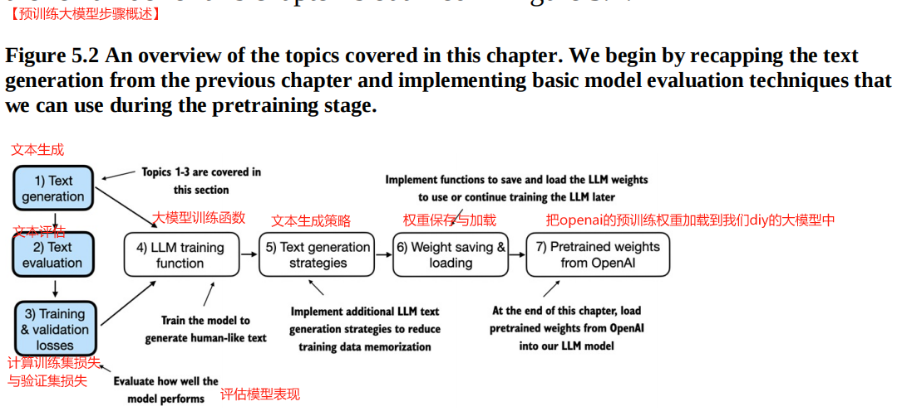
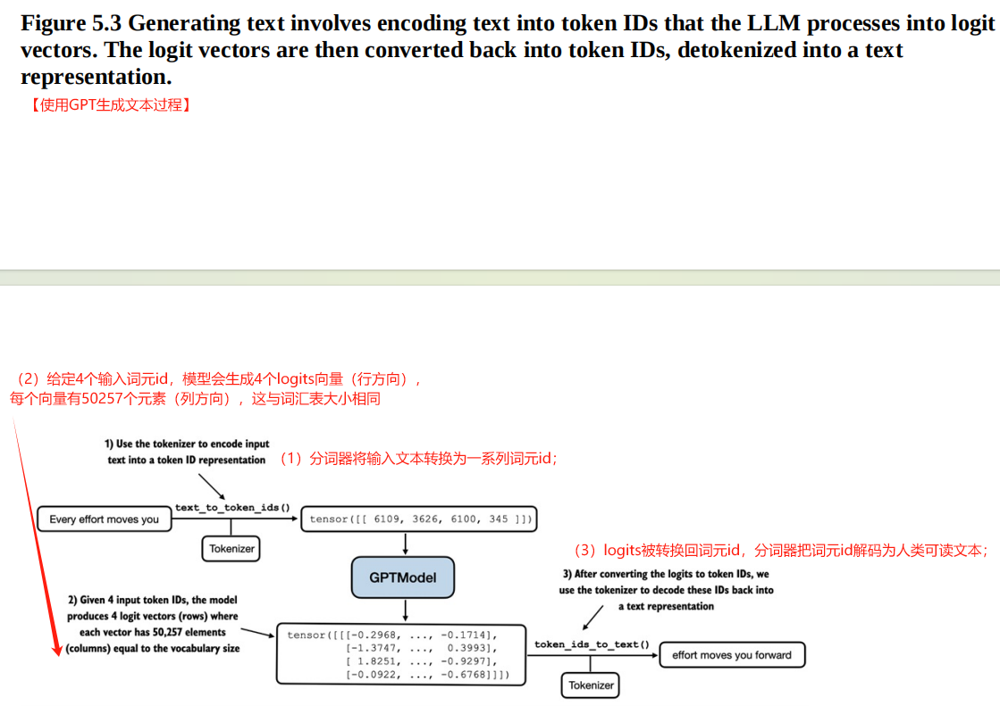
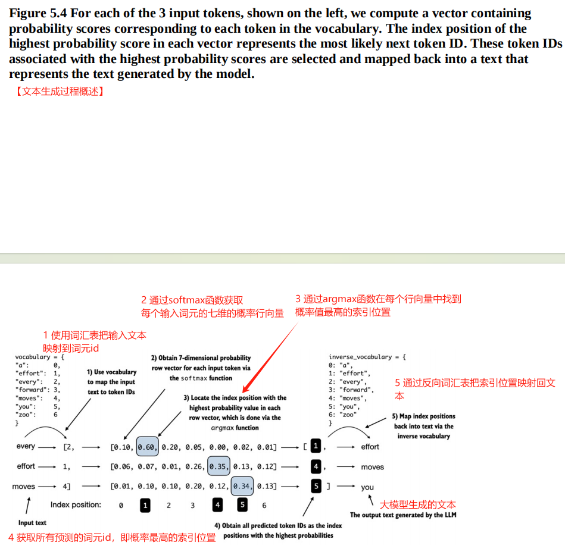
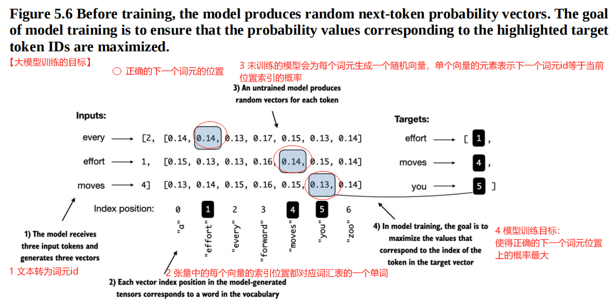
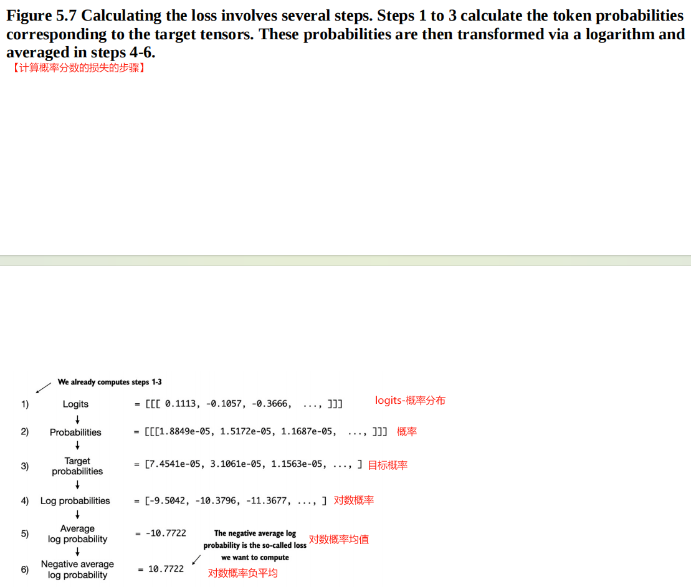

[TOC]

# 【README】

本文总结自<font color="#ff0000">《从零构建大模型》</font>，非常棒的一本书，墙裂推荐； 

本章中，我们将在无标签数据上预训练大模型，主要内容如下：

- 初始化大模型以进行文本生成；
- 讨论评估生成文本质量的基本方法；
- 计算训练集损失与验证集损失；（评估模型） 
- 大模型训练函数；
- 文本生成策略；
- 权重保存与加载；
- 把OpenAI的预训练权重加载到我们diy的大模型中；

本文代码参见： [https://github.com/TomJourney/build_a_llm_from_scratch](https://github.com/TomJourney/build_a_llm_from_scratch)

---

# 【1】评估文本生成模型

预训练大模型步骤概述，如图5-2所示。

 ---

<br>

---

## 【1.1】使用GPT来生成文本

使用DiyGPTModel与GPT_CONFIG_124M来初始化GPT模型。

```python
print("\n\n===使用python字典指定gpt模型的配置")
GPT_CONFIG_124M = {
    "vocab_size": 50257,
    "context_length": 256,
    "emb_dim": 768,
    "n_heads": 12,
    "n_layers": 12,
    "drop_rate": 0.1,
    "qkv_bias": False
}

# 实例化gpt模型（使用自定义GPT模型）
torch.manual_seed(123)
gpt_model = DiyGPTModel(GPT_CONFIG_124M)
gpt_model.eval()
```

---

### 【1.1.1】使用GPT模型生成文本过程

使用GPT模型生成文本过程包括3步，如图5-3所示：

- 分词器将输入文本转换为一系列词元id；
- 模型接收这些词元id并生成相应的logits，logits表示词汇表中每个词元的概率分布的向量；
- logits被转换回词元id，分词器把词元id解码为人类可读文本；



---

【test0501_p119_text_to_token_transfer_util_module.py】用于文本到词元id转换的工具函数 

```python
import torch


# 文本到词元id转换的工具函数
def text_to_tokens_ids(text, tokenizer):
    # 编码，词元化
    encoded = tokenizer.encode(text, allowed_special={'<|endoftext|>'})
    # 使用 .unsqueeze(0) 添加batch维度
    encoded_tensor = torch.tensor(encoded).unsqueeze(0)
    return encoded_tensor


# 词元id到文本转换的工具函数
def token_ids_to_text(token_ids, tokenizer):
    # 移除batch维度
    flat = token_ids.squeeze(0)
    return tokenizer.decode(flat.tolist())

```

【test0501_p119_text_to_token_transfer_util_module_main.py】验证案例-用于文本到词元id转换的工具函数

```python
import torch
import tiktoken
from src.chapter04.test0406_p107_gpt_model_module import DiyGPTModel
from src.chapter04.test0406_p112_gpt_model_generate_text_module import generate_text_simple
from src.chapter05.test0501_p119_text_to_token_transfer_util_module import text_to_tokens_ids, token_ids_to_text

# 文本到词元id转换的工具函数-测试案例
print("\n\n===使用python字典指定gpt模型的配置")
GPT_CONFIG_124M = {
    "vocab_size": 50257,
    "context_length": 256,
    "emb_dim": 768,
    "n_heads": 12,
    "n_layers": 12,
    "drop_rate": 0.1,
    "qkv_bias": False
}

# 实例化gpt模型（使用自定义GPT模型）
torch.manual_seed(123)
gpt_model = DiyGPTModel(GPT_CONFIG_124M)
gpt_model.eval()

# 使用文本到词元id转换的工具函数，生成文本
start_context = "Every effort moves you"
# 获取分词器
tokenizer = tiktoken.get_encoding("gpt2")
token_ids = generate_text_simple(
    gpt_model=gpt_model,
    index_array=text_to_tokens_ids(start_context, tokenizer),
    max_new_tokens=10,
    context_size=GPT_CONFIG_124M["context_length"]
)
print("token_ids = ", token_ids) 
# token_ids =  tensor([[ 6109,  3626,  6100,   345, 34245,  5139]])
print("词元转换为文本工具函数结果 = ", token_ids_to_text(token_ids, tokenizer))
# 词元转换为文本工具函数结果 =  Every effort moves you rentingetic wasnم refres RexMeCHicular stren
```

【代码解说】

显然，上述代码生成的文本是不连贯的，即语句不通。原因是DiyGPTModel没有经过预训练，其权值都是随机的。

接下来，本文会计算生成文本的损失函数大小，这个损失值将作为模型训练的评价指标。

<br>

---

## 【1.2】计算文本生成损失（评估模型）

在GPT模型训练过程中，本文将介绍通过计算文本生成损失值评估文本质量的技术。

文本生成全过程，如图5-4所示，从加载数据到生成文本。



---

【test0501_p120_text_generate_process_main.py】测试案例-文本生成过程的5个步骤

```python
import tiktoken
import torch

from src.chapter04.test0406_p107_gpt_model_module import DiyGPTModel
from src.chapter05.test0501_p119_text_to_token_transfer_util_module import token_ids_to_text

print("\n\n===使用python字典指定gpt模型的配置")
GPT_CONFIG_124M = {
    "vocab_size": 50257,
    "context_length": 256,
    "emb_dim": 768,
    "n_heads": 12,
    "n_layers": 12,
    "drop_rate": 0.1,
    "qkv_bias": False
}

# 实例化gpt模型（使用自定义GPT模型）
torch.manual_seed(123)
diy_gpt_model = DiyGPTModel(GPT_CONFIG_124M)
diy_gpt_model.eval()

# 获取分词器
tokenizer = tiktoken.get_encoding("gpt2")

# 文本生成过程-测试案例
inputs = torch.tensor([[16822, 3626, 6100],  # every effort moves
                       [40, 1107, 588]  # I really like
                       ])
# 与输入匹配，targets是我们期待生成的词元id
targets = torch.tensor([[3626, 6100, 345],  # effort moves you
                        [1107, 588, 11311]  # really like chocolate
                        ])

# 步骤1：为2个输入示例计算logits向量（logits表示词汇表中每个词元的概率分布的向量）
with torch.no_grad():
    logits = diy_gpt_model(inputs)
# 步骤2： 计算每个词元的概率
probability_score = torch.softmax(logits, dim=-1)
print("probability_score.shape = ", probability_score.shape)
# probability_score.shape =  torch.Size([2, 3, 50257])

# 步骤3+步骤4： 使用argmax函数计算概率值最高的索引位置(索引位置就是token的id)
token_ids = torch.argmax(probability_score, dim=-1, keepdim=True)
print("token_ids = ", token_ids)

# 步骤5：把词元id转换回文本
predict_text = token_ids_to_text(token_ids[0].flatten(), tokenizer)
print("预测的文本，predict_text = ", predict_text)
target_text = token_ids_to_text(targets[0], tokenizer)
print("原始的文本， target_text = ", target_text)
# 预测的文本，predict_text =  women saves Admir
# 原始的文本， target_text =   effort moves you
```

【代码解说】

显然，预测结果的文本，与原始的文本存在很大不同，这是模型DiyGPTModel没有训练导致的，即模型使用的权重是随机值，没有经过训练使得损失最小。

损失值（或损失函数值）：表示生成的词元（预测结果）与正确目标（真实值）间的差异，差异越小，则模型效果越高；

<br>

---

### 【1.2.1】模型训练的目标

<font color=red>模型训练的目标：</font>是增加正确目标词元id对应索引位置的softmax概率，即正确位置的概率越高，则模型效果越好，如图5-6所示。

- 或者模型训练的目标是：使得正确的下一次元位置上的概率最大，即最大化正确下一词元的概率；



【补充】

<font color=red>模型训练的目标是最大化正确下一词元的概率，这涉及到增大其相对于其他词元的概率</font>。通过这种方式，可以确保大模型始终选择正确的词元作为下一词元。

---

### 【1.2.2】计算概率分数的损失

计算概率分数的损失，对概率分数取对数，因为概率分数的对数易于处理，相比于直接处理分数；计算概率分数的损失的步骤，如图5-7所示。



【图解】

我们的目标是在训练过程中更新模型权重，使得<font color=red>负平均对数概率降到0 </font>。

<font color=red>负平均对数概率计算： 平均对数概率乘以-1 ，该计算方法又称为交叉熵损失 </font>。

- 交叉熵损失：一种常用度量方式，用于衡量两个概率分布的差异； 通过是数据集标签的真实分布与模型生成的预测分布间的差异；
- 交叉熵损失，又称为负平均对数概率；

---

### 【1.2.3】使用torch.cross_entropy函数计算交叉熵损失 

【test0501_p120_text_generate_process_main.py】使用torch.cross_entropy函数计算交叉熵损失

```python
# 打印logits张量与targets张量的形状(logits有3个维度：批处理大小，词元数量，词汇表大小)
# targets张量有2个维度： 批处理大小与词元数量
print("logits.shape = ", logits.shape)
print("targets.shape = ", targets.shape)
# logits.shape =  torch.Size([2, 3, 50257])
# targets.shape =  torch.Size([2, 3])

# 在批处理维度上把logits的维度进行展平（logits的3个维度转为2个维度，targets的2个维度转为1个维度）
logits_flat_predict = logits.flatten(0, 1)
targets_flat = targets.flatten()
print("logits_flat_predict.shape = ", logits_flat_predict.shape)
print("targets_flat.shape = ", targets_flat.shape)
# logits_flat_predict.shape =  torch.Size([6, 50257])
# targets_flat.shape =  torch.Size([6])

print("\n=== 使用torch.cross_entropy函数计算交叉熵损失")
cross_entropy_loss = torch.nn.functional.cross_entropy(logits_flat_predict, targets_flat)
print("交叉熵损失, cross_entropy_loss = ", cross_entropy_loss)
# 交叉熵损失, cross_entropy_loss =  tensor(10.8449)

```

<br>

---

## 【1.3】计算训练集和验证集的损失

具体的，是计算训练集与验证集的交叉熵损失；

【test0501_p127_compute_train_test_loss_module.py】计算训练集加载器与验证集加载器返回的给定批次的交叉熵损失函数+交叉熵损失计算加载器

```python
import torch

# 计算训练集加载器与验证集加载器返回的给定批次的交叉熵损失函数
def compute_loss_batch(input_batch, target_batch, diy_gpt_model, device):
    # to(device) 可以把输入数据转移到GPU上
    input_batch = input_batch.to(device)
    target_batch = target_batch.to(device)
    logits = diy_gpt_model(input_batch)
    cross_entropy_loss = torch.nn.functional.cross_entropy(
        logits.flatten(0, 1), target_batch.flatten()
    )
    return cross_entropy_loss

# 交叉熵损失计算加载器
def compute_loss_loader(data_loader, diy_gpt_model, device, num_batches=None):
    total_loss = 0
    if len(data_loader) == 0:
        return float("nan")
    elif num_batches is None:
        num_batches = len(data_loader)
    else:
        num_batches = min(num_batches, len(data_loader))
    for i, (input_batch, target_batch) in enumerate(data_loader):
        if i < num_batches:
            loss = compute_loss_batch(input_batch, target_batch, diy_gpt_model, device)
            total_loss += loss.item()
        else:
            break
    return total_loss / num_batches
```

---

【test0501_p127_compute_train_test_loss_module_main.py】计算训练集与测试集间的损失函数-测试案例

```python
from pathlib import Path

import tiktoken
import torch

from src.chapter02.test0206_p35_dataloader import create_data_loader_v1 as create_data_loader_v1
from src.chapter04.test0406_p107_gpt_model_module import DiyGPTModel
from src.utils import BusiIoUtils
from src.chapter05.test0501_p127_compute_train_test_loss_module import compute_loss_batch, compute_loss_loader

# 计算训练集与验证集的交叉熵损失
# 获取分词器
tokenizer = tiktoken.get_encoding("gpt2")

# 读取verdict小说
print("\n\n=== 读取verdict小说")
with open(Path(BusiIoUtils.get_root_dir(), "..", "file", "the-verdict.txt")) as f:
    raw_text = f.read()

total_characters = len(raw_text)
total_token = len(tokenizer.encode(raw_text))
print("总字符个数, total_characters = ", total_characters)
print("总词元个数, total_token = ", total_token)
# 总字符个数, total_characters =  20479
# 总词元个数, total_token =  5145

# 把数据分为训练集与测试集，并使用第2章的数据加载器来准备大模型训练所需的批次数据
train_ratio = 0.9
split_index = int(train_ratio * len(raw_text))
train_data = raw_text[:split_index]
test_data = raw_text[split_index:]

print("\n\n===使用python字典指定gpt模型的配置")
GPT_CONFIG_124M = {
    "vocab_size": 50257,
    "context_length": 256,
    "emb_dim": 768,
    "n_heads": 12,
    "n_layers": 12,
    "drop_rate": 0.1,
    "qkv_bias": False
}

# 创建数据加载器
torch.manual_seed(123)
train_data_loader = create_data_loader_v1(train_data,
                                          batch_size=2,
                                          max_length=GPT_CONFIG_124M["context_length"],
                                          stride=GPT_CONFIG_124M["context_length"],
                                          drop_last=False,
                                          shuffle=False,
                                          num_workers=0)
test_data_loader = create_data_loader_v1(test_data,
                                         batch_size=2,
                                         max_length=GPT_CONFIG_124M["context_length"],
                                         stride=GPT_CONFIG_124M["context_length"],
                                         drop_last=False,
                                         shuffle=False,
                                         num_workers=0)
print("\n===train_data_loader = ")
for x, y in train_data_loader:
    print(x.shape, y.shape)
# ===train_data_loader = （训练集有9个批次，每个批次2个样本，每个样本256个词元）
# torch.Size([2, 256]) torch.Size([2, 256])
# torch.Size([2, 256]) torch.Size([2, 256])
# torch.Size([2, 256]) torch.Size([2, 256])
# torch.Size([2, 256]) torch.Size([2, 256])
# torch.Size([2, 256]) torch.Size([2, 256])
# torch.Size([2, 256]) torch.Size([2, 256])
# torch.Size([2, 256]) torch.Size([2, 256])
# torch.Size([2, 256]) torch.Size([2, 256])
# torch.Size([2, 256]) torch.Size([2, 256])

print("\n===test_data_loader = ")
for x, y in test_data_loader:
    print(x.shape, y.shape)
# torch.Size([2, 256]) torch.Size([2, 256]) （测试集有1个批次，每个批次2个样本，每个样本256个词元）

# 实例化gpt模型（使用自定义GPT模型）
torch.manual_seed(123)
diy_gpt_model = DiyGPTModel(GPT_CONFIG_124M)
diy_gpt_model.eval()

# 使用交叉熵损失计算加载器，计算训练集与测试集间的交叉熵损失
print("\n\n=== 使用交叉熵损失计算加载器，计算训练集与测试集间的交叉熵损失")
device = torch.device("cuda" if torch.cuda.is_available() else "cpu")
diy_gpt_model.to(device)
with torch.no_grad():
    train_loss = compute_loss_loader(train_data_loader ,diy_gpt_model, device)
    test_loss = compute_loss_loader(test_data_loader, diy_gpt_model, device)
print("train_loss = ", train_loss)
print("test_loss = ", test_loss)
# train_loss =  10.987583584255642
# test_loss =  10.981106758117676

# 这个损失值就是我们的目标函数，我们训练模型的目的是使得该目标函数值最小
```

---

# 【2】训练大语言模型 

图5-11描述了一个典型的PyTorch神经网络训练工作流程，我们将根据该流程来训练一个大语言模型。

PyTorch神经网络训练工作流程，包括8个步骤。

1. 遍历训练轮次；
2. 在每个训练轮次中遍历批次；
3. 从上一个批次迭代中重置损失梯度；
4. 计算当前批次的损失；
5. 反向传播以计算损失梯度；
6. 使用损失梯度更新模型权重；
7. 打印训练集和验证集的损失；
8. 生成文本样本用于可视化；


