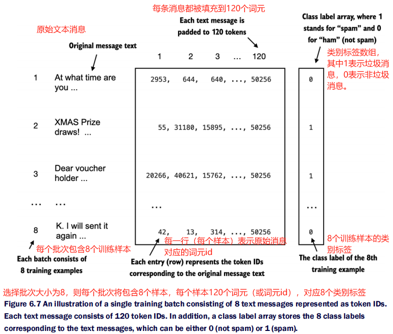

[TOC]

# 【README】

本文总结自<font color="#ff0000">《从零构建大模型》</font>，非常棒的一本书，墙裂推荐； 

本文通过在特定目标任务（如文本分类）上<font color=red>微调大模型</font>，来实践之前的学习成果；

微调大模型有两种方式，如图6-1所示：

- 用于分类的微调；
- 用于执行指令的微调；

本文代码参见： [https://github.com/TomJourney/build_a_llm_from_scratch](https://github.com/TomJourney/build_a_llm_from_scratch)

<br>

【图6-1】 构建大模型的3个主要阶段：1-实现一个类GPT大模型架构；2-把预训练模型的权重加载到大模型架构中；3-微调预训练的大模型来给文本分类；


---

# 【1】对大模型进行分类微调的3个阶段

微调语言模型最常见的方法： 指令微调、分类微调；

- 指令微调：如判断文本是否为垃圾消息，句子翻译等；
- 指令微调：提升了模型基于特定用户指令理解和生成响应的能力。指令微调最适合处理需要应对多种任务的模型，这些任务依赖于复杂的用户指令。

<br>

---

## 【1.1】对大模型进行分类微调的3个阶段

对大模型进行分类微调的3个阶段：包括准备数据集，模型设置，模型微调和应用；如图6-4所示。

1. 准备数据集：
   1. 下载数据集；
   2. 数据集预处理；
   3. 创建数据加载器；
2. 模型设置：
   1. 模型初始化；；
   2. 加载预训练权重；
   3. 修改模型以便微调；
   4. 实现评估工具； 
3. 模型微调与应用：
   1. 微调模型；
   2. 评估微调后的模型；
   3. 在新数据上应用模型； 


---

# 【2】准备数据集

## 【2.1】下载数据集

【test0601_p156_download_unzip_dataset_module.py】下载数据集

```python
import os
import urllib.request
import zipfile
from pathlib import Path

def download_and_unzip_spam_data(url, zip_path, extracted_path, data_file_path):
    if data_file_path.exists():
        print(f"{data_file_path} already exists. skipping download and extraction")
        return

    # 下载文件
    with urllib.request.urlopen(url) as response:
        with open(zip_path, "wb") as out_file:
            out_file.write(response.read())

    # 解压文件
    with zipfile.ZipFile(zip_path, "r") as zip_ref:
        zip_ref.extractall(extracted_path)

    original_file_path = Path(extracted_path) / "SMSSpamCollection"
    # 添加.tsv文件扩展名
    os.rename(original_file_path, data_file_path)
    print(f"file downloaded and saved as {data_file_path}")
```

【test0601_p156_download_unzip_dataset_module_main.py】测试案例-下载数据集并查看数据分布

```python
from pathlib import Path

import pandas as pd

# 下载并解压数据集
url = "https://archive.ics.uci.edu/static/public/228/sms+spam+collection.zip"
print("下载并解压数据集完成")

# 加载数据集
data_file_path = Path("dataset") / "SMSSpamCollection.tsv"
df = pd.read_csv(
    data_file_path, sep="\t", header=None, names=["Label", "Text"]
)

print("\n\n===查看数据分布")
print(f"数据分布 = \n", df["Label"].value_counts())
#  Label
# ham     4825
# spam     747
# Name: count, dtype: int64
```

<br>

---

### 【2.1.1】创建平衡数据集 

为简单起见，本文选择747的spam垃圾文本数据集，并创建包含747的非垃圾文本数据集，垃圾文本与非垃圾文本的数据量相等，称为平衡数据集，如下。

平衡数据集定义： 各类别的数量相同的数据集；

【test0602_p157_create_balance_dataset_module.py】创建平衡数据集模块

```python
import pandas as pd


def create_balanced_dataset(df):
    # 统计垃圾消息的样本数量
    num_spam = df[df["Label"] == "spam"].shape[0]

    # 随机采样非垃圾消息，使其数量与垃圾消息一致
    ham_subset = df[df["Label"] == "ham"].sample(
        num_spam, random_state=123
    )

    # 将垃圾消息与采样后的垃圾消息组合，构成平衡数据集
    balanced_df = pd.concat([
        ham_subset, df[df["Label"] == "spam"]
    ])
    return balanced_df
```

【test0602_p157_create_balance_dataset_module_main.py】测试案例-创建平衡数据集模块

```python
from pathlib import Path

import pandas as pd

from src.chapter06.test0601_p156_download_unzip_dataset_module import download_and_unzip_spam_data
from src.chapter06.test0602_p157_create_balance_dataset_module import create_balanced_dataset

# 下载并解压数据集
url = "https://archive.ics.uci.edu/static/public/228/sms+spam+collection.zip"
print("下载并解压数据集完成")

# 加载数据集
data_file_path = Path("dataset") / "SMSSpamCollection.tsv"
df = pd.read_csv(
    data_file_path, sep="\t", header=None, names=["Label", "Text"]
)

print("\n\n===查看数据分布")
print("数据分布 = \n", df["Label"].value_counts())
#  Label
# ham     4825
# spam     747
# Name: count, dtype: int64

print("\n\n=== 创建平衡数据集")
balanced_df = create_balanced_dataset(df)
print("balanced_df = \n", balanced_df["Label"].value_counts())
#  Label
# ham     747
# spam    747
# Name: count, dtype: int64
```

---

## 【2.2】划分数据集

把数据集划分为3部分，包括训练数据集-70%， 验证数据集-10%， 测试数据集=20% 

【test0602_p158_split_dataset_module.py】划分数据集模块

```python
# train_fraction 训练集比例
# validation_fraction 验证集比例
def random_split(df, train_fraction, validation_fraction):
    # 打乱整个 Dataframe
    df = df.sample(frac=1, random_state=123).reset_index(drop=True)

    # 计算拆分索引
    train_end = int(len(df) * train_fraction)
    validation_end = train_end + int(len(df) * validation_fraction)

    # 拆分 Dataframe，包括训练集，验证集， 测试集
    train_df = df[:train_end]
    validation_df = df[train_end:validation_end]
    test_df = df[validation_end:]

    return train_df, validation_df, test_df
```

【test0602_p158_split_dataset_module_main.py】测试案例-划分数据集模块

```python
from pathlib import Path

import pandas as pd

from src.chapter06.test0602_p157_create_balance_dataset_module import create_balanced_dataset
from src.chapter06.test0602_p158_split_dataset_module import random_split

# 下载并解压数据集
url = "https://archive.ics.uci.edu/static/public/228/sms+spam+collection.zip"
print("下载并解压数据集完成")

# 加载数据集
data_file_path = Path("dataset") / "SMSSpamCollection.tsv"
df = pd.read_csv(
    data_file_path, sep="\t", header=None, names=["Label", "Text"]
)

print("\n\n=== 步骤1： 查看数据分布")
print("数据分布 = \n", df["Label"].value_counts())
#  Label
# ham     4825
# spam     747
# Name: count, dtype: int64

print("\n\n=== 步骤2： 创建平衡数据集")
balanced_df = create_balanced_dataset(df)
print("balanced_df = \n", balanced_df["Label"].value_counts())
#  Label
# ham     747
# spam    747
# Name: count, dtype: int64

print("\n\n=== 步骤2-1： 把ham与spam分别转换为标签0和1")
balanced_df["Label"] = balanced_df["Label"].map({"ham": 0, "spam": 1})

print("\n\n=== 步骤3： 划分数据集，训练集70%， 验证集10%， 测试集20%； 其中总数量=747*2=1494")
train_df, validation_df, test_df = random_split(balanced_df, 0.7, 0.1)
print("把数据集保存为csv，以便重用")
train_df.to_csv(Path("dataset") / "train.csv", index=None)
validation_df.to_csv(Path("dataset") / "validation.csv", index=None)
test_df.to_csv(Path("dataset") / "test.csv", index=None)

print("\n\n===统计各数据集的数据量")
print("训练集数据量 = ", pd.read_csv(Path("dataset")/"train.csv").shape)
print("验证集数据量 = ", pd.read_csv(Path("dataset")/"validation.csv").shape)
print("测试集数据量 = ", pd.read_csv(Path("dataset")/"test.csv").shape)
# ===统计各数据集的数据量
# 训练集数据量 =  (1045, 2)
# 验证集数据量 =  (149, 2)
# 测试集数据量 =  (300, 2)
```

<br>

---

# 【3】创建数据加载器 

为实现批处理，本文把所有消息都填充到最长消息的长度，需要向较短消息添加填充词元<|endoftext|>，具体实现是把文本<|endoftext|>对应的词元id添加到编码的文本消息中。

50256是填充词元<|endoftext|>的词元id。可以使用tiktoken包中的gpt-2分词器来核对填充词元id是否为50256。

```python
import tiktoken

# 获取tiktoken中的gpt2分词器
gpt2_tokenizer = tiktoken.get_encoding("gpt2")
# 把<|endoftext|>作为填充词元，词元<|endoftext|>的词元id等于50256
print(gpt2_tokenizer.encode("<|endoftext|>", allowed_special={"<|endoftext|>"}))
# [50256]
```

## 【3.1】创建自定义垃圾文本数据集类

【test0603_p160_spam_dataset_module.py】创建自定义垃圾文本数据集模块 

```python
import pandas as pd
from sympy.printing.pytorch import torch
from torch.utils.data import Dataset


# 垃圾邮件数据集类-DiySpamDataset
# 垃圾邮件数据集类处理几个关键任务： 1-把文本消息编码为词元序列，2-识别训练数据集中最长的序列，
# 3-确保所有其他序列都使用填充词元进行填充，以匹配最长序列的长度
class DiySpamDataset(Dataset):
    def __init__(self, csv_file, tokenizer, max_length=None, pad_token_id=50256):
        self.data = pd.read_csv(csv_file)

        # 文本分词
        self.encoded_text_array = [
            tokenizer.encode(text) for text in self.data["Text"]
        ]

        if max_length is None:
            self.max_length = self._longest_encoded_length()
        else:
            self.max_length = max_length

            # 如果序列长度超过 max_length，则进行截断
            self.encoded_text_array = [
                encoded_text[:self.max_length]
                for encoded_text in self.encoded_text_array
            ]

        # 填充到最长序列的长度
        self.encoded_text_array = [
            encoded_text + [pad_token_id] * (self.max_length - len(encoded_text))
            for encoded_text in self.encoded_text_array
        ]

    def __getitem__(self, index):
        encoded = self.encoded_text_array[index]
        label = self.data.iloc[index]["Label"]
        return (
            torch.tensor(encoded, dtype=torch.long),
            torch.tensor(label, dtype=torch.long)
        )

    def __len__(self):
        return len(self.data)

    # 识别数据集中数据序列的最大长度
    def _longest_encoded_length(self):
        max_length = 0
        for encoded_text in self.encoded_text_array:
            encoded_length = len(encoded_text)
            if encoded_length > max_length:
                max_length = encoded_length
        return max_length
```

【test0603_p160_spam_dataset_module_main.py】测试案例-创建自定义垃圾文本数据集模块 

```python
from pathlib import Path

import tiktoken

from src.chapter06.test0603_p160_spam_dataset_module import DiySpamDataset

# 获取tiktoken中的gpt2分词器
gpt2_tokenizer = tiktoken.get_encoding("gpt2")
# 把<|endoftext|>作为填充词元，词元<|endoftext|>的词元id等于50256
print(gpt2_tokenizer.encode("<|endoftext|>", allowed_special={"<|endoftext|>"}))
# [50256]

# 创建训练集
train_dataset = DiySpamDataset(
    csv_file=Path("dataset") / "train.csv",
    max_length=None,
    tokenizer=gpt2_tokenizer
)
# 最长序列长度
print("train_dataset.max_length = ", train_dataset.max_length)
# train_dataset.max_length =  120

# 创建验证集
validate_dataset = DiySpamDataset(
    csv_file=Path("dataset") / "validation.csv",
    max_length=train_dataset.max_length,
    tokenizer=gpt2_tokenizer
)

# 创建测试集
test_dataset = DiySpamDataset(
    csv_file=Path("dataset") / "test.csv",
    max_length=train_dataset.max_length,
    tokenizer=gpt2_tokenizer
)
```

---

## 【3.2】创建数据加载器 

与创建文本数据加载器类似，可以创建标签数据加载器，即目标是类别标签，而不是文本中的下一个词元； 

选择批次大小为8，则每个批次将包含8个样本，每个样本120个词元（或词元id），对应8个类别标签。如图6-7所示。

 

---

### 【3.2.1】标签数据加载器代码实现

【test0603_p162_create_label_dataset_loader_main.py】测试案例-创建标签数据加载器 

```python
from pathlib import Path

import tiktoken
import torch
from torch.utils.data import DataLoader

from src.chapter06.test0603_p160_spam_dataset_module import DiySpamDataset

# 获取tiktoken中的gpt2分词器
gpt2_tokenizer = tiktoken.get_encoding("gpt2")

# 创建训练集
train_dataset = DiySpamDataset(
    csv_file=Path("dataset") / "train.csv",
    max_length=None,
    tokenizer=gpt2_tokenizer
)
# 创建验证集
validate_dataset = DiySpamDataset(
    csv_file=Path("dataset") / "validation.csv",
    max_length=train_dataset.max_length,
    tokenizer=gpt2_tokenizer
)
# 创建测试集
test_dataset = DiySpamDataset(
    csv_file=Path("dataset") / "test.csv",
    max_length=train_dataset.max_length,
    tokenizer=gpt2_tokenizer
)

# 创建标签数据加载器
print("\n\n=== 创建标签数据加载器")
num_workers = 0
batch_size = 8
torch.manual_seed(123)

# 创建训练集数据加载器
train_loader = DataLoader(
    dataset=train_dataset,
    batch_size=batch_size,
    shuffle=True,
    num_workers=num_workers,
    drop_last=True
)
# 创建验证集数据加载器
validate_loader = DataLoader(
    dataset=validate_dataset,
    batch_size=batch_size,
    shuffle=True,
    num_workers=num_workers,
    drop_last=False
)
# 创建测试集数据加载器
test_loader = DataLoader(
    dataset=test_dataset,
    batch_size=batch_size,
    shuffle=True,
    num_workers=num_workers,
    drop_last=False
)

print("\n\n=== 打印数据加载器的输入批次与目标批次")
for input_batch, target_batch in train_loader:
    pass
print("input_batch.shape = ", input_batch.shape)
print("target_batch.shape = ", target_batch.shape)
# input_batch.shape =  torch.Size([8, 120])
# target_batch.shape =  torch.Size([8])

print("\n\n===打印每个数据集的总批次数")
print("训练集批次数量 = ", len(train_loader))
print("验证集批次数量 = ", len(validate_loader))
print("测试集批次数量 = ", len(test_loader))
# 训练集批次数量 =  130
# 验证集批次数量 =  19
# 测试集批次数量 =  38
```

---

<br>

# 【4】初始化带有预训练权重的模型 

初始化预训练模型：对垃圾消息进行分类微调的第一步，是要初始化预训练模型，如图6-8所示；  

【test0604_p164_initialize_pretrained_model_main.py】测试案例-初始化带有预训练权重的模型 

```python
import tiktoken

from src.chapter04.test0406_p107_gpt_model_module import DiyGPTModel
from src.chapter05.gpt_download import download_and_load_gpt2
from src.chapter05.test0501_p119_text_to_token_transfer_util_module import text_to_tokens_ids, token_ids_to_text
from src.chapter05.test0503_p142_modify_text_generate_function import based_temperature_topk_generate_text_simple
from src.chapter05.test0505_p148_load_gpt2_params_to_diy_gpt_model_module import load_weights_into_gpt

# 【1】模型配置信息

CHOOSE_MODEL = "gpt2-small (124M)"
INPUT_PROMPT = "Every effort moves"
# 基本配置，包括词汇表大小， 上下文长度， dropout率-丢弃率， 查询-键-值的偏置
BASE_CONFIG = {
    "vocab_size": 50257,
    "context_length": 1024,
    "drop_rate": 0.0,
    "qkv_bias": True
}
# 模型参数配置
# 字典保存不同模型尺寸的GPT模型参数
gpt2_model_configs = {
    "gpt2-small (124M)": {"emb_dim": 768, "n_layers": 12, "n_heads": 12},
    "gpt2-medium (355M)": {"emb_dim": 1024, "n_layers": 24, "n_heads": 16},
    "gpt2-large (744M)": {"emb_dim": 1280, "n_layers": 36, "n_heads": 20},
    "gpt2-xl (1558M)": {"emb_dim": 1600, "n_layers": 48, "n_heads": 25}
}
BASE_CONFIG.update(gpt2_model_configs[CHOOSE_MODEL])

# 【2】加载预训练模型
pretrain_model_size = CHOOSE_MODEL.split(" ")[-1].lstrip("(").rstrip(")")
print("pretrain_model_size = ", pretrain_model_size) # 124M

# 获取gpt2模型的架构设置与权重参数
settings, params = download_and_load_gpt2(model_size=pretrain_model_size, models_dir="../chapter05/gpt2", is_download=False)
# 创建GPT模型实例
diy_gpt_model = DiyGPTModel(BASE_CONFIG)
# 把gpt2的参数加载到GPT模型实例
load_weights_into_gpt(diy_gpt_model, params)
# 把模型切换为推断模式 ，这会禁用模型的dropout层
diy_gpt_model.eval()

print("\n=== 【3】 使用文本生成工具函数， 确保模型生成连贯的文本")
# 获取tiktoken中的gpt2分词器
gpt2_tokenizer = tiktoken.get_encoding("gpt2")

text_1 = "Every effort moves you"
token_ids = based_temperature_topk_generate_text_simple(
    gpt_model=diy_gpt_model,
    index_array=text_to_tokens_ids(text_1, tokenizer=gpt2_tokenizer),
    max_new_tokens=15,
    context_size=BASE_CONFIG["context_length"]
)
print(token_ids_to_text(token_ids, gpt2_tokenizer))

print("\n=== 【4】 把模型微调为垃圾消息分类器之前， 本文尝试输入指令，查看模型是否能够正确分类垃圾消息")
test_text = (
    "Is the following text 'spam' ? Answer with 'yes' or 'no':"
    " 'You are a winner you have been specially"
    " selected to receive $1000 cash or a $2000 award."
)

test_token_ids = based_temperature_topk_generate_text_simple(
    gpt_model=diy_gpt_model,
    index_array=text_to_tokens_ids(test_text, tokenizer=gpt2_tokenizer),
    max_new_tokens=23,
    context_size=BASE_CONFIG["context_length"]
)
print(token_ids_to_text(test_token_ids, gpt2_tokenizer))
```

<br>

---

# 【5】添加分类头 

本文的目标是预测文本消息是否为垃圾消息，输出标签是1-垃圾消息， 0-非垃圾消息。

所以需要把原始输出层（该输出层映射到一张包含50257个词元的词汇表），替换为一个较小的输出层，该输出层映射到两个类别，即0与1； 如6-9所示（本文使用了之前的模型，但替换了输出层）。

 

---

## 【5.1】替换原始模型的输出层

本文接下来


