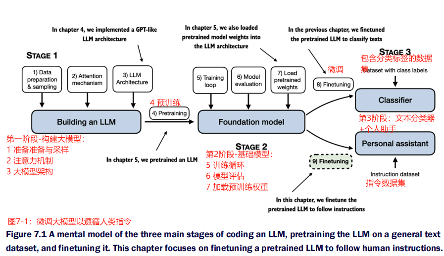
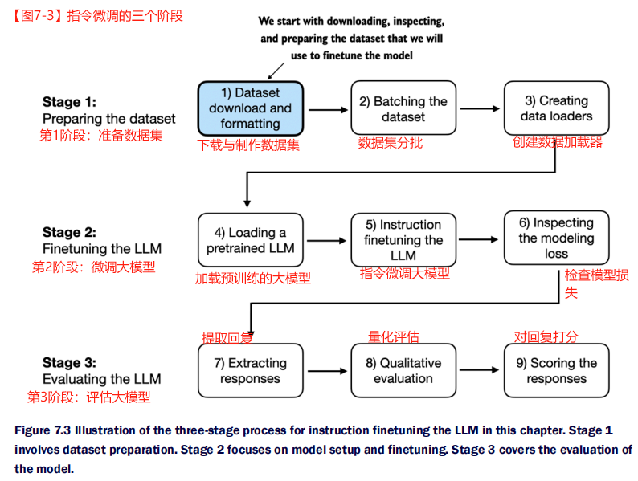
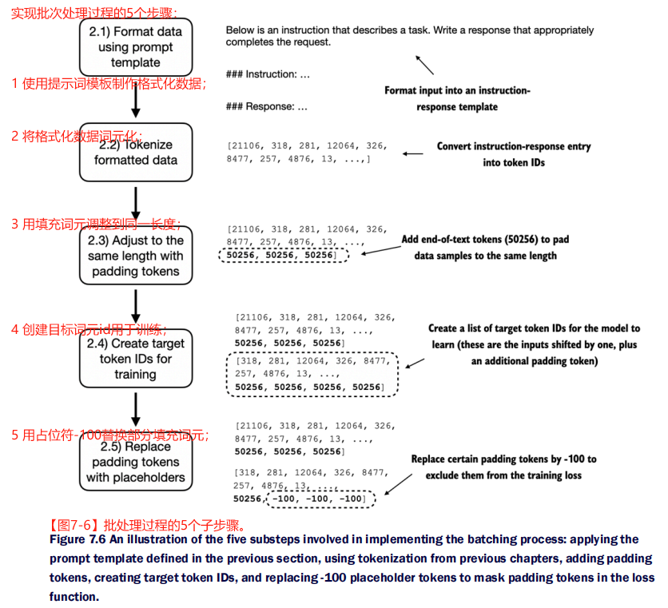
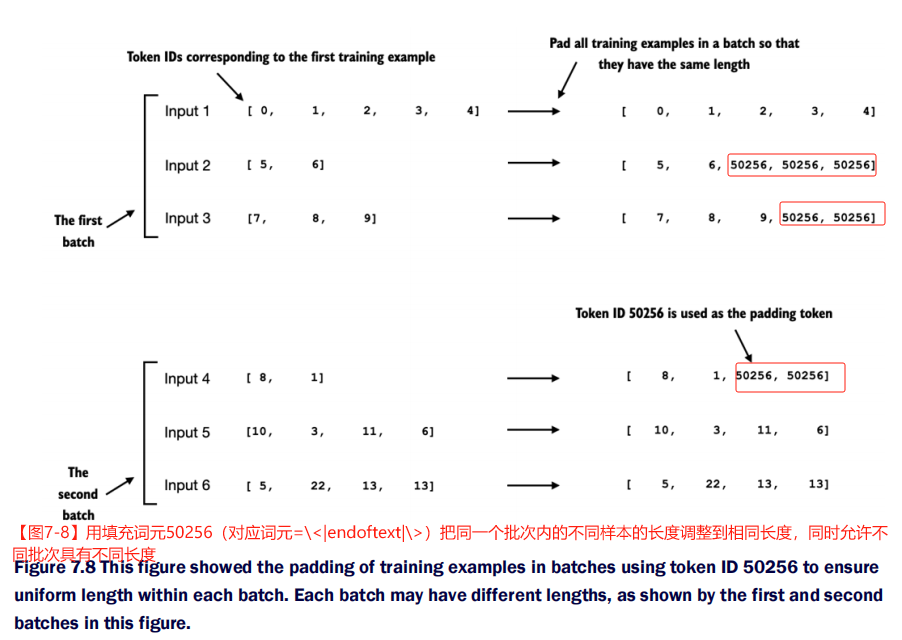
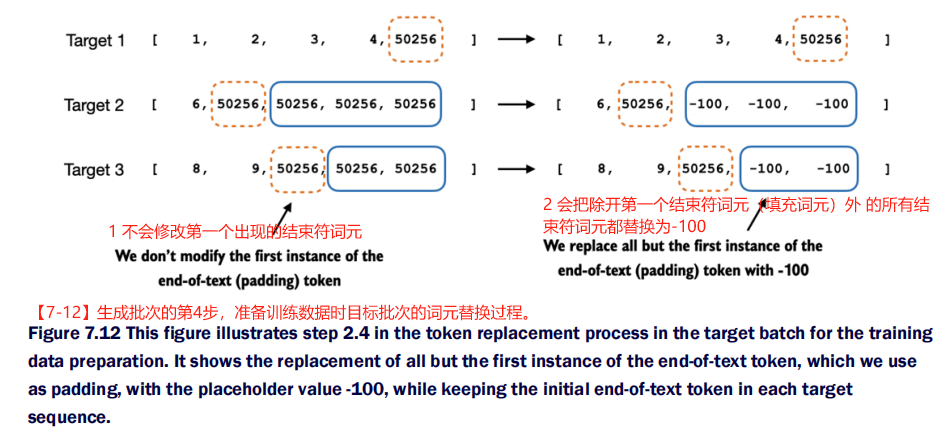
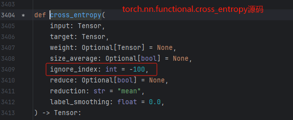
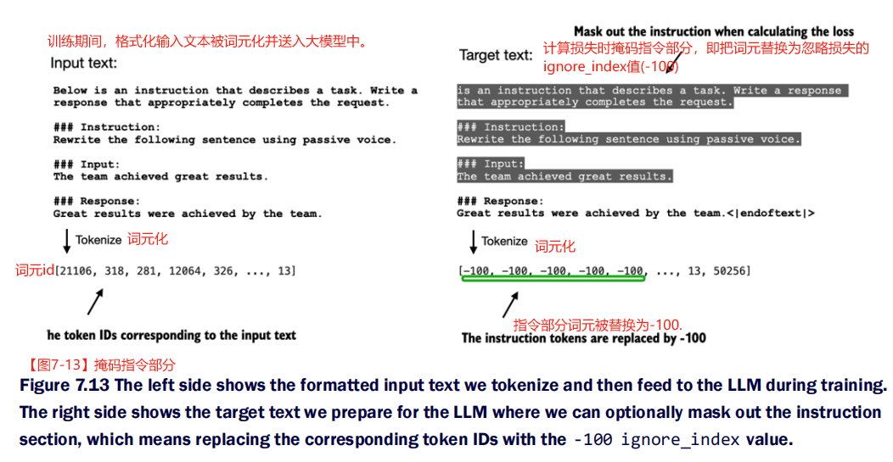
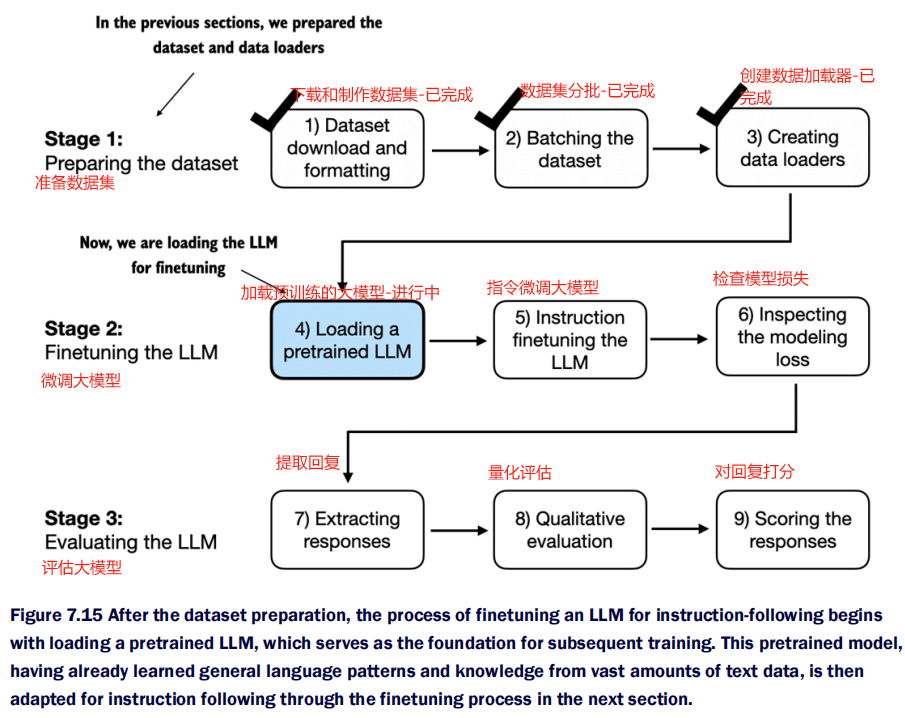
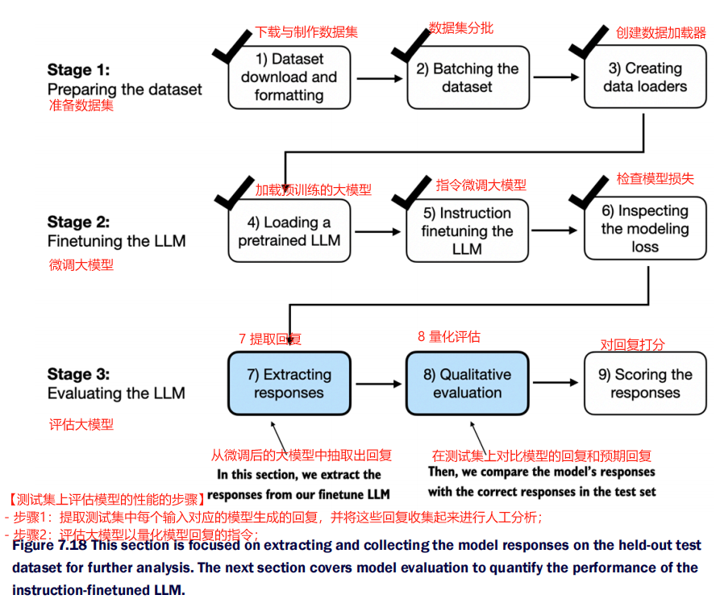

[TOC]

# 【README】

本文总结自<font color="#ff0000">《从零构建大模型》</font>，非常棒的一本书，墙裂推荐； 

本文实现微调大模型以遵循人类指令，如图7-1所示。

<font color=red>图7-1显式了微调大模型主要有两种方式</font>：

- 用于文本分类的微调（分类微调）；
- 遵循人类指令的微调（指令微调）； 



---

# 【1】指令微调介绍

指令微调：提高大模型遵循指令并生成合理回复的能力。（准备数据集是指令微调的关键部分）

指令微调的步骤（如图7-3）：

1. 第1阶段：准备数据集；
   1. 下载和制作数据集；
   2. 数据集分批；
   3. 创建数据加载器；
2. 第2阶段：微调大模型；
   1. 加载预训练的大模型；
   2. 指令微调大模型；
   3. 检查模型损失；
3. 第3阶段：评估大模型；
   1. 提取回复；
   2. 量化评估；
   3. 对回复打分；



<br>

---

# 【2】为指令微调准备数据集

【下载数据集】

下载地址：[https://raw.githubusercontent.com/rasbt/LLMs-from-scratch/main/ch07/01_main-chapter-code/instruction-data.json](https://raw.githubusercontent.com/rasbt/LLMs-from-scratch/main/ch07/01_main-chapter-code/instruction-data.json)

【test0702_p187_download_dataset_main.py】测试案例-下载数据集

```python
import json

# 下载并打印数据集
# url=https://raw.githubusercontent.com/rasbt/LLMs-from-scratch/main/ch07/01_main-chapter-code/instruction-data.json

with open('./dataset/instruction-data.json', 'r', encoding='utf-8') as file:
    data = json.load(file)

print("数据量 = ", len(data))
# 数据量 =  1100
# 打印某条数据
print("data[50] = ", data[50])
# data[50] =  {'instruction': 'Identify the correct spelling of the following word.', 'input': 'Ocassion', 'output': "The correct spelling is 'Occasion.'"}

# {
# 	"instruction": "Identify the correct spelling of the following word.",
# 	"input": "Ocassion",
# 	"output": "The correct spelling is Occasion."
# }

# 打印数据项=data[999]
print("data[999] = ", data[999])
# data[999] =  {'instruction': "What is an antonym of 'complicated'?", 'input': '', 'output': "An antonym of 'complicated' is 'simple'."}

# {
# 	"instruction": "What is an antonym of 'complicated'?",
# 	"input": "",
# 	"output": "An antonym of "complicated" is 'simple'."
# }
```

【代码解说】并不是所有数据样本的input属性都有值，如data[999]；  

<br>

---

## 【2.1】指令微调的数据样本格式

指令微调需要在一个提供输入-输出对（如data[500]中的input，output）的数据集上训练模型。 

大模型训练所需的样本格式如图7-4所示，也被称为提示词风格；

考虑Alpaca提示词风格很大程度上奠定了指令微调的基础，故<font color=red>本文后续部分均使用Alpaca提示词风格</font>。


---

## 【2.2】原生数据样本转为Alpaca提示词风格的样本

【test0702_p189_format_input_to_alpaca_module.py】Alpaca提示词风格转换函数

```python
def format_input_to_alpaca(entry):
    instruction_text = (
        f"Below is an instruction that describes a task."
        f"Write a response that appropriately completes the request."
        f"\n\n### Instruction:\n{entry['instruction']}"
    )

    input_text = (
        f"\n\n### Input:\n{entry['input']}" if entry["input"] else ""
    )

    return instruction_text + input_text
```

【test0702_p189_format_input_to_alpaca_module_main.py】测试案例-Alpaca提示词风格转换函数

```python
import json

from src.chapter07.test0702_p189_format_input_to_alpaca_module import format_input_to_alpaca

# 读取数据集
with open('./dataset/instruction-data.json', 'r', encoding='utf-8') as file:
    data = json.load(file)

print("\n=== 调用 format_input_to_alpaca 把数据data[50]转为 Alpaca提示词格式")
model_input = format_input_to_alpaca(data[50])
desired_response = f"\n\n### Response:\n{data[50]['output']}"
print(model_input + desired_response)

# Below is an instruction that describes a task.Write a response that appropriately completes the request.
#
# ### Instruction:
# Identify the correct spelling of the following word.
#
# ### Input:
# Ocassion
#
# ### Response:
# The correct spelling is 'Occasion.'

print("\n=== 调用 format_input_to_alpaca 把数据data[999]转为 Alpaca提示词格式")
model_input = format_input_to_alpaca(data[999])
desired_response = f"\n\n### Response:\n{data[999]['output']}"
print(model_input + desired_response)

# Below is an instruction that describes a task.Write a response that appropriately completes the request.
#
# ### Instruction:
# What is an antonym of 'complicated'?
#
# ### Response:
# An antonym of 'complicated' is 'simple'.
```

【代码解说】

data[999]没有input，转为Alpaca提示词风格后也没有对应的input。

---

## 【2.3】划分数据集

把数据集划分为训练集、验证集、测试集。

【test0702_p190_split_dataset_main.py】测试案例-划分数据集

```python
import json

from src.chapter07.test0702_p189_format_input_to_alpaca_module import format_input_to_alpaca

# 读取数据集
with open('./dataset/instruction-data.json', 'r', encoding='utf-8') as file:
    data = json.load(file)

print("\n=== 划分数据集： 训练集85%， 测试集10%， 验证集5%")
train_portion = int(len(data) * 0.85)
test_portion = int(len(data) * 0.1)
validate_portion = int(len(data) * 0.05)

train_data = data[:train_portion]
test_data = data[train_portion:train_portion+test_portion]
validate_data = data[train_portion+test_portion:]

print("训练集长度 = ", len(train_data))
print("测试集长度 = ", len(test_data))
print("验证集长度 = ", len(validate_data))
# 训练集长度 =  935
# 测试集长度 =  110
# 验证集长度 =  55
```

<br>

---

# 【3】将数据组织成训练批次（数据集分批）

数据样本生成批次：把单个数据样本列表合并为一个批次，以便模型在训练时能够高效处理；

<font color=red>数据样本生成批次，5个步骤如下</font>。（如图7-6所示） 

1. 使用提示词模板制作格式化数据；
   - 具体的，把输入的样本数据格式化为指令-回复模板；
2. 将格式化数据词元化； 
   - 具体的，把指令-回复样本变成词元id； 
3. 用填充词元调整到同一长度；
   - 具体的， 在每个数据样本后加入填充词元50256，使得同批次的样本长度相同；词元id=50256对应的词元是\<|endoftext|\>，这是一个特殊词元；
4. 创建目标词元id用于训练；
   - 创建一个用于模型学习的目标词元id列表； 这个列表由输入词元向右移动一个词，再加上一个填充词元得到； 
5. 用占位符替换部分填充词元；
   - 将部分填充词元替换为-100， 使得模型在学习时不计算这部分损失； 



---

## 【3.1】第1步+第2步：使用提示词模板制作格式化数据并词元化

第1步+第2步：使用提示词模板制作格式化数据，并对格式化数据词元化； 

【test0703_p193_instruction_dataset_module.py】定义指令微调数据集类，使用提示词模板制作格式化数据并词元化

```python
import torch
from torch.utils.data import Dataset

from src.chapter07.test0702_p189_format_input_to_alpaca_module import format_input_to_alpaca

# 指令微调的数据集类
class InstructionDataset(Dataset):
    def __init__(self, data, tokenizer):
        self.data = data
        self.encoded_texts = []
        for entry in data:
            # 预先词元化文本
            instruction_plus_input = format_input_to_alpaca(entry)
            response_text = f"\n\n### Response:\n{entry['output']}"
            full_text = instruction_plus_input + response_text
            self.encoded_texts.append(
                tokenizer.encode(full_text)
            )

    def __getitem__(self, index):
        return self.encoded_texts[index]

    def __len__(self):
        return len(self.data)
```

<br>

---

## 【3.2】第3步：用填充词元把样本调整到同一长度

第3步：用填充词元50256（对应词元=\<|endoftext|\>）把同一个批次内的不同样本的长度调整到相同长度，同时允许不同批次具有不同长度（这样能够避免非必要的填充），如图7-8所示；



---

### 【3.2.1】自定义批次合理函数版本1

【test0703_p194_custom_agg_module.py】代码实现-用填充词元把样本调整到同一长度

```python
import torch


# 自定义聚合函数-版本1
def custom_agg_function_v1(
        batch, pad_token_id=50256, device="cpu"
):
    # 找到批次中最长的序列
    batch_max_length = max(len(item) + 1 for item in batch)
    inputs_1st = []

    # 填充并准备输入
    for item in batch:
        new_item = item.copy()
        new_item += [pad_token_id]

        padded = (
            new_item + [pad_token_id] * (batch_max_length - len(new_item))
        )
        # 删除之前添加的额外填充词元
        inputs = torch.tensor(padded[:-1])
        inputs_1st.append(inputs)

    # 输入列表变成一个张量并转移到目标设备
    inputs_tensor = torch.stack(inputs_1st).to(device)
    return inputs_tensor

```

---

【test0703_p194_custom_agg_module_main.py】测试案例-用填充词元把样本调整到同一长度（调用自定义聚合函数版本1）

```python
from src.chapter07.test0703_p194_custom_agg_module import custom_agg_function_v1, custom_agg_function_v2

inputs_1 = [0, 1, 2, 3, 4]
inputs_2 = [5, 6]
inputs_3 = [7, 8, 9]

batch = (
    inputs_1,
    inputs_2,
    inputs_3
)
# 填充批次中的样本使得样本的长度相等
print("\n=== 填充批次中的样本使得样本的长度相等")
print(custom_agg_function_v1(batch))
# tensor([[    0,     1,     2,     3,     4],
#         [    5,     6, 50256, 50256, 50256],
#         [    7,     8,     9, 50256, 50256]])
```


---

## 【3.3】第4步：创建目标词元id用于训练

创建目标词元id用于训练：创建一个用于模型学习的目标词元id列表； 这个列表由输入词元向右移动一个词，再加上一个填充词元得到；

<font color=red>目标词元id非常重要，因为目标词元id代表本文期望模型生成的内容，并以此来计算损失训练模型，以便进行权重更新</font>。

【结束符词元的作用】

- 结束符词元=\<|endoftext|\>
- 结束符词元=50256
- 作用：如图7-12，结束符词元=\<|endoftext|\> 可以作为回答结束的指示符；



【图解】创建目标词元id的词元替换过程，代码如自定义聚合函数版本2所示。

- 不会修改第1个出现的结束符词元；
- 会把除第1个出现的结束符词元以外的所有结束符都替换为-100；

---

## 【3.4】第5步：用占位符替换部分填充词元

不会修改第1个出现的结束符词元，会把除第1个出现的结束符词元以外的所有结束符都替换为-100；

### 【3.4.1】自定义批次处理函数版本2

【test0703_p194_custom_agg_module.py】自定义聚合函数版本2-创建目标词元id（把除第1个出现的结束符词元以外的所有结束符都替换为-100）

```python
# 自定义聚合函数-版本2
def custom_agg_function_v2(
        batch, pad_token_id=50256, ignore_index=-100, allow_max_length=None, device="cpu"
):
    batch_max_length = max(len(item) + 1 for item in batch)
    inputs_1st, targets_1st = [], []

    for item in batch:
        new_item = item.copy()
        new_item += [pad_token_id]

        # 将序列填充至max_length
        padded = (
                new_item + [pad_token_id] * (batch_max_length - len(new_item))
        )

        # 截断输入的最后一个词元
        inputs = torch.tensor(padded[:-1])
        # 向左移动一个位置得到目标
        targets = torch.tensor(padded[1:])

        # 目标序列中的除第1个填充词元外的所有填充词元全部替换为 ignore_index
        mask = targets == pad_token_id
        indices = torch.nonzero(mask).squeeze()
        if indices.numel() > 1:
            targets[indices[1:]] = ignore_index

        # 可选地截断至最大序列长度
        if allow_max_length is not None:
            inputs = inputs[:allow_max_length]
            targets = targets[:allow_max_length]

        inputs_1st.append(inputs)
        targets_1st.append(targets)

    inputs_tensor = torch.stack(inputs_1st).to(device)
    targets_tensor = torch.stack(targets_1st).to(device)
    return inputs_tensor, targets_tensor
```

【test0703_p194_custom_agg_module_main.py】测试案例-自定义聚合函数版本2-创建目标词元id

```python
print("\n=== 调用自定义聚合函数-版本2")
inputs, targets = custom_agg_function_v2(batch)
print("inputs = ", inputs)
print("targets = ", targets)
# inputs =  tensor([[    0,     1,     2,     3,     4],
#         [    5,     6, 50256, 50256, 50256],
#         [    7,     8,     9, 50256, 50256]])
# targets =  tensor([[    1,     2,     3,     4, 50256],
#         [    6, 50256,  -100,  -100,  -100],
#         [    8,     9, 50256,  -100,  -100]])
```

---

### 【3.4.2】为什么要把填充词元50256替换为-100

【test0703_p199_why_50256_replace_into_minus100_main.py】测试案例-为什么要把填充词元50256替换为-100

```python
import torch

# 测试案例-为什么要把填充词元50256替换为-100

# 1 计算2个词元的预测logits，logits表示词汇表中每个词元的概率分布的向量
logits_1 = torch.tensor(
    [[-1.0, 1.0],
     [-0.5, 1.5]]
)
# 生成正确的词元索引
targets_1 = torch.tensor([0, 1])
loss_1 = torch.nn.functional.cross_entropy(logits_1, targets_1)
print("计算交叉熵损失, loss_1 = ", loss_1)
# 计算交叉熵损失, loss_1 =  tensor(1.1269)

# 2 计算3个词元的预测logits
logits_2 = torch.tensor(
    [[-1.0, 1.0],
     [-0.5, 1.5],
     [-0.5, 1.5]]
)
# 生成正确的词元索引
targets_2 = torch.tensor([0, 1, 1])
loss_2 = torch.nn.functional.cross_entropy(logits_2, targets_2)
print("计算交叉熵损失, loss_2 = ", loss_2)
# 计算交叉熵损失, loss_2 =  tensor(0.7936)

# 3 把第2步的targets2的第3个目标词元id修改为-100，再计算交叉熵损失
targets_3 = torch.tensor([0, 1, -100])
loss_3 = torch.nn.functional.cross_entropy(logits_2, targets_3)
print("计算交叉熵损失, loss_3 = ", loss_3)
# 计算交叉熵损失, loss_3 =  tensor(1.1269)， 等于loss_1

# 结论：交叉熵损失计算函数cross_entropy会忽略目标词元id等于-100的交叉熵损失。

```

【代码解说】

交叉熵损失计算函数cross_entropy会忽略目标词元id等于-100的交叉熵损失。

【问题】

为什么cross_entropy函数会忽略id等于-100的交叉熵损失？

【答案】

<font color=red>查看torch.nn.functional.cross_entropy源码可知：cross_entropy函数默认设置ignore_index等于-100，即默认忽略-100的目标词元</font>。



【补充】

ignore_index的作用：用来忽略那些用于填充训练示例以使每个批次具有相同长度的额外结束符（填充）词元。（当然，我们可以显式传入ignore_index到cross_entropy函数）

在数据准备过程中，我们需要再目标词元中保留结束符词元id-50256，因为它有助于大模型学习生成结束符词元，从而在适当的时候结束回复。

---

### 【3.4.3】掩码与指令相关的目标词元

通过掩码与指令对应的目标词元，交叉熵损失可以针对生成的回复目标词元进行计算。因此，模型的训练更专注于生成准确的回复，而非记住指令，这样可以减少过拟合。掩码与指令对应的目标词元，如图7-13所示。



【但有一个问题】

目前，研究人员对于在指令微调过程中是否掩码与指令相关的目标词元（掩码指令的损失）存在分歧。部分研究人员认为不掩码指令可以提高大模型性能，故本文中采用不掩码与指令相关的目标词元，读者可以选择掩码或者不掩码指令的目标词元。

<br>

---

# 【4】创建指令数据集的数据加载器

把指令数据集的InstructionDataset类与custom_agg_function函数传入Pytorch数据加载器，则在大模型的指令微调过程中，这些加载器将自动聚合（生成批次）并随机打乱用于迭代训练的数据。

【test0704_p203_init_dataloader_main.py】创建PyTorch数据加载器实现大模型的指令微调

```python
import json

import tiktoken
import torch
from torch.utils.data import DataLoader

from src.chapter07.test0703_p193_instruction_dataset_module import InstructionDataset
from src.chapter07.test0703_p194_custom_agg_module import custom_agg_function_v2

# 测试案例： 初始化用于指令微调的数据加载器

# 读取数据集
with open('./dataset/instruction-data.json', 'r', encoding='utf-8') as file:
    data = json.load(file)

print("\n=== 划分数据集： 训练集85%， 测试集10%， 验证集5%")
train_portion = int(len(data) * 0.85)
test_portion = int(len(data) * 0.1)
validate_portion = int(len(data) * 0.05)

train_data = data[:train_portion]
test_data = data[train_portion:train_portion + test_portion]
validate_data = data[train_portion + test_portion:]

print("\n\n=== 初始化用于指令微调的数据加载器")
num_workers = 0
batch_size = 8
torch.manual_seed(123)

# 获取tiktoken中的gpt2分词器
gpt2_tokenizer = tiktoken.get_encoding("gpt2")

print("\n=== 初始化训练数据加载器")
train_dataset = InstructionDataset(train_data, gpt2_tokenizer)
train_dataloader = DataLoader(train_dataset,
                              batch_size=batch_size,
                              collate_fn=custom_agg_function_v2,
                              shuffle=False,
                              drop_last=False,
                              num_workers=num_workers)

print("\n=== 1 初始化训练集数据加载器")
train_dataset = InstructionDataset(train_data, gpt2_tokenizer)
train_dataloader = DataLoader(train_dataset,
                              batch_size=batch_size,
                              collate_fn=custom_agg_function_v2,
                              shuffle=False,
                              drop_last=False,
                              num_workers=num_workers)

print("\n=== 2 初始化验证集数据加载器")
validate_dataset = InstructionDataset(validate_data, gpt2_tokenizer)
validate_dataloader = DataLoader(validate_dataset,
                              batch_size=batch_size,
                              collate_fn=custom_agg_function_v2,
                              shuffle=False,
                              drop_last=False,
                              num_workers=num_workers)

print("\n=== 3 初始化测试集数据加载器")
test_dataset = InstructionDataset(test_data, gpt2_tokenizer)
test_dataloader = DataLoader(test_dataset,
                              batch_size=batch_size,
                              collate_fn=custom_agg_function_v2,
                              shuffle=False,
                              drop_last=False,
                              num_workers=num_workers)

print("\n=== train_dataloader产生的输入批次与目标批次的维度")
for inputs, targets in train_dataloader:
    print(inputs.shape, targets.shape)
# === train_dataloader产生的输入批次与目标批次的维度
# torch.Size([8, 74]) torch.Size([8, 74])
# torch.Size([8, 62]) torch.Size([8, 62])
# torch.Size([8, 71]) torch.Size([8, 71])
# ......
# torch.Size([8, 70]) torch.Size([8, 70])
# torch.Size([8, 83]) torch.Size([8, 83])
# torch.Size([7, 69]) torch.Size([7, 69])
```

【代码解说】

输出结果中， 第一个输入批次和目标批次的维度为8*74，其中批次大小为8（即每个批次的样本数量），每个样本的词元数量为74；

<br>

---

# 【5】加载预训练的大模型

【回顾】大模型指令微调的三阶段：数据集准备，微调大模型，评估大模型，如图7-15所示。本文加载的是参数量为3.55亿的中等规模的GPT模型，因为参数量为1.24亿的模型容量过于有限，无法通过指令微调获得令人满意的结果；（具体说，较小的模型在学习高质量的指令遵循任务时，缺乏执行该任务所需的复杂模式和细微行为的能力）

【注意】

若硬件限制，可以选择1.24亿参数的模型，因为3.55亿参数的模型更加耗费计算资源；



---

## 【5.1】下载并加载预训练大模型

【test0705_p205_load_pretrain_model_main.py】测试案例-下载并加载预训练大模型

```python
from src.chapter04.test0406_p107_gpt_model_module import DiyGPTModel
from src.chapter05.gpt_download import download_and_load_gpt2
from src.chapter05.test0505_p148_load_gpt2_params_to_diy_gpt_model_module import load_weights_into_gpt

# 测试案例-加载预训练模型

# 测试用例-计算分类准确率
# 【1】模型配置信息
# 基本配置，包括词汇表大小， 上下文长度， dropout率-丢弃率， 查询-键-值的偏置
BASE_CONFIG = {
    "vocab_size": 50257,
    "context_length": 1024,
    "drop_rate": 0.0,
    "qkv_bias": True
}
# 模型参数配置
# 字典保存不同模型尺寸的GPT模型参数
gpt2_model_configs = {
    "gpt2-small (124M)": {"emb_dim": 768, "n_layers": 12, "n_heads": 12},
    "gpt2-medium (355M)": {"emb_dim": 1024, "n_layers": 24, "n_heads": 16},
    "gpt2-large (744M)": {"emb_dim": 1280, "n_layers": 36, "n_heads": 20},
    "gpt2-xl (1558M)": {"emb_dim": 1600, "n_layers": 48, "n_heads": 25}
}
# 选择参数量为3.55亿的模型
CHOOSE_MODEL = "gpt2-medium (355M)"
BASE_CONFIG.update(gpt2_model_configs[CHOOSE_MODEL])

# 解析模型的参数大小
pretrain_model_size = CHOOSE_MODEL.split(" ")[-1].lstrip("(").rstrip(")")
print("pretrain_model_size = ", pretrain_model_size)  # 355M

# 下载模型
settings, params = download_and_load_gpt2(model_size=pretrain_model_size, models_dir="gpt2", is_download=True)

# 创建大模型实例，加载权重到模型实例
gpt2_355_model = DiyGPTModel(BASE_CONFIG)
load_weights_into_gpt(gpt2_355_model, params)
# 设置大模型为评估模式
gpt2_355_model.eval()

# checkpoint: 100%|██████████| 77.0/77.0 [00:00<00:00, 38.6kiB/s]
# encoder.json: 100%|██████████| 1.04M/1.04M [00:00<00:00, 1.06MiB/s]
# hparams.json: 100%|██████████| 91.0/91.0 [00:00<00:00, 879iB/s]
# model.ckpt.data-00000-of-00001: 100%|██████████| 1.42G/1.42G [01:17<00:00, 18.3MiB/s]
# model.ckpt.index: 100%|██████████| 10.4k/10.4k [00:00<00:00, 5.24MiB/s]
# model.ckpt.meta: 100%|██████████| 927k/927k [00:00<00:00, 1.02MiB/s]
# vocab.bpe: 100%|██████████| 456k/456k [00:01<00:00, 283kiB/s]

```

<br>

---

## 【5.2】验证加载的大模型

【test0705_p205_load_pretrain_model_validate_main.py】测试案例-验证加载的大模型

```python
import json

import tiktoken
import torch
from torch.utils.data import DataLoader

from src.chapter04.test0406_p107_gpt_model_module import DiyGPTModel
from src.chapter05.gpt_download import download_and_load_gpt2
from src.chapter05.test0501_p119_text_to_token_transfer_util_module import text_to_tokens_ids, token_ids_to_text
from src.chapter05.test0503_p142_modify_text_generate_function import based_temperature_topk_generate_text_simple
from src.chapter05.test0505_p148_load_gpt2_params_to_diy_gpt_model_module import load_weights_into_gpt
from src.chapter07.test0702_p189_format_input_to_alpaca_module import format_input_to_alpaca
from src.chapter07.test0703_p193_instruction_dataset_module import InstructionDataset
from src.chapter07.test0703_p194_custom_agg_module import custom_agg_function_v2

# 读取数据集
with open('./dataset/instruction-data.json', 'r', encoding='utf-8') as file:
    data = json.load(file)

print("\n=== 划分数据集： 训练集85%， 测试集10%， 验证集5%")
train_portion = int(len(data) * 0.85)
test_portion = int(len(data) * 0.1)
validate_portion = int(len(data) * 0.05)

train_data = data[:train_portion]
test_data = data[train_portion:train_portion + test_portion]
validate_data = data[train_portion + test_portion:]

print("\n\n=== 初始化用于指令微调的数据加载器")
num_workers = 0
batch_size = 8
torch.manual_seed(123)

# 获取tiktoken中的gpt2分词器
gpt2_tokenizer = tiktoken.get_encoding("gpt2")

print("\n=== 初始化训练数据加载器")
train_dataset = InstructionDataset(train_data, gpt2_tokenizer)
train_dataloader = DataLoader(train_dataset,
                              batch_size=batch_size,
                              collate_fn=custom_agg_function_v2,
                              shuffle=False,
                              drop_last=False,
                              num_workers=num_workers)

print("\n=== 1 初始化训练集数据加载器")
train_dataset = InstructionDataset(train_data, gpt2_tokenizer)
train_dataloader = DataLoader(train_dataset,
                              batch_size=batch_size,
                              collate_fn=custom_agg_function_v2,
                              shuffle=False,
                              drop_last=False,
                              num_workers=num_workers)

print("\n=== 2 初始化验证集数据加载器")
validate_dataset = InstructionDataset(validate_data, gpt2_tokenizer)
validate_dataloader = DataLoader(validate_dataset,
                                 batch_size=batch_size,
                                 collate_fn=custom_agg_function_v2,
                                 shuffle=False,
                                 drop_last=False,
                                 num_workers=num_workers)

print("\n=== 3 初始化测试集数据加载器")
test_dataset = InstructionDataset(test_data, gpt2_tokenizer)
test_dataloader = DataLoader(test_dataset,
                             batch_size=batch_size,
                             collate_fn=custom_agg_function_v2,
                             shuffle=False,
                             drop_last=False,
                             num_workers=num_workers)

print("\n=== 【测试案例1】加载预训练模型")
# 测试用例-计算分类准确率
# 【1】模型配置信息
# 基本配置，包括词汇表大小， 上下文长度， dropout率-丢弃率， 查询-键-值的偏置
BASE_CONFIG = {
    "vocab_size": 50257,
    "context_length": 1024,
    "drop_rate": 0.0,
    "qkv_bias": True
}
# 模型参数配置
# 字典保存不同模型尺寸的GPT模型参数
gpt2_model_configs = {
    "gpt2-small (124M)": {"emb_dim": 768, "n_layers": 12, "n_heads": 12},
    "gpt2-medium (355M)": {"emb_dim": 1024, "n_layers": 24, "n_heads": 16},
    "gpt2-large (744M)": {"emb_dim": 1280, "n_layers": 36, "n_heads": 20},
    "gpt2-xl (1558M)": {"emb_dim": 1600, "n_layers": 48, "n_heads": 25}
}
# 选择参数量为3.55亿的模型
CHOOSE_MODEL = "gpt2-medium (355M)"
BASE_CONFIG.update(gpt2_model_configs[CHOOSE_MODEL])

# 解析模型的参数大小
pretrain_model_size = CHOOSE_MODEL.split(" ")[-1].lstrip("(").rstrip(")")
print("pretrain_model_size = ", pretrain_model_size)  # 355M

# 下载模型
settings, params = download_and_load_gpt2(model_size=pretrain_model_size, models_dir="gpt2", is_download=False)

# 创建大模型实例，加载权重到模型实例
gpt2_355_model = DiyGPTModel(BASE_CONFIG)
load_weights_into_gpt(gpt2_355_model, params)
# 设置大模型为评估模式
gpt2_355_model.eval()

print("\n===【测试案例2】基于验证集评估大模型")
torch.manual_seed(123)
input_text = format_input_to_alpaca(validate_data[0])
print("input_text = ", input_text)

print("\n=== 使用generate函数-based_temperature_topk_generate_text_simple生成模型的回复")
token_ids = based_temperature_topk_generate_text_simple(
    gpt_model=gpt2_355_model,
    index_array=text_to_tokens_ids(input_text, gpt2_tokenizer),
    max_new_tokens=35,
    context_size=BASE_CONFIG["context_length"],
    eos_id=50256
)
generated_text = token_ids_to_text(token_ids, gpt2_tokenizer)

# based_temperature_topk_generate_text_simple函数返回的是拼接在一起的输入与输出文本
# 而本测试用例仅关注模型生成的回复
print("\n=== 获取模型的回复")
response_text = generated_text[len(input_text):].strip()
print("模型回复 = ", response_text)
```

<br>

---

# 【6】在指令数据上微调大模型

指令微调：加载预训练大模型，并使用指令数据集训练该大模型；

## 【6.1】在训练集和验证集上计算损失值

【test0705_p208_compute_loss_main.py】在训练集和验证集上计算损失值

```python
import json

import tiktoken
import torch
from torch.utils.data import DataLoader

from src.chapter04.test0406_p107_gpt_model_module import DiyGPTModel
from src.chapter05.gpt_download import download_and_load_gpt2
from src.chapter05.test0501_p119_text_to_token_transfer_util_module import text_to_tokens_ids, token_ids_to_text
from src.chapter05.test0501_p127_compute_train_test_loss_module import compute_loss_loader
from src.chapter05.test0503_p142_modify_text_generate_function import based_temperature_topk_generate_text_simple
from src.chapter05.test0505_p148_load_gpt2_params_to_diy_gpt_model_module import load_weights_into_gpt
from src.chapter07.test0702_p189_format_input_to_alpaca_module import format_input_to_alpaca
from src.chapter07.test0703_p193_instruction_dataset_module import InstructionDataset
from src.chapter07.test0703_p194_custom_agg_module import custom_agg_function_v2

# 读取数据集
with open('./dataset/instruction-data.json', 'r', encoding='utf-8') as file:
    data = json.load(file)

print("\n=== 划分数据集： 训练集85%， 测试集10%， 验证集5%")
train_portion = int(len(data) * 0.85)
test_portion = int(len(data) * 0.1)
validate_portion = int(len(data) * 0.05)

train_data = data[:train_portion]
test_data = data[train_portion:train_portion + test_portion]
validate_data = data[train_portion + test_portion:]

print("\n\n=== 初始化用于指令微调的数据加载器")
num_workers = 0
batch_size = 8
torch.manual_seed(123)

# 获取tiktoken中的gpt2分词器
gpt2_tokenizer = tiktoken.get_encoding("gpt2")

print("\n=== 初始化训练数据加载器")
train_dataset = InstructionDataset(train_data, gpt2_tokenizer)
train_dataloader = DataLoader(train_dataset,
                              batch_size=batch_size,
                              collate_fn=custom_agg_function_v2,
                              shuffle=False,
                              drop_last=False,
                              num_workers=num_workers)

print("\n=== 1 初始化训练集数据加载器")
train_dataset = InstructionDataset(train_data, gpt2_tokenizer)
train_dataloader = DataLoader(train_dataset,
                              batch_size=batch_size,
                              collate_fn=custom_agg_function_v2,
                              shuffle=False,
                              drop_last=False,
                              num_workers=num_workers)

print("\n=== 2 初始化验证集数据加载器")
validate_dataset = InstructionDataset(validate_data, gpt2_tokenizer)
validate_dataloader = DataLoader(validate_dataset,
                                 batch_size=batch_size,
                                 collate_fn=custom_agg_function_v2,
                                 shuffle=False,
                                 drop_last=False,
                                 num_workers=num_workers)

print("\n=== 3 初始化测试集数据加载器")
test_dataset = InstructionDataset(test_data, gpt2_tokenizer)
test_dataloader = DataLoader(test_dataset,
                             batch_size=batch_size,
                             collate_fn=custom_agg_function_v2,
                             shuffle=False,
                             drop_last=False,
                             num_workers=num_workers)

print("\n=== 【测试案例1】加载预训练模型")
# 测试用例-计算分类准确率
# 【1】模型配置信息
# 基本配置，包括词汇表大小， 上下文长度， dropout率-丢弃率， 查询-键-值的偏置
BASE_CONFIG = {
    "vocab_size": 50257,
    "context_length": 1024,
    "drop_rate": 0.0,
    "qkv_bias": True
}
# 模型参数配置
# 字典保存不同模型尺寸的GPT模型参数
gpt2_model_configs = {
    "gpt2-small (124M)": {"emb_dim": 768, "n_layers": 12, "n_heads": 12},
    "gpt2-medium (355M)": {"emb_dim": 1024, "n_layers": 24, "n_heads": 16},
    "gpt2-large (744M)": {"emb_dim": 1280, "n_layers": 36, "n_heads": 20},
    "gpt2-xl (1558M)": {"emb_dim": 1600, "n_layers": 48, "n_heads": 25}
}
# 选择参数量为3.55亿的模型
CHOOSE_MODEL = "gpt2-medium (355M)"
BASE_CONFIG.update(gpt2_model_configs[CHOOSE_MODEL])

# 解析模型的参数大小
pretrain_model_size = CHOOSE_MODEL.split(" ")[-1].lstrip("(").rstrip(")")
print("pretrain_model_size = ", pretrain_model_size)  # 355M

# 下载模型
settings, params = download_and_load_gpt2(model_size=pretrain_model_size, models_dir="gpt2", is_download=False)

# 创建大模型实例，加载权重到模型实例
gpt2_355_model = DiyGPTModel(BASE_CONFIG)
load_weights_into_gpt(gpt2_355_model, params)
# 设置大模型为评估模式
gpt2_355_model.eval()
device = torch.device("cuda" if torch.cuda.is_available() else "cpu")

print("\n===【测试案例】在训练集和验证集上计算损失值")
with torch.no_grad():
    train_loss = compute_loss_loader(
        train_dataloader, gpt2_355_model, device, num_batches=5
    )
    validate_loss = compute_loss_loader(
        validate_dataloader, gpt2_355_model, device, num_batches=5
    )
print("train_loss = ", train_loss)
print("validate_loss = ", validate_loss)
# train_loss =  11.326406097412109
# validate_loss =  11.354615783691406
```

<br>

---

## 【6.2】训练大模型

训练大模型，训练过程包括初始化优化器，设定训练轮数，定义评估的频率和起始上下文；其中，起始上下文是指在训练过程中，评估大模型在第一个验证集指令(validate_data[0])上的生成的回复。

【test0705_p209_instruction_finetune_pretrain_llm_main】测试案例-对预训练的大模型进行指令微调

【注意】受硬件限制，本例选择1.22亿参数的小模型 

```python
import json
import time

import tiktoken
import torch
from torch.utils.data import DataLoader

from src.chapter04.test0406_p107_gpt_model_module import DiyGPTModel
from src.chapter05.gpt_download import download_and_load_gpt2
from src.chapter05.test0502_p133_train_model_module import train_model_simple
from src.chapter05.test0505_p148_load_gpt2_params_to_diy_gpt_model_module import load_weights_into_gpt
from src.chapter07.test0702_p189_format_input_to_alpaca_module import format_input_to_alpaca
from src.chapter07.test0703_p193_instruction_dataset_module import InstructionDataset
from src.chapter07.test0703_p194_custom_agg_module import custom_agg_function_v2

# 读取数据集
with open('./dataset/instruction-data.json', 'r', encoding='utf-8') as file:
    data = json.load(file)

print("\n=== 划分数据集： 训练集85%， 测试集10%， 验证集5%")
train_portion = int(len(data) * 0.85)
test_portion = int(len(data) * 0.1)
validate_portion = int(len(data) * 0.05)

train_data = data[:train_portion]
test_data = data[train_portion:train_portion + test_portion]
validate_data = data[train_portion + test_portion:]

print("\n\n=== 初始化用于指令微调的数据加载器")
num_workers = 0
batch_size = 8
torch.manual_seed(123)

# 获取tiktoken中的gpt2分词器
gpt2_tokenizer = tiktoken.get_encoding("gpt2")

print("\n=== 初始化训练数据加载器")
train_dataset = InstructionDataset(train_data, gpt2_tokenizer)
train_dataloader = DataLoader(train_dataset,
                              batch_size=batch_size,
                              collate_fn=custom_agg_function_v2,
                              shuffle=False,
                              drop_last=False,
                              num_workers=num_workers)

print("\n=== 1 初始化训练集数据加载器")
train_dataset = InstructionDataset(train_data, gpt2_tokenizer)
train_dataloader = DataLoader(train_dataset,
                              batch_size=batch_size,
                              collate_fn=custom_agg_function_v2,
                              shuffle=False,
                              drop_last=False,
                              num_workers=num_workers)

print("\n=== 2 初始化验证集数据加载器")
validate_dataset = InstructionDataset(validate_data, gpt2_tokenizer)
validate_dataloader = DataLoader(validate_dataset,
                                 batch_size=batch_size,
                                 collate_fn=custom_agg_function_v2,
                                 shuffle=False,
                                 drop_last=False,
                                 num_workers=num_workers)

print("\n=== 3 初始化测试集数据加载器")
test_dataset = InstructionDataset(test_data, gpt2_tokenizer)
test_dataloader = DataLoader(test_dataset,
                             batch_size=batch_size,
                             collate_fn=custom_agg_function_v2,
                             shuffle=False,
                             drop_last=False,
                             num_workers=num_workers)

print("\n=== 【测试案例1】加载预训练模型")
# 测试用例-计算分类准确率
# 【1】模型配置信息
# 基本配置，包括词汇表大小， 上下文长度， dropout率-丢弃率， 查询-键-值的偏置
BASE_CONFIG = {
    "vocab_size": 50257,
    "context_length": 1024,
    "drop_rate": 0.0,
    "qkv_bias": True
}
# 模型参数配置
# 字典保存不同模型尺寸的GPT模型参数
gpt2_model_configs = {
    "gpt2-small (124M)": {"emb_dim": 768, "n_layers": 12, "n_heads": 12},
    "gpt2-medium (355M)": {"emb_dim": 1024, "n_layers": 24, "n_heads": 16},
    "gpt2-large (744M)": {"emb_dim": 1280, "n_layers": 36, "n_heads": 20},
    "gpt2-xl (1558M)": {"emb_dim": 1600, "n_layers": 48, "n_heads": 25}
}
# 选择参数量为1.2亿的模型
CHOOSE_MODEL = "gpt2-small (124M)"
# 选择参数量为3.55亿的模型
# CHOOSE_MODEL = "gpt2-medium (355M)"

BASE_CONFIG.update(gpt2_model_configs[CHOOSE_MODEL])

# 解析模型的参数大小
pretrain_model_size = CHOOSE_MODEL.split(" ")[-1].lstrip("(").rstrip(")")
print("pretrain_model_size = ", pretrain_model_size)  # 355M

# 下载模型
settings, params = download_and_load_gpt2(model_size=pretrain_model_size, models_dir="../chapter05/gpt2", is_download=False)

# 创建大模型实例，加载权重到模型实例
gpt2_model = DiyGPTModel(BASE_CONFIG)
load_weights_into_gpt(gpt2_model, params)
# 设置大模型为评估模式
gpt2_model.eval()
device = torch.device("cuda" if torch.cuda.is_available() else "cpu")

# 训练大模型，训练过程包括初始化优化器，设定训练轮数，定义评估的频率和起始上下文
# 测试案例-对预训练的大模型进行指令微调

start_time = time.time()
torch.manual_seed(123)
optimizer = torch.optim.AdamW(
    gpt2_model.parameters(), lr=0.00005, weight_decay=0.1
)
# 训练轮次
num_epochs = 1
# 训练模型
train_loss, validate_loss, tokens_seen = train_model_simple(
    gpt2_model,
    train_dataloader,
    validate_dataloader,
    optimizer,
    device,
    num_epochs == num_epochs,
    eval_frequency=5,
    eval_iter=4,
    start_context=format_input_to_alpaca(validate_data[0]),
    tokenizer=gpt2_tokenizer
)
end_time = time.time()
execution_time_minute = (end_time-start_time)/60
print(f"training completed in {execution_time_minute:.2f} minutes.")
```

【代码解说】

对大模型来说，最关键的是回复质量和准确性方面的表现；

我们接下来将提取回复，并以一种可以评估和量化质量的格式存储模型的回复。

---

# 【7】抽取并保存模型回复 

【测试集上评估模型的性能的步骤，如图7-18所示】

- 步骤1：提取测试集中每个输入对应的模型生成的回复，并将这些回复收集起来进行人工分析；
- 步骤2：评估大模型以量化模型回复的指令；



---

## 【7.1】比对模型的回复与测试集的预期回复

【test0705_p212_compare_model_response_and_expected_response_main.py】比对模型的回复与测试集的预期回复

```python
import json
import time

import tiktoken
import torch
from torch.utils.data import DataLoader

from src.chapter04.test0406_p107_gpt_model_module import DiyGPTModel
from src.chapter05.gpt_download import download_and_load_gpt2
from src.chapter05.test0502_p133_train_model_module import train_model_simple
from src.chapter05.test0503_p142_modify_text_generate_function import based_temperature_topk_generate_text_simple
from src.chapter05.test0505_p148_load_gpt2_params_to_diy_gpt_model_module import load_weights_into_gpt
from src.chapter07.test0702_p189_format_input_to_alpaca_module import format_input_to_alpaca
from src.chapter07.test0703_p193_instruction_dataset_module import InstructionDataset
from src.chapter07.test0703_p194_custom_agg_module import custom_agg_function_v2
from src.chapter05.test0501_p119_text_to_token_transfer_util_module import text_to_tokens_ids, token_ids_to_text

# 读取数据集
with open('./dataset/instruction-data.json', 'r', encoding='utf-8') as file:
    data = json.load(file)

print("\n=== 划分数据集： 训练集85%， 测试集10%， 验证集5%")
train_portion = int(len(data) * 0.85)
test_portion = int(len(data) * 0.1)
validate_portion = int(len(data) * 0.05)

train_data = data[:train_portion]
test_data = data[train_portion:train_portion + test_portion]
validate_data = data[train_portion + test_portion:]

print("\n\n=== 初始化用于指令微调的数据加载器")
num_workers = 0
batch_size = 8
torch.manual_seed(123)

# 获取tiktoken中的gpt2分词器
gpt2_tokenizer = tiktoken.get_encoding("gpt2")

print("\n=== 初始化训练数据加载器")
train_dataset = InstructionDataset(train_data, gpt2_tokenizer)
train_dataloader = DataLoader(train_dataset,
                              batch_size=batch_size,
                              collate_fn=custom_agg_function_v2,
                              shuffle=False,
                              drop_last=False,
                              num_workers=num_workers)

print("\n=== 1 初始化训练集数据加载器")
train_dataset = InstructionDataset(train_data, gpt2_tokenizer)
train_dataloader = DataLoader(train_dataset,
                              batch_size=batch_size,
                              collate_fn=custom_agg_function_v2,
                              shuffle=False,
                              drop_last=False,
                              num_workers=num_workers)

print("\n=== 2 初始化验证集数据加载器")
validate_dataset = InstructionDataset(validate_data, gpt2_tokenizer)
validate_dataloader = DataLoader(validate_dataset,
                                 batch_size=batch_size,
                                 collate_fn=custom_agg_function_v2,
                                 shuffle=False,
                                 drop_last=False,
                                 num_workers=num_workers)

print("\n=== 3 初始化测试集数据加载器")
test_dataset = InstructionDataset(test_data, gpt2_tokenizer)
test_dataloader = DataLoader(test_dataset,
                             batch_size=batch_size,
                             collate_fn=custom_agg_function_v2,
                             shuffle=False,
                             drop_last=False,
                             num_workers=num_workers)

print("\n=== 【测试案例1】加载预训练模型")
# 测试用例-计算分类准确率
# 【1】模型配置信息
# 基本配置，包括词汇表大小， 上下文长度， dropout率-丢弃率， 查询-键-值的偏置
BASE_CONFIG = {
    "vocab_size": 50257,
    "context_length": 1024,
    "drop_rate": 0.0,
    "qkv_bias": True
}
# 模型参数配置
# 字典保存不同模型尺寸的GPT模型参数
gpt2_model_configs = {
    "gpt2-small (124M)": {"emb_dim": 768, "n_layers": 12, "n_heads": 12},
    "gpt2-medium (355M)": {"emb_dim": 1024, "n_layers": 24, "n_heads": 16},
    "gpt2-large (744M)": {"emb_dim": 1280, "n_layers": 36, "n_heads": 20},
    "gpt2-xl (1558M)": {"emb_dim": 1600, "n_layers": 48, "n_heads": 25}
}
# 选择参数量为1.2亿的模型
CHOOSE_MODEL = "gpt2-small (124M)"
# 选择参数量为3.55亿的模型
# CHOOSE_MODEL = "gpt2-medium (355M)"

BASE_CONFIG.update(gpt2_model_configs[CHOOSE_MODEL])

# 解析模型的参数大小
pretrain_model_size = CHOOSE_MODEL.split(" ")[-1].lstrip("(").rstrip(")")
print("pretrain_model_size = ", pretrain_model_size)  # 355M

# 下载模型
settings, params = download_and_load_gpt2(model_size=pretrain_model_size, models_dir="../chapter05/gpt2", is_download=False)

# 创建大模型实例，加载权重到模型实例
gpt2_model = DiyGPTModel(BASE_CONFIG)
load_weights_into_gpt(gpt2_model, params)
# 设置大模型为评估模式
gpt2_model.eval()
device = torch.device("cuda" if torch.cuda.is_available() else "cpu")

# 测试案例-比对模型的回复与测试集的预期回复
torch.manual_seed(123)

# 遍历前3个测试样本
for entry in test_data[:3]:
    input_text = format_input_to_alpaca(entry)
    # 使用 based_temperature_topk_generate_text_simple 函数生成文本
    token_ids = based_temperature_topk_generate_text_simple(
        gpt_model=gpt2_model,
        index_array=text_to_tokens_ids(input_text,gpt2_tokenizer).to(device),
        max_new_tokens=256,
        context_size=BASE_CONFIG["context_length"],
        eos_id=50256
    )
    generated_text = token_ids_to_text(token_ids, gpt2_tokenizer)
    # 获取响应文本
    response_text = (
        generated_text[len(input_text):].replace("### Response:", "").strip()
    )

    # 打印模型回复 与 测试集期望的回复，并比较
    print(input_text)
    print(f"测试集期望的回复 = {entry['output']}")
    print(f"模型回复 = {response_text.strip()}")
    print("----------------------------------------")

```


<br>

---

## 【7.2】评估指令微调大模型

评估指令微调大模型的方法：

- 方法1-多项选择问答：短答案与多项选择的基准测试；
- 方法2-人类评估：与其他大模型进行人类偏好比较；
- 方法3-衡量对话性能的自动化指标：使用其他大模型如GPT-4来自动评估回复的对话基准；

【本文采用的评估方法】

- 受AlpacaEval启发的方法，本文使用另一个大模型来评估微调后的模型的回复； 

【保存模型回复】

- 本文把生成的模型响应或回复附加到test_set字典中，并将更新后的数据保存为 instruction-data-with-response.json 文件以便记录。
- 通过保存该文件，我们可以在后续的python会话轻松加载和分析这些响应。

<br>

---

### 【7.2.1】测试案例-生成测试集上的回复

【test0705_p215_generate_test_set_response_main.py】测试案例-生成测试集上的回复

```python
import json
import re
import time

import tiktoken
import torch
from torch.utils.data import DataLoader

from src.chapter04.test0406_p107_gpt_model_module import DiyGPTModel
from src.chapter05.gpt_download import download_and_load_gpt2
from src.chapter05.test0502_p133_train_model_module import train_model_simple
from src.chapter05.test0503_p142_modify_text_generate_function import based_temperature_topk_generate_text_simple
from src.chapter05.test0505_p148_load_gpt2_params_to_diy_gpt_model_module import load_weights_into_gpt
from src.chapter07.test0702_p189_format_input_to_alpaca_module import format_input_to_alpaca
from src.chapter07.test0703_p193_instruction_dataset_module import InstructionDataset
from src.chapter07.test0703_p194_custom_agg_module import custom_agg_function_v2
from src.chapter05.test0501_p119_text_to_token_transfer_util_module import text_to_tokens_ids, token_ids_to_text
from tqdm import tqdm

# 读取数据集
with open('./dataset/instruction-data.json', 'r', encoding='utf-8') as file:
    data = json.load(file)

print("\n=== 划分数据集： 训练集85%， 测试集10%， 验证集5%")
train_portion = int(len(data) * 0.85)
test_portion = int(len(data) * 0.1)
validate_portion = int(len(data) * 0.05)

train_data = data[:train_portion]
test_data = data[train_portion:train_portion + test_portion]
validate_data = data[train_portion + test_portion:]

print("\n\n=== 初始化用于指令微调的数据加载器")
num_workers = 0
batch_size = 8
torch.manual_seed(123)

# 获取tiktoken中的gpt2分词器
gpt2_tokenizer = tiktoken.get_encoding("gpt2")

print("\n=== 初始化训练数据加载器")
train_dataset = InstructionDataset(train_data, gpt2_tokenizer)
train_dataloader = DataLoader(train_dataset,
                              batch_size=batch_size,
                              collate_fn=custom_agg_function_v2,
                              shuffle=False,
                              drop_last=False,
                              num_workers=num_workers)

print("\n=== 1 初始化训练集数据加载器")
train_dataset = InstructionDataset(train_data, gpt2_tokenizer)
train_dataloader = DataLoader(train_dataset,
                              batch_size=batch_size,
                              collate_fn=custom_agg_function_v2,
                              shuffle=False,
                              drop_last=False,
                              num_workers=num_workers)

print("\n=== 2 初始化验证集数据加载器")
validate_dataset = InstructionDataset(validate_data, gpt2_tokenizer)
validate_dataloader = DataLoader(validate_dataset,
                                 batch_size=batch_size,
                                 collate_fn=custom_agg_function_v2,
                                 shuffle=False,
                                 drop_last=False,
                                 num_workers=num_workers)

print("\n=== 3 初始化测试集数据加载器")
test_dataset = InstructionDataset(test_data, gpt2_tokenizer)
test_dataloader = DataLoader(test_dataset,
                             batch_size=batch_size,
                             collate_fn=custom_agg_function_v2,
                             shuffle=False,
                             drop_last=False,
                             num_workers=num_workers)

print("\n=== 【测试案例1】加载预训练模型")
# 测试用例-计算分类准确率
# 【1】模型配置信息
# 基本配置，包括词汇表大小， 上下文长度， dropout率-丢弃率， 查询-键-值的偏置
BASE_CONFIG = {
    "vocab_size": 50257,
    "context_length": 1024,
    "drop_rate": 0.0,
    "qkv_bias": True
}
# 模型参数配置
# 字典保存不同模型尺寸的GPT模型参数
gpt2_model_configs = {
    "gpt2-small (124M)": {"emb_dim": 768, "n_layers": 12, "n_heads": 12},
    "gpt2-medium (355M)": {"emb_dim": 1024, "n_layers": 24, "n_heads": 16},
    "gpt2-large (744M)": {"emb_dim": 1280, "n_layers": 36, "n_heads": 20},
    "gpt2-xl (1558M)": {"emb_dim": 1600, "n_layers": 48, "n_heads": 25}
}
# 选择参数量为1.2亿的模型
CHOOSE_MODEL = "gpt2-small (124M)"
# 选择参数量为3.55亿的模型
# CHOOSE_MODEL = "gpt2-medium (355M)"

BASE_CONFIG.update(gpt2_model_configs[CHOOSE_MODEL])

# 解析模型的参数大小
pretrain_model_size = CHOOSE_MODEL.split(" ")[-1].lstrip("(").rstrip(")")
print("pretrain_model_size = ", pretrain_model_size)  # 355M

# 下载模型
settings, params = download_and_load_gpt2(model_size=pretrain_model_size, models_dir="../chapter05/gpt2", is_download=False)

# 创建大模型实例，加载权重到模型实例
gpt2_model = DiyGPTModel(BASE_CONFIG)
load_weights_into_gpt(gpt2_model, params)
# 设置大模型为评估模式
gpt2_model.eval()
device = torch.device("cuda" if torch.cuda.is_available() else "cpu")
torch.manual_seed(123)

# 测试案例-生成测试集上的回复
for i, entry in tqdm(enumerate(test_data), total=len(test_data)):
    input_text = format_input_to_alpaca(entry)

    token_ids = based_temperature_topk_generate_text_simple(
        gpt_model=gpt2_model,
        index_array=text_to_tokens_ids(input_text, gpt2_tokenizer).to(device),
        max_new_tokens=256,
        context_size=BASE_CONFIG["context_length"],
        eos_id=256
    )
    generate_text = token_ids_to_text(token_ids, gpt2_tokenizer)

    # 生成回复
    response_text = (
        generate_text[len(input_text):].replace("### Response:", "").strip()
    )
    test_data[i]["model_response"] = response_text
# 写入文件
with open("instruction-data-with-response.json", "w") as file:
    json.dump(test_data, file, indent=4)

print("\n=== 检查其中一个样本来确认回复是否被加入到 test_set字典中")
print(test_data[0])

print("\n=== 把模型保存到gpt2-medium355M-sft.pth文件中，以便将来复用该模型")
# 去除文件名中的空白字符与括号
file_name = f"{re.sub(r'[ ()]', '', CHOOSE_MODEL)}-sft.pth"
torch.save(gpt2_model.state_dict(), file_name)
print(f"model saved as {file_name}")

# 注意：我们可以通过 model.load_state_dict(torch.load(file_name))来加载保存的模型
```

<br>

---

# 【8】评估微调后的大模型

在从微调后的大模型抽取出回复后，<font color=red>使用另外一个大模型来自动评估这些回复</font>，如图7-19所示。


---

## 【8.1】使用MetaAI开发的Llama3模型评估微调后的大模型

本文使用由MetaAI开发的现有的经过指令微调后参数想为80亿的Llama3模型。该模型可以通过开源的Ollama应用程序在本地运行。

安装Ollama，参见： [https://blog.csdn.net/PacosonSWJTU/article/details/148821642](https://blog.csdn.net/PacosonSWJTU/article/details/148821642)

<br>

---

---

## 【8.2】与本地部署的ollama模型交互

## 【8.2】与ollama本地部署的模型交互


